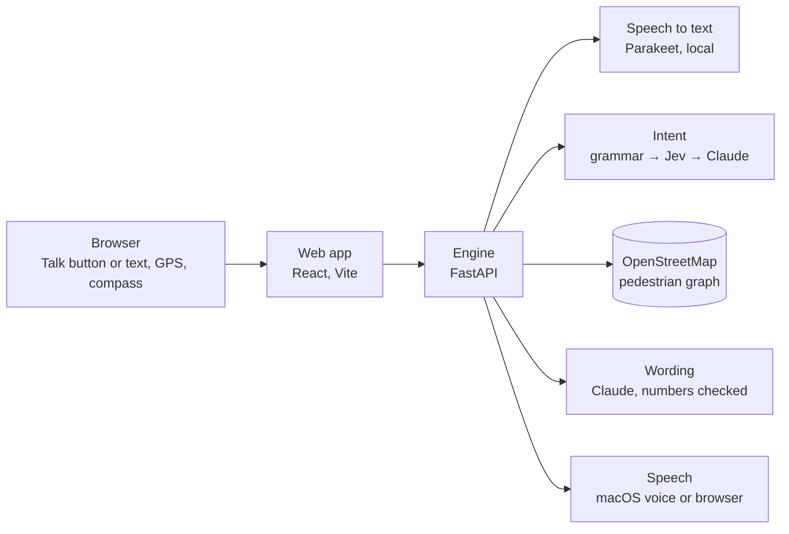

# Milo

A voice-first assistant that helps blind and low-vision pedestrians understand an area and walk to a place. Every distance, direction and crossing it mentions is computed from OpenStreetMap, and what the map does not know is said out loud.

> **Status: early development.** Milo is a hackathon prototype and the first step of a longer project. It has not been tested with blind users yet, so it must not be relied on to cross a street.

## Why

Milo was built at the BAINSA Accessibility Hackathon 2026 (Generali × Anthropic).

Blind people learn to walk a route with a white cane or a guide dog and orientation-and-mobility training. Navigation apps add turn-by-turn directions, but they rarely say what matters at the kerb: whether a crossing has traffic lights, whether those lights make a sound, and what the map simply does not know. Milo explores that gap: a spoken conversation about the walk, in which the answers come from the map rather than from a language model's guess.

## What it does

You speak or type; Milo answers aloud. A live map shows the route to a sighted companion; the blind user never needs it.

- **Before you leave:** Milo describes the area around you and lets you walk the streets virtually, junction by junction. It answers questions about the map and compares routes under your constraints, including a stop on the way.
- **While you walk:** turn-by-turn guidance from the phone's GPS and compass, with early cues and a warning as soon as you leave the route.

| Feature | Try saying |
|---|---|
| Start point and destination | "Use my location", "Take me to Bocconi University", "Yes", "The second one" |
| Describe the area | "What's around me?" |
| Virtual walk | "Let's walk", "Turn left", "Take via Brembo", "Go back", "Where am I?" |
| Map questions | "How far is it on foot?", "Is there anything between me and the station?", "Does this street go through?" |
| Place information | "Is the pharmacy open?", "Tell me about Lidl" |
| Routes and constraints | "How do I get there?", "Avoid crossings without signals", "Avoid steps", "Take the bus" |
| Stops on the way | "Stop at a pharmacy for 10 minutes", "I want a coffee on the way" |
| Live guidance | "Let's go", "Stop guiding" |
| General questions | "What is Bocconi known for?" |
| Controls | "Repeat", "Stop", "More", "What don't you know?", "Help", "Faster", "Slower" |

For each feature, [docs/features.md](docs/features.md) shows what Milo answers and how it works.

## How it works



- **Speech to text:** NVIDIA Parakeet TDT 0.6B v3, run locally on a Mac with Apple Silicon. On other computers you type.
- **Intent:** each sentence becomes one action. The engine tries three steps in order:
  1. a fixed grammar in English and basic Italian;
  2. TypeSafe Jev, a fast multiple-choice classifier (optional);
  3. Claude, which fills a fixed JSON schema.
- **Engine:** deterministic computations on an OpenStreetMap pedestrian graph (OSMnx): overview, virtual walk, map questions, routes under constraints, live guidance. Places come from Photon, public transport from Transitous.
- **Wording:** Claude shortens the engine's answer to one or two sentences. Every number in its text is checked against the engine's result; if one does not match, Milo says the engine's own sentence.
- **Speech:** macOS `say`, or the browser's own voice on other systems.

Claude never computes a direction or a distance: it picks an action and rewords facts. More in [docs/architecture.md](docs/architecture.md).

## Getting started

### Requirements

- Python 3.11 or newer, and Node 20.19+ or 22.12+.
- Optional: an [Anthropic API key](https://console.anthropic.com/). With it, Milo also understands free-form sentences and general questions and gives shorter replies. Without it, only the fixed phrases work.
- Optional, for voice input: a Mac with Apple Silicon and `ffmpeg` (`brew install ffmpeg`). On Windows, Linux or an Intel Mac, you type your sentences and Milo still answers aloud through the browser.

### 1. Install

```bash
git clone https://github.com/DaMa02/milo.git
cd milo
python3 -m venv .venv
source .venv/bin/activate        # Windows: .venv\Scripts\activate
pip install -r server-py/requirements.txt
npm ci
```

On a Mac with Apple Silicon, also download the speech model once:

```bash
python -c "from huggingface_hub import snapshot_download; snapshot_download('mlx-community/parakeet-tdt-0.6b-v3')"
```

### 2. Configure

The engine reads these environment variables; [.env.example](.env.example) lists them all.

| Variable | Needed | What it does |
|---|---|---|
| `TOOLS` | Yes | Folder for the map and transit caches |
| `ANTHROPIC_API_KEY` | No | Free-form sentences, general questions, shorter wording |
| `TYPESAFE_API_KEY` | No | Jev, for faster commands |
| `LOTL_ZONE` | No | `porta-romana` loads a small test area instead of central Milan |

Set them in the terminal where the engine will run.

macOS and Linux:

```bash
mkdir -p "$HOME/.cache/milo"
export TOOLS="$HOME/.cache/milo"
export ANTHROPIC_API_KEY="your key"   # optional
```

Windows (PowerShell):

```powershell
New-Item -ItemType Directory -Force "$HOME\.cache\milo" | Out-Null
$env:TOOLS = "$HOME\.cache\milo"
$env:ANTHROPIC_API_KEY = "your key"   # optional
```

### 3. Run

Use two terminals from the repository root, with the virtual environment active in the first.

```bash
# Terminal 1: engine. The first start downloads the map of central Milan (about a minute), then it is cached.
cd server-py
uvicorn app:app --host 127.0.0.1 --port 8000

# Terminal 2: web app
npm run dev
```

Open http://127.0.0.1:5173 in a browser. Type a sentence and press Enter, or press Talk on a Mac with Apple Silicon.

### 4. Try it

Type these one at a time:

1. "Start at Talent Garden", then "Yes"
2. "What's around me?"
3. "Let's walk", "Turn left", "Where am I?"
4. "Take me to Bocconi University", then "Yes"
5. "How do I get there?", then "Avoid crossings without signals"
6. "Stop at a pharmacy for 10 minutes"
7. "What don't you know?"

Live guidance ("Let's go") follows your GPS position, so it is meant for a phone.

### Optional: use a phone

The microphone and GPS need HTTPS. Start a tunnel with [`cloudflared`](https://github.com/cloudflare/cloudflared) and open on the phone the address it prints:

```bash
cloudflared tunnel --url http://127.0.0.1:5173
```

## Tests

No test calls a paid API.

```bash
npm run check                             # contracts, types, dictionaries
npm run test:e2e                          # Playwright, Chromium and iPhone WebKit
cd server-py && python tests/test_api.py  # one engine test; each file in server-py/tests/ runs on its own
```

## Project structure

| Path | Contents |
|---|---|
| [`web/`](web/) | Web app: voice and text input, audio, compass, live guidance, live map |
| [`server-py/`](server-py/) | Engine: API endpoints and map logic (`lotl/`) |
| [`contracts/`](contracts/) | JSON Schemas for every engine response, with fixtures |
| [`docs/`](docs/) | [Features](docs/features.md), [architecture](docs/architecture.md), [speaking rules](docs/speaking-rules.md), [roadmap](docs/roadmap.md), [how we built it](docs/how-we-built-it.md) |

## Limitations

- It is a prototype: it has not been tested with blind users, and its guidance rules follow common practice as we understand it.
- OpenStreetMap often lacks accessibility details, such as whether a traffic light has sound. Milo says when the data is missing.
- GPS in a city is often wrong by 5–15 metres, so live guidance cannot say "turn now" to the metre.
- Voice input needs a Mac with Apple Silicon. Replies are in English; Italian input is understood.
- Live guidance is on foot only, and the phone screen must stay on while guiding.
- Central Milan is preloaded. Elsewhere, the first request downloads the surrounding map, which takes about 80 seconds.

## Development since the hackathon

After the hackathon we started turning the prototype into a base that can grow. This work is on the [`development`](https://github.com/DaMa02/milo/tree/development) branch:

- **The engine in TypeScript** (`packages/engine`), so it can run in a browser or on a phone without the Mac server. Its tests replay 324 answers of the Python engine and require the same words.
- **Research** (`docs/ricerca/`) on:
  - studies of blind pedestrian navigation;
  - what blind users say about current apps;
  - existing solutions;
  - GPS precision;
  - conversation design;
  - the Italian context;
  - the technical choices ahead.
- **A work plan** (`docs/piano-di-lavoro.md`, in Italian): what Milo should do next and in which order.

## Future developments

- Rehearse a planned route at home, junction by junction, with every crossing described.
- Say a whole trip in one sentence: "to the Duomo, stopping at a pharmacy, without public transport".
- Describe each crossing with everything the map knows: lights, sound, traffic island, tactile paving, tram tracks.
- A web version used with the person's own screen reader, with replies in Italian as well as English.
- Later, guidance on the street from a phone app that says how precise its position is.
- Design and test every step with blind pedestrians and orientation-and-mobility instructors.

## Team

Built by [Daniele Maglionico](https://github.com/DaMa02) (engine, voice back end) and [Leonardo Gallo](https://github.com/Leoldo) (web app, live map, product). See [how we built it](docs/how-we-built-it.md).

## License

[MIT](LICENSE). Map data © [OpenStreetMap contributors](https://www.openstreetmap.org/copyright), ODbL.
