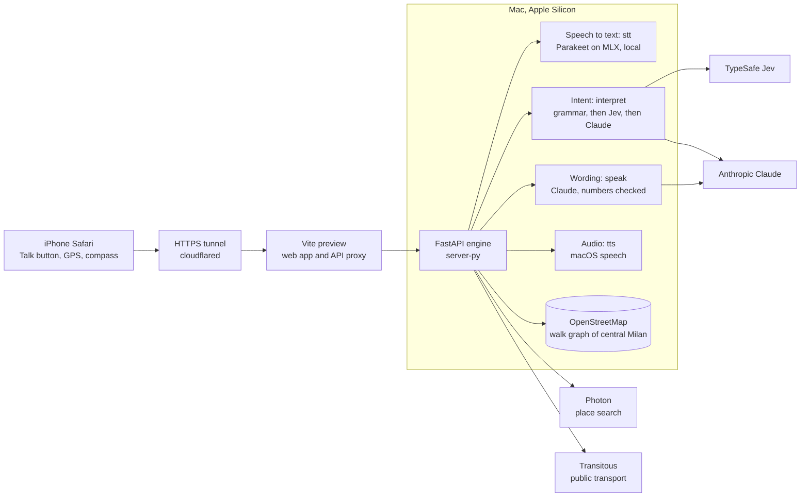

# Milo

**A voice-only iPhone web app that helps blind and low-vision pedestrians understand an area of Milan and walk to a place. Every distance, direction and crossing it mentions is computed from OpenStreetMap.**

Built in one day at the BAINSA Accessibility Hackathon (Talent Garden, Milan, 26 September 2026), Track 1 "Hearing Hues": *explore a place before entering it*. Early commits call the project "Lay of the Land", and some identifiers in the code (`lotl`) still use that name.

## The problem

A sighted person can glance at a map and see how streets connect, what lies in the way and which route looks complicated. A blind pedestrian has to get that picture some other way, usually before leaving home. In a February 2025 RNIB survey of 1,197 blind and partially sighted people in the UK, 61% said they cannot make all the journeys they want or need to, and 73% said some roads in their area are too unsafe to cross because accessible crossings are missing ([RNIB, *In My Way*, 2025](https://media.rnib.org.uk/documents/In_My_Way_-_Navigating_pedestrian_journeys_with_sight_loss_2025_PDF_UBGbFuv.pdf)). The map data has gaps too: within 400 m of Talent Garden, only 7 of 70 crossings in OpenStreetMap say whether the signal makes a sound (counted by our engine). When the map is silent, Milo says so.

## What Milo does

You hold the phone and use a single Talk button: tap to speak, or hold while talking. Milo answers aloud. It works in two situations:

- **Before you leave:** it describes the area around you relative to where the phone is pointing, lets you walk the streets virtually one junction at a time, answers questions about the map and compares routes under the constraints you set.
- **While you walk:** it gives turn-by-turn guidance from the phone's GPS and compass, with early, repeated cues and an immediate warning when you leave the route.

### Talk to it

The replies below are engine outputs recorded on 26 September 2026 in separate runs, all starting at Talent Garden (via Arcivescovo Calabiana 6). The route reply comes from a live run and the guidance lines from the simulated walk in the test suite. Claude writes the final wording, so the phrasing changes from one run to the next, but the numbers do not.

> **You:** Use my location<br>
> **Milo:** You seem to be at via Arcivescovo Calabiana 6, within about 30 metres. Start here?<br>
> **You:** Yes
>
> **You:** Take me to Bocconi University<br>
> **Milo:** I found Bocconi University, Piazza Angelo Sraffa, Milan. Is that right? Say 'yes' or 'no'.<br>
> **You:** Yes
>
> **You:** How do I get there?<br>
> **Milo:** To reach Bocconi University from Talent Garden, I recommend route A, on foot along main streets, 29 minutes. It has 10 crossings without a signal. Say 'let's go' to start, or 'other routes' to compare.
>
> **You:** Let's go<br>
> **Milo:** Guidance started to Bocconi University: 2,280 metres, about 29 minutes. Walk along via Arcivescovo Calabiana for 85 metres, then turn left onto a pavement.<br>
> *(16 s later)* In 60 metres, turn left onto a pavement.<br>
> *(28 s later)* In 25 metres, turn left onto a pavement.<br>
> *(12 s later)* Turn left now, onto a pavement.

### Features

| Feature | What you say | What happens |
|---|---|---|
| Start from GPS | "Use my location", then "Yes" | The phone's position is turned into an address (Photon) and confirmed aloud. |
| Start or destination by name | "Start from the Duomo", "Take me to Bocconi University" | Up to 3 places in Milan, confirmed by voice ("yes", "no", "the second one"). If speech recognition mishears a name, Claude suggests what you probably meant. |
| Describe the area | "What's around me?" | The 800 m around you: railways and where to cross them, nearby main roads and construction sites, as clock positions relative to the direction the phone is facing. |
| Virtual walk | "Let's walk", "Turn left", "Take via Brembo", "Go back", "Where am I?" | You move junction by junction. Each way out is listed from left to right, with its crossing and signal, and the way you came from is "behind you". |
| Questions about the map | "How far is it on foot?", "Is there anything between me and Bocconi?", "Does via Brembo go through?", "How big is the park?", "How many ways are there to Bocconi?" | Five deterministic computations on the street graph, each with its evidence. |
| About a place | "Is the pharmacy open?", "Tell me about Lidl" | Opening hours from OpenStreetMap (Rome time), wheelchair access tag, straight-line distance. |
| Routes | "How do I get there?", "Other routes", "Take the shortest", "Take the bus" | Route A keeps to main streets, route B is the shortest on foot, route C uses public transport (Transitous). Each route states its time and the crossings without signals. |
| Constraints | "Avoid crossings without signals", "Avoid steps", "Only side streets" | The routes are recomputed. If no route meets the constraint, Milo says so and offers the closest one. |
| A stop on the way | "Stop at a pharmacy for 10 minutes", "I want a coffee on the way", then "The first one" | 3 candidates within 300 m of the route, each with the minutes it adds and its hours. Then every route is recomputed through the stop. |
| Live guidance | "Let's go", "Guide me", "Stop guiding" | Turns are announced at about 60 m, 25 m and "now", and crossings at about 30 m. Milo also warns about wrong-way walking and leaving the route, re-routes and announces arrival. |
| General questions | "What is Bocconi known for?", "How do I add a stop?", "Search online when the library opens" | Claude answers in one to three sentences, from general knowledge or a web search when you ask for one. It never gives directions or distances. |
| Service commands | "Repeat", "Stop", "More", "What don't you know?", "Help", "Faster", "Slower", "Start over" | Handled instantly by a local grammar. |
| Live map | Nothing: it is on screen for a sighted companion or observer | Once a start point is set, a Leaflet map with OpenStreetMap tiles shows the start, the destination and, during guidance, the route line, your position with its accuracy and heading, the next instruction, and the distance and time left. The blind user never needs it, it never blocks voice, and if the tiles fail the journey stays readable as text. |

Each feature is described in more detail, with its module and algorithm, in [docs/features.md](docs/features.md).

## How it works



Each utterance goes through these steps: the recording goes to `/stt`, the text to `/interpret`, which returns one action. The app then calls the engine endpoint for that action (`/session`, `/explore`, `/ask`, `/plan/*`, `/navigate`). `/speak` turns the result into one or two sentences, and `/tts` returns audio that the page plays. The engine loads one pedestrian graph of central Milan (an 8 × 8 km square, roughly the area inside the 90/91 ring: 152,974 nodes and 13,552 crossings) once at startup. For a start point outside that area, it downloads a 1.5 km zone. See [docs/architecture.md](docs/architecture.md).

## Why you can trust what it says

- **Every number comes from the map engine, with its evidence.** Each response carries `facts`, and each fact has a `source` (`computed`, `map_tag`, `transit_api`, `web`, `estimated` or `unknown`), the OpenStreetMap ids or URLs behind it, the inputs that produced it and the data date. [`contracts/validate.py`](contracts/validate.py) fails if a number in a spoken sentence has no matching fact.
- **Unknowns are said aloud.** Each answer lists what the map does not say (`unknown[]`), for example whether a signal has sound. "What don't you know?" reads that list back. A route that passes a crossing the map is silent about is never called compliant.
- **Claude does not compute directions or distances.** The router only chooses one action from a fixed JSON schema and copies place names from your words. The engine computes the answer. The chat model is instructed to refuse directions, distances and routes and to name the phrase that asks the engine instead.
- **Numbers in Claude's spoken summaries are checked against the engine's result.** `/speak` extracts every number Claude writes, including number words and clock positions, and compares it with the engine result. If a number has no backing, or the reply is truncated, refused or later than 3 s, Milo says the engine's own sentence instead.

## Measured latencies

Measured on 26 September 2026 from the iPhone, through the tunnel, against the engine on the Mac. The `/speak` row comes from live runs on the Mac.

| Step | Time |
|---|---|
| Speech to text (Parakeet) | 0.5 s |
| Fixed command (local grammar) | 0.05 s |
| Intent with Jev | 0.3–0.7 s |
| Intent with Claude | 2–5 s |
| General question (Claude) | 2–3 s, 13 s with a web search |
| Place search / new session | 0.1 s / 0.1 s |
| Route plan, Talent Garden to Bocconi | 1.6 s |
| Each map question | under 1.5 s |
| One live guidance update (`/navigate`) | 0.4 s |
| Spoken reply from Claude (`/speak`) | 1.6–3.2 s (with a 3 s budget, after which the engine's text is used) |
| Speech audio (`/tts`) | 0.8–1.3 s |

At startup, loading the city graph takes about 50 s.

## Run it locally

**Prerequisites:** a Mac with Apple Silicon (Parakeet runs on MLX, and speech uses macOS `say`), Python 3.11+, `ffmpeg`, Node 20.19+ or 22.12+, [`cloudflared`](https://github.com/cloudflare/cloudflared), and an iPhone with Safari.

```bash
git clone https://github.com/DaMa02/milo.git && cd milo
python3 -m venv .venv && source .venv/bin/activate
pip install -r server-py/requirements.txt
python -c "from huggingface_hub import snapshot_download; snapshot_download('mlx-community/parakeet-tdt-0.6b-v3')"
npm ci
```

**Environment variables.** The engine reads them from the shell. Never put keys in a file or in the web app.

| Variable | Needed | Effect |
|---|---|---|
| `ANTHROPIC_API_KEY` | recommended | Claude for intents, spoken wording, general questions and misheard names. Without it, Milo understands only the fixed phrases and speaks the engine's text. |
| `ANTHROPIC_WORKSPACE_ID` | optional | Sent as the `anthropic-workspace-id` header. |
| `TYPESAFE_API_KEY` | optional | Enables the Jev step between the grammar and Claude. |
| `TOOLS` | recommended | Folder for the map and transit caches, for example `$HOME/.cache/milo`. The default path is the authors' machine. |

**Three commands, in three terminals, with the variables above exported in the first:**

```bash
# 1. Engine (the first start downloads the Milan map from OpenStreetMap and caches it in $TOOLS)
source .venv/bin/activate && cd server-py && HF_HUB_OFFLINE=1 uvicorn app:app --host 127.0.0.1 --port 8000

# 2. Web app
npm run build && cd web && npx vite preview --host 127.0.0.1 --port 4173

# 3. HTTPS tunnel (microphone and GPS need HTTPS on the phone)
cloudflared tunnel --url http://127.0.0.1:4173
```

On the iPhone, open the `https://…trycloudflare.com` address printed by the tunnel in Safari, tap Talk, and allow the microphone, location, and Motion & Orientation (for the compass).

## Tests

None of the tests call a paid API.

- `npm run check`: validates the contract fixtures against the JSON Schemas (Python with `jsonschema`, found in `.venv`), typechecks the web app and checks the dictionaries.
- Engine: each file in [`server-py/tests/`](server-py/tests/) is a standalone script, run from `server-py/` with `python tests/<file>.py`. The tests cover the API, plans, the city graph and its speed, the interpreter, chat, places, place kinds, voice, spoken replies and live guidance. They use fake Claude clients, a mocked Photon and Transitous answers from the cache, and several of them fail on any network call. The voice test uses the local Parakeet model and skips when it is missing. The tests need the map cache, so start the engine once before running them.
- Browser: `npx playwright install chromium webkit`, then `npm run test:e2e`. Playwright runs the flows in Chromium, and the voice, places and route-voice flows also in WebKit with an iPhone 13 profile. The suite includes axe-core WCAG A/AA checks. `web/tests/live-engine.spec.ts` runs against the real engine only with `LOTL_LIVE_ENGINE=1`.

## Repository layout

| Path | Contents |
|---|---|
| [`web/`](web/) | The iPhone web app: Vite, React, TypeScript. Voice input, audio playback, compass, live guidance loop, live map. |
| [`server-py/`](server-py/) | The engine: FastAPI endpoints (`*_api.py`, `app.py`) and the map logic in `lotl/` (zone, overview, explore, tools, plan, navigate, grammar, Jev, chat, speak). |
| [`contracts/`](contracts/) | JSON Schemas for every engine response, real fixtures from the demo area, and the validator. See [contracts/README.md](contracts/README.md). |
| [`docs/`](docs/) | Features, architecture, speaking rules, roadmap and how we built it. The rules for how Milo speaks are in [`docs/speaking-rules.md`](docs/speaking-rules.md). |
| [`scripts/`](scripts/) | Cross-platform Node scripts behind `npm run check`. |

## Limitations

- **OpenStreetMap is incomplete.** Near Talent Garden, sound at traffic lights is mapped on 7 of 70 crossings. Unnamed footpaths are spoken as "a footpath" or "a pavement". Two crossings a few metres apart, such as at a traffic island, get two cues.
- **Guidance is on foot only.** Milo can plan a public transport route, but it does not guide you on the bus or tram.
- **The screen must stay on.** iOS suspends GPS and audio when the phone locks. The app asks to keep the screen awake and warns you when the page goes to the background.
- **Place information is partial.** The distance in "about a place" is a straight line, and opening hours appear only when OpenStreetMap has them.
- **English replies only.** Italian phrases are understood, but Milo answers in English.
- **The engine runs on a Mac.** Speech recognition uses MLX, sessions live in memory and are lost on restart, and a new area outside central Milan takes about 80 s to download the first time.
- **Claude's wording has a 3 s budget.** In our live runs, about one call in three fell back to the engine's text, which is correct but longer.
- **Limited real-world testing.** The compass and audio have been only partly tested on a real iPhone. Milo has not yet been tested with blind users. Its speaking rules follow common orientation-and-mobility practice, which is our assumption.

## Roadmap

See [docs/roadmap.md](docs/roadmap.md): richer accessibility data, guidance on public transport, spatial audio, a cloud engine and community map corrections.

## Team

- **Daniele Maglionico** ([@DaMa02](https://github.com/DaMa02)): map engine, contracts, voice back end, integration.
- **Leonardo Gallo** ([@Leoldo](https://github.com/Leoldo)): iPhone web app, live map, voice experience, product and delivery.

We built it in one day, working with coding agents. See [docs/how-we-built-it.md](docs/how-we-built-it.md).

## License

[MIT](LICENSE). Map data © [OpenStreetMap contributors](https://www.openstreetmap.org/copyright), available under the Open Database License.

## Acknowledgements

- [OpenStreetMap](https://www.openstreetmap.org/copyright) contributors, for the map every answer comes from.
- [Photon](https://github.com/komoot/photon) by komoot, for place search and reverse geocoding.
- [Transitous](https://transitous.org) and [MOTIS](https://github.com/motis-project/motis), for public transport routes.
- [NVIDIA Parakeet](https://huggingface.co/nvidia/parakeet-tdt-0.6b-v3), run locally through [parakeet-mlx](https://github.com/senstella/parakeet-mlx).
- [TypeSafe](https://typesafe.ai) Jev, for fast intent choices.
- [Anthropic Claude](https://www.anthropic.com/claude), the event's main partner technology.
- [OSMnx](https://github.com/gboeing/osmnx), [FastAPI](https://fastapi.tiangolo.com), [Vite](https://vite.dev), [React](https://react.dev) and [Leaflet](https://leafletjs.com).
