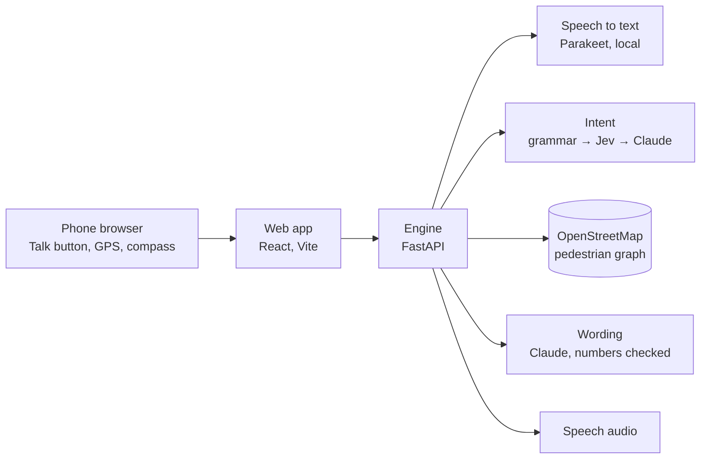

# Milo

A voice-first web app that helps blind and low-vision pedestrians understand an area and walk to a place. Every distance, direction and crossing it mentions is computed from OpenStreetMap, and what the map does not know is said out loud.

Milo is not tied to one city. Central Milan is loaded at startup; for a start point anywhere else with OpenStreetMap coverage, the engine downloads the surrounding map on first use.

## What it does

The interface is a single Talk button. You speak, Milo answers aloud.

- **Before you leave:** describes the area relative to where the phone is pointing, lets you walk the streets virtually junction by junction, answers questions about the map and compares routes under your constraints.
- **While you walk:** turn-by-turn guidance from the phone's GPS and compass, with early cues and an immediate warning when you leave the route.

| Feature | Example phrases |
|---|---|
| Start point and destination | "Use my location", "Take me to Bocconi University", "Yes", "The second one" |
| Describe the area | "What's around me?" |
| Virtual walk | "Let's walk", "Turn left", "Take via Brembo", "Go back", "Where am I?" |
| Map questions | "How far is it on foot?", "Is there anything between me and the station?", "Does this street go through?" |
| Place information | "Is the pharmacy open?", "Tell me about Lidl" |
| Routes and constraints | "How do I get there?", "Other routes", "Take the bus", "Avoid crossings without signals", "Avoid steps" |
| Stops on the way | "Stop at a pharmacy for 10 minutes", "I want a coffee on the way" |
| Live guidance | "Let's go", "Stop guiding" |
| General questions | "What is Bocconi known for?", "Search online when the library opens" |
| Controls | "Repeat", "Stop", "More", "What don't you know?", "Help", "Faster", "Slower", "Start over" |

A live map shows the route and position for a sighted companion; the blind user never needs it. Details for each feature are in [docs/features.md](docs/features.md).

## How it works



Each utterance is transcribed locally, mapped to one action (a local grammar first, then TypeSafe Jev, then Claude with a fixed JSON schema), executed by the deterministic map engine, rewritten into one or two sentences and played back as audio. Place search uses Photon and public transport uses Transitous. See [docs/architecture.md](docs/architecture.md).

**Why the answers can be trusted**

- Directions, distances and routes come only from the map engine. Every map answer carries its facts and their source (OpenStreetMap ids, Photon or Transitous).
- Claude never computes directions. It picks an action from a fixed schema, and every number in its spoken wording is checked against the engine result; if one does not match, Milo speaks the engine's own sentence.
- Missing data is stated, not skipped: "What don't you know?" reads back what the map does not say.
- General questions go to Claude and are introduced as general knowledge or a web result; Claude is instructed never to give directions there.

Latencies measured on 26 September 2026 from an iPhone over the tunnel: speech to text 0.5 s, fixed commands 0.05 s, intent with Claude 2–5 s, route plan 1.6 s, guidance update 0.4 s.

## Getting started

**Requirements:** a Mac with Apple Silicon (speech recognition runs on MLX), Python 3.11+, Node 20.19+, `ffmpeg`, [`cloudflared`](https://github.com/cloudflare/cloudflared) and a phone with a browser.

```bash
git clone https://github.com/DaMa02/milo.git && cd milo
python3 -m venv .venv && source .venv/bin/activate
pip install -r server-py/requirements.txt
python -c "from huggingface_hub import snapshot_download; snapshot_download('mlx-community/parakeet-tdt-0.6b-v3')"
npm ci
```

Export the variables listed in [.env.example](.env.example) in your shell (at least `TOOLS`, the cache folder; `ANTHROPIC_API_KEY` enables free-form speech and general questions). Keys are read by the engine only and never reach the browser.

Then, in three terminals from the repo root:

```bash
# 1. Engine (the first start downloads and caches the map)
cd server-py && uvicorn app:app --host 127.0.0.1 --port 8000

# 2. Web app
npm run build && cd web && npx vite preview --host 127.0.0.1 --port 4173

# 3. HTTPS tunnel for the phone
cloudflared tunnel --url http://127.0.0.1:4173
```

Open the tunnel address on the phone, tap Talk and allow microphone, location and motion access.

## Tests

No test calls a paid API.

```bash
npm run check                             # contracts, types, dictionaries
npm run test:e2e                          # Playwright, Chromium and iPhone WebKit
cd server-py && python tests/test_api.py  # one engine test; each file in server-py/tests/ is a standalone script
```

## Project structure

| Path | Contents |
|---|---|
| [`web/`](web/) | Phone web app: voice input, audio playback, compass, live guidance, live map |
| [`server-py/`](server-py/) | Engine: API endpoints and map logic (`lotl/`) |
| [`contracts/`](contracts/) | JSON Schemas for every engine response, fixtures and validator |
| [`docs/`](docs/) | Features, architecture, [speaking rules](docs/speaking-rules.md), [roadmap](docs/roadmap.md) |

## Limitations

- OpenStreetMap often lacks accessibility details, such as whether a signal has sound. Milo says when the data is missing.
- Live guidance is on foot only, and the screen must stay on while guiding.
- Replies are in English; Italian input is understood.
- The engine runs on a Mac, and a new area outside the preloaded one takes about 80 s to download the first time.
- Milo has not yet been tested with blind users.

## Team

Built at the BAINSA Accessibility Hackathon 2026 by [Daniele Maglionico](https://github.com/DaMa02) (engine, voice back end) and [Leonardo Gallo](https://github.com/Leoldo) (web app, live map, product). See [how we built it](docs/how-we-built-it.md).

## License

[MIT](LICENSE). Map data © [OpenStreetMap contributors](https://www.openstreetmap.org/copyright), ODbL.
