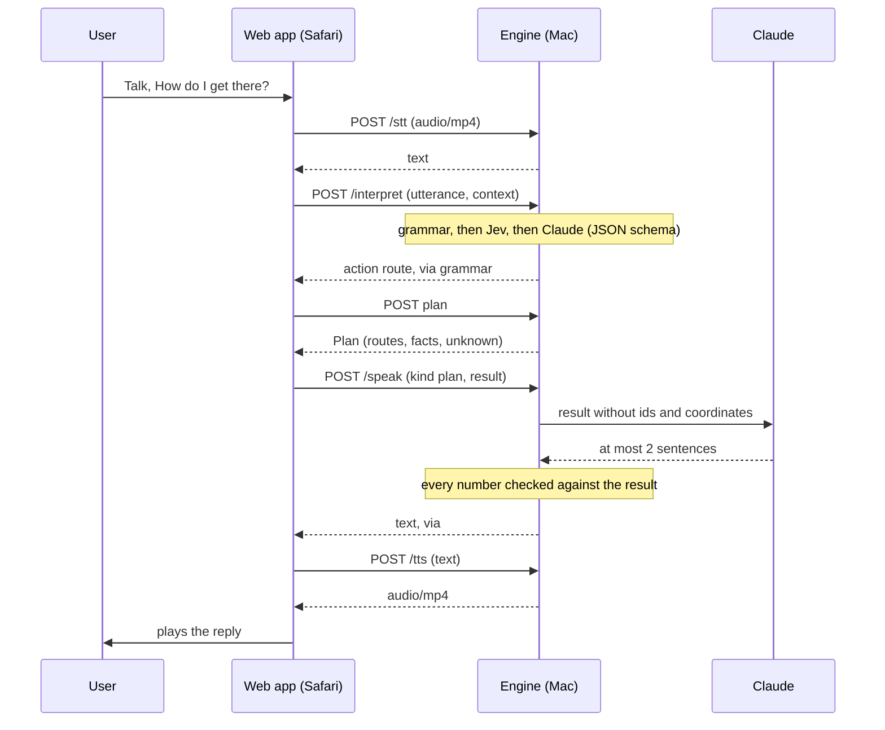
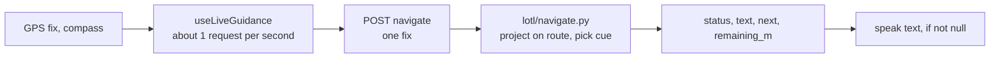

# Architecture

Milo has two halves. A single web page runs in Safari on the iPhone, and an engine runs on a Mac. The phone records speech, reads GPS and compass, and plays audio. Everything else happens on the Mac: speech recognition, intent, map computation, wording and speech synthesis.

## Components

| Component | Where | What it does |
|---|---|---|
| Web app | [`web/`](https://github.com/DaMa02/milo/tree/ed9c4bf/web/) (Vite, React, TypeScript) | One Talk button (tap to speak, or hold while talking). It records with `MediaRecorder` (`audio/mp4` on iOS), watches GPS with `watchPosition`, and reads the compass from `DeviceOrientationEvent`, averaged over the last 3 s. Replies play through one `<audio>` element unlocked by the Talk tap, with the browser's speech synthesis as a fallback. During guidance the app holds a screen wake lock. Results are also announced through `aria-live` regions. A lazy-loaded live map (Leaflet, OpenStreetMap tiles) shows the journey to a sighted companion or observer; it is hidden from screen readers, never blocks voice, and the same details stay readable as text if the tiles fail. See [features.md](features.md#13-live-map). |
| Vite preview | the Mac, port 4173 | Serves the built app and forwards `/api/*` to the engine on `127.0.0.1:8000`, stripping the prefix. |
| HTTPS tunnel | `cloudflared` | Gives the phone an HTTPS address, because Safari allows the microphone and GPS only in a secure context. |
| Engine | [`server-py/`](https://github.com/DaMa02/milo/tree/ed9c4bf/server-py/) (FastAPI) | Endpoints in `app.py` and `*_api.py`. The map logic lives in `lotl/`: `zone` (graph, crossings, names), `overview`, `explore`, `tools` (map questions), `plan` (routes), `navigate` (live guidance), `grammar`, `jev`, `llm`, `chat` and `speak`. |
| Speech to text | `voice_api.py` | NVIDIA Parakeet TDT 0.6B through `parakeet-mlx`, loaded from the local cache at startup. It never downloads the model and handles one transcription at a time. |
| Speech synthesis | `tts_api.py` | macOS `say`, voice Daniel (en-GB), returns AAC in an MP4 container. "N m" is read as metres, and the last 64 clips are cached in memory. |

## One utterance, end to end

1. **`/stt`** receives the raw recording and returns `{text, lang, audio_ms, stt_ms}`, or a 422 with a sentence the app can say ("No speech detected.").
2. **`/interpret`** turns the text into exactly one action ([`interpret_api.py`](https://github.com/DaMa02/milo/blob/ed9c4bf/server-py/interpret_api.py)), using the app's context: current view, pending question, candidates, routes. It tries three steps in order:
   - **Grammar** ([`lotl/grammar.py`](https://github.com/DaMa02/milo/blob/ed9c4bf/server-py/lotl/grammar.py)): fixed English and basic Italian phrases, with no model, in about 0.05 s.
   - **Jev** ([`lotl/jev.py`](https://github.com/DaMa02/milo/blob/ed9c4bf/server-py/lotl/jev.py)): one multiple-choice call to TypeSafe, only when `TYPESAFE_API_KEY` is set, with a 1.5 s timeout. The answer is kept only when every choice it uses has confidence of at least 0.8 and the action copies no free text from the utterance.
   - **Claude**: picks one action from a fixed JSON schema and copies place names exactly as spoken. The default model is `claude-opus-5-5` at low effort, and `ANTHROPIC_MODEL` overrides it.

   An utterance that fits no action goes to the chat answer ([`lotl/chat.py`](https://github.com/DaMa02/milo/blob/ed9c4bf/server-py/lotl/chat.py)) instead of a dead end.
3. **The engine endpoint for that action** does the work deterministically: `/places/*`, `/session`, `/explore`, `/ask`, `/plan/*` or `/navigate`. Service commands (repeat, stop, faster, slower) are handled in the app.
4. **`/speak`** ([`lotl/speak.py`](https://github.com/DaMa02/milo/blob/ed9c4bf/server-py/lotl/speak.py)) asks Claude for at most 2 short sentences that answer the utterance from the result, with the OpenStreetMap ids, evidence and coordinates removed. The engine then checks every number in Claude's text against the numbers in the result and the trip facts: digits, the number words two to twelve, and clock positions. It also appends a fixed next-step hint for the result's kind, such as "Say 'let's go' to start, or 'other routes' to compare." An unbacked number, a truncated or refused reply, or a delay over 3 s makes the engine use its own text instead: the first 2 sentences of the result plus the hint. Without an Anthropic key, the engine's text is always used.
5. **`/tts`** returns the audio, which the page plays. "Faster" and "Slower" change the playback rate.

## Live guidance loop

**Client** ([`web/src/hooks/useLiveGuidance.ts`](https://github.com/DaMa02/milo/blob/ed9c4bf/web/src/hooks/useLiveGuidance.ts)). The client sends the latest fix with its accuracy and the compass heading about once a second, and resends it even when the phone is standing still. A new GPS fix or a heading change of more than 25° is sent at once. Only one request is in flight at a time, and newer fixes replace queued ones. A reply containing "now", or an off-route warning, interrupts whatever is being said.

**Engine** ([`lotl/navigate.py`](https://github.com/DaMa02/milo/blob/ed9c4bf/server-py/lotl/navigate.py)). Each fix is projected onto the selected foot route. Progress is searched at most 150 m ahead of the last position and never jumps back more than 30 m in one fix, so a route that doubles back does not confuse it. The reply's `text` is what to say now, or `null` when there is nothing new.

| Situation | Rule | Example |
|---|---|---|
| Start | Total distance and time. If the route starts more than 45° away from the compass heading, Milo says where it starts. Then the first street and turn. | "Guidance started to Bocconi University: 2,280 metres, about 29 minutes. Walk along via Arcivescovo Calabiana for 85 metres, then turn left onto a pavement." |
| Turn | Only real turns, meaning a bearing change over 35°. A bend under 60° along the same street is not a turn, and turns less than 20 m apart are said as one. Cues come at about 60 m, 25 m and "now" (about 8 m), with a lookahead of walking speed × 2.5 s to cover speech latency. 15 m past the turn: "Now on X. Continue for N metres." | "In 60 metres, turn left onto viale Toscana." … "Turn left now, onto viale Toscana." |
| Crossing | One cue at about 30 m, with what the map says about signals and sound. For crossings without signals, "Crossing now." at about 5 m. | "In 30 metres, a crossing with traffic lights, the map does not say if it has a sound signal." |
| Reminder | After 25 s of silence on the route. | "Keep going along via Giovanni Lorenzini: 140 metres to the next turn." |
| Wrong way | Progress drops more than 12 m in 6 s, or the GPS direction of travel is more than 120° from the route for 3 fixes. At most once every 15 s. | "You are going the wrong way. Turn around." … "Good, now you are heading the right way." |
| Off route | 2 fixes further than max(20, min(accuracy, 40)) m from the route, or one fix beyond 60 m. The way back is given as a clock position, with a reminder every 12 s. | "You are off the route, about 90 metres from it. The route is at 5 o'clock." |
| Re-route | After 25 s or 80 m off the route, a new foot route from the current position. | "New route. Walk along …" |
| Arrival | Within max(15, min(accuracy, 25)) m of the destination, said once. | "You have arrived at Bocconi University. It is at 11 o'clock, about 15 metres." |
| GPS noise | A fix with accuracy worse than 60 m moves nothing and says nothing unless it is more than 80 m off. Duplicate fixes and compass heartbeats never repeat speech, and the same sentence is never said twice within 10 s. | |

The spoken transcript of a full simulated walk from Talent Garden to Bocconi University (at 1.3 m/s, with GPS noise) is in [`server-py/tests/guidance_transcript.txt`](https://github.com/DaMa02/milo/blob/ed9c4bf/server-py/tests/guidance_transcript.txt).

## Data sources

| Source | Used for | Notes |
|---|---|---|
| [OpenStreetMap](https://www.openstreetmap.org/copyright) via Overpass, loaded with OSMnx | Pedestrian graph with crossing, signal, sound, tactile paving and `noexit` tags. Features: railways, waterways, railway and construction land, parks, gardens, shops, pharmacies, cafés, cash machines, banks. | Central Milan: an 8 × 8 km square centred on the Duomo, roughly the area inside the 90/91 ring, 152,974 nodes and 13,552 crossings, loaded once at startup in about 50 s. Outside it, a 1.5 km zone is built around the origin: about 80 s the first time, then about 6 s from the cache. If the build takes longer than 45 s, the request answers 503 with a sentence to say, and the build goes on in the background. Every fact records the snapshot date. |
| [Photon](https://github.com/komoot/photon) (komoot) | Place search and reverse geocoding | 3 s timeout, answers cached in memory. When Photon is down, the named streets and features of the loaded map are used instead. |
| [Transitous](https://transitous.org) (MOTIS) | Public transport route C | Cached by the exact request in `$TOOLS/py/transit-cache`. Each request carries a `User-Agent` with a contact address, as the service asks. `LOTL_OFFLINE=1` uses the cache only. |
| Anthropic Claude | Intent, spoken wording, general questions, misheard place names | Called only from the engine. Web search is enabled only when the user asks for a search. |
| TypeSafe Jev | Fast intent choices | Optional. |

## Contracts

Every engine response follows a JSON Schema (draft-07) in [`contracts/`](https://github.com/DaMa02/milo/tree/ed9c4bf/contracts/), with real fixtures from the demo area. [contracts/README.md](https://github.com/DaMa02/milo/blob/ed9c4bf/contracts/README.md) documents every endpoint and field. The central object is the `fact`: `{type, value, unit, source, evidence[], inputs{}, data_date, completeness}`. [`contracts/validate.py`](https://github.com/DaMa02/milo/blob/ed9c4bf/contracts/validate.py) checks the fixtures against the schemas and fails if a number in a spoken string has no matching fact. The engine tests apply the same check to the engine's own responses.

## Privacy

- **No recording is stored.** Audio goes to the Mac, is transcribed locally by Parakeet from a temporary file that is deleted right away, and never leaves the Mac.
- **Nothing personal is logged.** The engine does not log audio, transcripts, spoken texts or coordinates. Positions and words travel in request bodies, never in URLs, and the HTTP client's URL logging is turned off.
- **Only the services that need the data receive it.** When the grammar does not match, the utterance goes to TypeSafe and Anthropic. `/speak` sends the engine's result to Anthropic. Place queries and coordinates go to Photon, and route ends go to Transitous.
- **State lives in memory only.** Sessions, plans, guidance state (the last 5 fixes) and chat history (the last 6 turns) are lost when the engine restarts.
- **Keys stay on the engine.** API keys are read from the engine's environment variables only. They never reach the browser, and `.env` files are gitignored.
