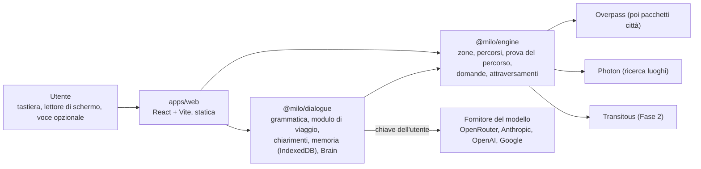
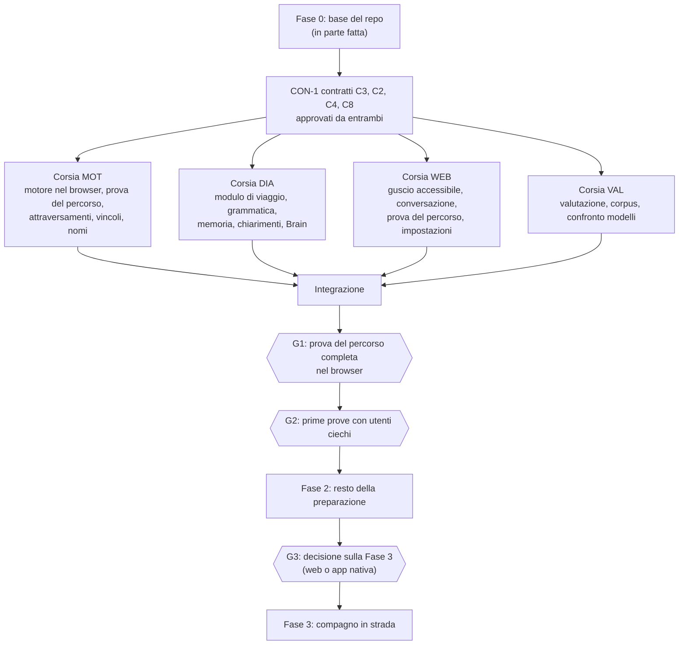

# Milo: piano di lavoro

Versione 2 del 27 settembre 2026. Sostituisce la v1 (commit `28220f8`), che puntava a un navigatore completo sul telefono.

**Cosa cambia rispetto alla v1, in breve**
- **Il cuore di Milo è preparare il percorso, non guidare in strada.** Milo aiuta a capire la zona, scegliere la strada e provarla incrocio per incrocio prima di uscire. L'accompagnamento in strada viene dopo (Fase 3).
- **Si parte dal web, forse si resta sul web.** Il motore gira nel browser.
- **Si interagisce scrivendo, con il lettore di schermo.** La voce è un'opzione.
- **Lingue:** inglese come lingua di riferimento, più l'italiano.
- **Nessun server nostro.** I modelli linguistici si usano con la chiave dell'utente, e Milo indica quali consiglia.

---

## Come usare questo documento

- **Chi sviluppa:** §1 (cosa fa Milo), §2 (decisioni), §6 (step di lavoro), §9 (punti aperti).
- **Agenti:**
  - leggete prima [`AGENTS.md`](../AGENTS.md);
  - lavorate su una card di §6 alla volta, e non uscite dallo scope di §1;
  - i contratti tra componenti (§5.3) cambiano solo con una PR approvata da entrambi.
- **Fonti:** le ricerche sono in [`docs/ricerca/2026-09-27/`](ricerca/2026-09-27/) (rapporti A–S, indice in §10). Tra parentesi quadre il rapporto e la sezione, per esempio [E §2].

---

## 1. Cosa fa Milo

### 1.1 In una frase

Milo aiuta una persona cieca o ipovedente a **capire un percorso a piedi prima di farlo**. Le dice com'è la zona, che strada conviene, cosa troverà a ogni incrocio e attraversamento e cosa la mappa non sa, e le fa **provare il percorso incrocio per incrocio**. Si usa scrivendo o parlando, con il proprio lettore di schermo.

### 1.2 Per chi

- **Utenti:** persone cieche e ipovedenti che preparano un tragitto:
  - a casa al computer, con NVDA, JAWS o VoiceOver;
  - oppure al telefono, con VoiceOver o TalkBack.
  - Vale sia per chi è esperto sia per chi è alle prime armi: il dettaglio si regola [A].
- **Utenti secondari:**
  - istruttori di orientamento e mobilità (O&M), che preparano i percorsi con gli allievi;
  - accompagnatori vedenti, che guardano la mappa.

### 1.3 I compiti di Milo (lo scope)

Ogni funzione deve servire almeno uno di questi compiti. Se non ne serve nessuno, non si fa.

| # | Compito | Esempi di richieste |
|---|---|---|
| **J1** | **Capire la zona** | «Com'è la zona intorno alla stazione?», «Com'è l'incrocio tra via Brembo e via Ripamonti?», «C'è qualcosa tra me e il parco?» |
| **J2** | **Scegliere il percorso** | «Voglio andare al Duomo fermandomi in una farmacia, senza mezzi e senza scale», «Perché questa strada e non l'altra?», «Evita gli attraversamenti senza semaforo» |
| **J3** | **Provare il percorso** | «Fammi provare il percorso», «Avanti», «Ripeti», «Com'è questo attraversamento?», «Torna alla svolta prima» |
| **J4** | **Portarsi dietro il percorso** | Riassunto da riascoltare o stampare, file GPX per Soundscape o VoiceVista, luoghi e percorsi salvati |
| J5 *(Fase 3)* | **Restare orientati in strada** | «Dove sono?», «Cosa arriva adesso?», «Cosa mi avevi detto per questo incrocio?». Gli annunci sono ancorati a incroci e attraversamenti e dichiarano l'incertezza |

**Perché questo è il cuore:**
- **La prova del percorso ha l'evidenza più forte.** Dopo tre giorni di prova, 12 utenti su 14 hanno percorso da soli un percorso reale (Guerreiro 2017/2020 [A]).
- **Nessuna app lo fa.** Nessuna prova il percorso calcolato incrocio per incrocio descrivendo gli attraversamenti [C].
- **La guida in strada è la parte più cara e rischiosa:**
  - il GPS in città sbaglia di 5–15 m [D];
  - serve un'app nativa che funzioni a schermo bloccato [O][R];
  - i navigatori esistenti la offrono già.

### 1.4 Principi (non si negoziano)

1. **Ogni numero detto viene dal motore.** Il modello linguistico interpreta la frase e riformula la risposta. Non calcola distanze, direzioni o percorsi, e non inventa luoghi [E].
2. **Cosa la mappa non sa si dice**, non si salta.
3. **Milo informa, non comanda.** Mai «attraversa adesso», mai «puoi attraversare».
4. **Prima breve, poi i dettagli su richiesta.** Il dettaglio si regola [B §3].
5. **Il lettore di schermo viene prima di tutto.** Tutto si fa da tastiera, e la voce di Milo non si sovrappone mai al lettore [D §1].
6. **I dati dell'utente restano nel browser.** Niente account. Verso l'esterno esce solo ciò che serve (§5.4).
7. **Complemento, non sostituto** del bastone, del cane guida e dell'addestramento O&M. Lo si dice al primo avvio [F §1].

### 1.5 Cosa Milo non è (per non perdere la direzione)

- **Un navigatore svolta per svolta alla Google Maps.** La Fase 3 accompagna, non comanda al metro.
- **Un rilevatore di ostacoli.** È il lavoro del bastone e del cane.
- **Un descrittore di immagini o della fotocamera.** Lo fanno Be My Eyes e Seeing AI: Milo passa a loro, non li rifà.
- **Un assistente generico o una chat.** Le domande generali («cos'è la Bocconi?») hanno una risposta breve con la fonte, e basta.
- **Navigazione al chiuso, in auto o in bici.**
- **Un servizio con chiavi o costi pagati da noi.** L'utente usa la sua chiave, oppure solo le funzioni che non la richiedono.

**Controllo di scope per ogni nuova funzione** (va scritto nella PR):
1. Quale compito J1–J4 serve?
2. Supera il controllo d'impatto (§3)?
3. Rispetta i principi di §1.4?

Se una risposta è no, la funzione non si fa. Chi vuole comunque farla scrive una decisione in §2 e la fa approvare a entrambi.

---

## 2. Decisioni

| # | Decisione | Scelta | Perché | Stato |
|---|---|---|---|---|
| D1 | Cuore del prodotto | Preparazione del percorso (J1–J4). Il compagno in strada (J5) viene dopo | §1.3 | Decisa 27/09 |
| D2 | Canale | Web, dal computer e dal telefono. L'app nativa solo se la Fase 3 la richiede | La preparazione non richiede lo schermo bloccato. Il web si prova subito con i lettori di schermo da computer | Decisa 27/09 |
| D3 | Dove gira il motore | Nel browser (`@milo/engine`, già in TypeScript) | Nessun server da pagare, privacy, stesso codice per una futura app | Decisa 27/09 |
| D4 | Interazione predefinita | Testo più lettore di schermo. La voce (microfono e sintesi) è un'opzione, attiva di default sul telefono | Al computer il lettore di schermo usa voce e velocità scelte dall'utente. Il riconoscimento vocale del browser spesso manda l'audio a server esterni | Decisa 27/09 |
| D5 | Lingue | Inglese come riferimento (corpus, prima beta, comunità online), più italiano. Il motore è già bilingue | Più tester in inglese [L]; a Milano si prova in italiano | Decisa 27/09 |
| D6 | Modelli linguistici | Chiave dell'utente; Milo indica i modelli consigliati. Nei test si usa una chiave di sviluppo. Nessun server nostro per i modelli | Non è ancora un servizio pubblico, e non paghiamo noi i modelli | Decisa 27/09 |
| D7 | Server | Nessun backend in Fase 1: solo hosting statico dell'app (e poi dei pacchetti città). Il browser usa direttamente i servizi pubblici (Overpass, Photon, Transitous) e il fornitore del modello | Conseguenza di D3 e D6 | Proposta |
| D8 | Dati dell'utente | Solo nel browser (IndexedDB): memoria della sessione, preferenze, luoghi e percorsi salvati. Si possono esportare e cancellare | Privacy, niente account [J] | Proposta |
| D9 | Conversazione | Richieste componibili. Il modello restituisce comandi tipizzati che modificano un unico «modulo di viaggio»; il codice cerca i luoghi, calcola e decide cosa chiedere [E §2] | Due turni invece di nove; niente errori del tipo «il secondo» finito sull'oggetto sbagliato | Proposta (dalla v1) |
| D10 | Chiarimenti | Si tiene ciò che è stato capito, lo si rilegge e si chiede solo il pezzo mancante, una cosa alla volta. «Dimmi una cosa alla volta» solo dopo due fallimenti o se l'utente lo imposta [J §5] | Rilanciare la richiesta recupera il 64% dei casi, chiedere di riformulare il 49% [J] | Proposta |
| D11 | Harness per il modello | Interfaccia `Brain` nostra. Dietro: Pi (`@earendil-works/pi-ai` e `pi-agent-core`, MIT), se lo spike DIA-5 conferma che gira nel browser con la chiave dell'utente. Altrimenti gli adattatori che abbiamo già [G] | Prende la chiave dell'utente, parla con molti fornitori e gestisce gli strumenti. OpenClaw è scartato [G] | Proposta |
| D12 | Codice dell'hackathon | `server-py/` e `web/` escono dall'albero e restano nella storia git (commit `ed9c4bf`). Card F0-7 recupera ciò che serve | Un agente lo leggerebbe come codice attuale | Fatto 27/09 |
| D13 | Divisione del lavoro | Una persona su motore, dialogo e valutazione (D), l'altra su web app, esperienza d'uso e accessibilità (L). Ognuno rivede le PR dell'altro | [Q §8] | Proposta |

**Decisioni della v1 che restano:** motore deterministico su OpenStreetMap, regola dei numeri, open source MIT, nessun account, controllo d'impatto per ogni modifica.

**Decisioni della v1 superate:**
- «Android per primo»: si parte dal web.
- «Nessun server nostro»: resta vero, perché con D6 il server non serve.
- «Prima l'italiano»: vedi D5.
- L'ordine delle fasi: la prova del percorso passa davanti alla guida precisa.

---

## 3. Metodo

### 3.1 Controllo d'impatto (da scrivere in ogni PR che tocca l'utente)

1. **Tastiera e lettore di schermo.** Si fa tutto da tastiera? Funziona con NVDA, JAWS, VoiceOver e TalkBack? La voce di Milo, se è attiva, si sovrappone al lettore?
2. **Orecchie.** Quanto parla Milo? Si può interrompere?
3. **Precisione.** Dichiara una precisione che non abbiamo? Dice cosa non sa?
4. **Errore.** Cosa succede se il modello sbaglia, se manca la rete, se la mappa è incompleta, se la chiave non c'è?
5. **Sicurezza.** Può spingere a un'azione pericolosa? Milo informa, non comanda.
6. **Carico.** Quante parole dice? Quante cose bisogna ricordare?
7. **Controllo.** Si può ripetere, annullare, chiedere di più?
8. **Lingua.** Le frasi sono naturali in inglese e in italiano? I nomi delle vie si leggono bene?

### 3.2 Evidenze prima del progetto

Ogni area nuova parte da una ricerca breve: studi, voci degli utenti, soluzioni esistenti e codice riusabile. Le ricerche vanno in `docs/ricerca/<data>/`.

### 3.3 Con persone cieche

Le prove con utenti ciechi partono appena c'è qualcosa di concreto (cancello G2, §6.4):
- tester da remoto in inglese [L §2];
- a Milano con UICI, l'Istituto dei Ciechi e istruttori O&M [F].

I testi della prova del percorso li rivede un istruttore O&M prima delle prove.

---

## 4. Cosa fa l'app: funzioni

### 4.1 MVP: «Prova il percorso» (Fase 1)

| Funzione | Cosa fa | Compito | Stato oggi |
|---|---|---|---|
| **Partenza e arrivo** | Ricerca dei luoghi (Photon, con ripiego sui nomi della mappa), «casa» salvata, «qui» dal GPS del browser | J2 | Il motore ha la ricerca; manca l'interfaccia |
| **Panoramica** | La zona intorno a partenza e arrivo: breve, poi i dettagli | J1 | C'è (`overview`) ma è lunga: da stratificare |
| **Domande sulla mappa** | Le 6 del motore (distanza a piedi, cosa c'è in mezzo, se la via continua, estensione, collegamenti, orari e accessibilità di un luogo), anche con frasi libere | J1 | C'è (`tools`) |
| **Percorso con vincoli** | Da A a B a piedi. Si possono evitare scale, attraversamenti senza semaforo, semafori senza sonoro, strade principali. Una tappa per categoria, «senza mezzi», confronto tra alternative con il perché | J2 | C'è una tappa sola; «senza mezzi» manca |
| **Prova del percorso a salti** | Svolta per svolta. Per ogni tratto: la via, la lunghezza e la svolta (sinistra o destra; le ore dell'orologio solo per i rami obliqui). Per ogni incrocio: i rami da sinistra a destra. Per ogni attraversamento: tipo, semaforo, sonoro, vibrazione, isola, percorso tattile, bordo ribassato, corsie, tram e cosa non si sa. Comandi: avanti, indietro, ripeti, dettagli, «vai all'attraversamento 3» | **J3** | **Manca**: la passeggiata virtuale libera esiste, la prova del percorso calcolato no |
| **Conversazione** | Frasi composte che diventano il modulo di viaggio. Chiarimenti mirati. Riferimenti come «l'altra», «la seconda» o «lì». «Annulla», «cosa hai capito?» | J1–J3 | Oggi un'azione per frase: da rifare |
| **Memoria della sessione** | «Cosa mi hai detto prima?», «torna alla farmacia di prima», preferenze («evita sempre le scale»), luoghi salvati | J2–J4 | Manca |
| **Uscita** | Testo in una regione live letta dal lettore di schermo. Voce di Milo opzionale; mai insieme al lettore di schermo | tutti | Da rifare per il web |
| **Esportazione** | Riassunto in testo, file GPX con i punti degli attraversamenti | J4 | Manca |
| **Impostazioni** | Lingua, livello di dettaglio, unità, voce e velocità, chiave API e modello (con i modelli consigliati), preferenze di percorso | tutti | Manca |
| **Vista per chi vede** | Mappa con il percorso e gli attraversamenti, nascosta ai lettori di schermo | secondario | C'è la mappa live dell'hackathon (Leaflet), da portare |

**Senza chiave API** funziona tutto tranne le frasi libere e le domande generali. Restano i comandi fissi della grammatica, i pulsanti e i moduli. Milo lo dice chiaramente.

### 4.2 Fase 2: il resto della preparazione

- Prova del percorso passo passo, oltre che a salti [A §4].
- Esplorazione a strati e «com'è questo incrocio» ovunque, anche senza un percorso [v1 §4.6].
- Più tappe (fino a 3), tappe per nome, passaggi obbligati, «arrivare entro» [v1 §4.5].
- Mezzi pubblici: pianificazione con Transitous; le tratte a piedi ricalcolate col nostro motore, perché quelle di Transitous non conoscono gli attraversamenti [N].
- Pacchetti città statici, se Overpass è troppo lento o la sua policy lo richiede [I §6].
- Modalità istruttore O&M: preparare e condividere un percorso con un allievo [K].
- Posizione delle strisce rispetto all'angolo, calcolata dalla geometria [v1 §4.4].

### 4.3 Fase 3: il compagno in strada (J5)

- Annunci ancorati a incroci e attraversamenti, con l'incertezza del GPS detta a voce [D §4][v1 §4.3].
- Richiede la posizione a schermo bloccato. Il web su iOS non lo permette, quindi quasi certamente serve un'app nativa [R][O]. Si decide al cancello G3.
- Passaggio a Be My Eyes e scheda per chi vede [K].
- Fotocamera solo dopo, per l'ultimo tratto fino all'ingresso [O §7].

---

## 5. Come: architettura

### 5.1 Schema



- **Tutto gira nel browser.** L'hosting è statico: GitHub Pages o Cloudflare Pages. Non c'è un server nostro.
- **`@milo/engine`**: decide in modo deterministico. Riceve dati e restituisce fatti strutturati con la loro fonte. Non produce frasi finali: il testo si genera da modelli di frase per lingua (card MOT-5).
- **`@milo/dialogue`**: trasforma ciò che dice l'utente in comandi sul modulo di viaggio, li applica, tiene la memoria e decide cosa chiedere. Chiama il modello solo quando la grammatica non basta.
- **`apps/web`**: interfaccia, accessibilità, impostazioni, uscita di testo e di voce.
- **`@milo/eval`**: gira in Node e misura il dialogo su un corpus di frasi (§6, corsia VAL).

### 5.2 Struttura del repo (obiettivo)

```text
milo/
├─ AGENTS.md, CLAUDE.md      regole per gli agenti
├─ apps/web/                 l'app (card WEB-1)
├─ packages/engine/          il motore (esiste)
├─ packages/dialogue/        il dialogo (oggi: il codice «assistant», da rifare con le card DIA)
├─ packages/contracts/       i contratti tra componenti (card CON-1)
├─ packages/eval/            il sistema di valutazione (card VAL-1)
├─ eval/                     il corpus pubblico (semi, sviluppo); il set di test resta privato
├─ contracts/                gli schemi JSON attuali del motore (passano in packages/contracts con CON-1)
└─ docs/                     questo piano, le ricerche, le regole di parola, l'archivio dell'hackathon
```

### 5.3 Contratti tra componenti

Li scrive la card CON-1 prima del lavoro in parallelo. Da lì in poi cambiano solo con una PR che aggiorna schema, esempio e registro delle modifiche, approvata da entrambi [Q §2].

| # | Contratto | Tra | Base |
|---|---|---|---|
| C3 | **Comandi e modulo di viaggio** (tipi di luogo, riferimenti, vincoli, tappe, orario, `revert`, `clarify`) | grammatica e modello → applicatore; corpus | [E §2] con le correzioni di [Q §2.3] e [J §4.4] |
| C2 | **Passo della prova e fatto** (tratto, svolta, incrocio, attraversamento; con i fatti e le fonti, senza testo finale) | motore → dialogo, web, esportazione | [Q §2.2] adattato alla prova; lo schema `fact` attuale |
| C4 | **Memoria nel browser** (eventi, registro dei luoghi citati, versioni del modulo, profilo) | dialogo ↔ web | [J §4] |
| C8 | **Frase del corpus** | autori del corpus → valutazione | [P §9] |

Quelli per la Fase 3 (eventi nativi, messaggio di condivisione) e per un eventuale server (API gateway, pacchetto città) si scrivono quando servono [Q §2.2].

### 5.4 Cosa esce dal browser

| Verso | Cosa | Quando | Senza rete |
|---|---|---|---|
| Overpass (poi i pacchetti città) | Il rettangolo della zona | Prima volta in una zona; poi resta in cache nel browser | Funziona se la zona è in cache |
| Photon | Il testo cercato e una posizione approssimata | Ricerca dei luoghi | Solo i nomi della mappa in cache |
| Fornitore del modello (chiave dell'utente) | La frase, lo stato del modulo di viaggio e i nomi dei luoghi. **Mai le coordinate** [J §4.8] | Frasi che la grammatica non capisce, domande generali | Solo la grammatica |
| Transitous (Fase 2) | Partenza, arrivo, orario | Percorsi coi mezzi | No |
| Noi | **Niente** | – | – |

**Rischi da verificare subito:**
- **CORS dei fornitori di modelli e dei servizi pubblici** (spike MOT-1 e DIA-5).
- **La chiave nel browser.** Il default è tenerla solo per la sessione; salvarla sul dispositivo è una scelta dell'utente, con un avviso.
- **Policy d'uso di Overpass e Photon** per un'app pubblica [I §6-7]: bastano per i test, non per un rilascio ampio.
- **Obblighi prima di un rilascio pubblico:** la frase «sono un'IA» al primo uso (AI Act art. 50, in vigore dal 2 agosto 2026), un'informativa privacy e testi che non presentino Milo come dispositivo medico [I §12][F §6].

---

## 6. Step di lavoro

### 6.1 Da dove partiamo

| Cosa | Stato | Decisione |
|---|---|---|
| `packages/engine` (TypeScript, 166 test, parità parola per parola col vecchio motore) | Funziona in Node; nel browser non è ancora provato | **Si tiene.** È la base di tutto |
| `packages/dialogue` (ex `packages/assistant`, F0-5) | Grammatica EN/IT a un'azione per frase (233 test), adattatori per Anthropic, OpenAI-compatibili, Gemini e modello sul telefono, controllo dei numeri | **Si rifà** secondo C3. Si salvano la grammatica come punto di partenza, il controllo dei numeri e gli adattatori finché D11 non è chiusa |
| `contracts/` | Schemi JSON dei risultati del motore, controllati nei test del motore | **Si tiene**, poi passa in `packages/contracts` (CON-1) |
| `server-py/`, `web/` (hackathon) | Motore Python su Mac, web app a pulsante unico | **Tolti dall'albero** (D12, F0-2). Restano nel commit `ed9c4bf` |
| Documentazione dell'hackathon (`docs/architecture.md`, `features.md`, `how-we-built-it.md`, `roadmap.md`) | Descrive il sistema vecchio | **Spostata** in `docs/archivio/hackathon-2026/` (F0-2) |

### 6.2 Fasi e ordine



**In serie, e solo in serie:**
1. Fase 0.
2. CON-1: i contratti, approvati da entrambi. Tutte le corsie ci si appoggiano.
3. Integrazione, poi i cancelli G1 → G2 → G3.

**In parallelo** (subito dopo CON-1): le quattro corsie MOT, DIA, WEB e VAL. **Alcune card non aspettano CON-1**: F0-7, MOT-1, MOT-3, WEB-1 e VAL-2. Dentro ogni corsia l'ordine è quello della colonna «Dipende da» (§6.3).

**Tempi.** Il codice lo scrivono gli agenti e va veloce. Non si comprime invece ciò che è fisico o umano:
- prove con i lettori di schermo veri;
- revisione dei testi con un istruttore O&M;
- reclutamento e prove con utenti ciechi;
- revisione delle PR da parte dell'altro.

Per questo il piano ha cancelli, non date.

### 6.3 Card

Legenda:
- **Chi**: D = chi sviluppa motore e dialogo, L = chi sviluppa la web app, A = agente, che lavora sotto chi è indicato.
- **Dipende da**: le card che devono essere finite prima.
- **Fatto quando**: il criterio di chiusura, da verificare nella PR.

#### Fase 0: base del repo

| ID | Card | Chi | Dipende da | Fatto quando | Stato |
|---|---|---|---|---|---|
| F0-1 | Togliere dal motore il server Overpass russo e quelli obsoleti | D/A | – | Resta solo `overpass-api.de` | **Fatto** |
| F0-2 | **Archiviare l'hackathon:**<br/>• fuori dall'albero `server-py/`, `web/`, `playwright.config.ts`, `scripts/`, `tools/reference/dump.py`, `contracts/*.py`, `.env.example`;<br/>• documenti vecchi in `docs/archivio/hackathon-2026/`, con i link puntati al commit `ed9c4bf`;<br/>• `server-py/tests/guidance_transcript.txt` spostato prima in `packages/engine/test/fixtures/golden/` | D o L | – | `npm run check` verde; `docs/archivio/hackathon-2026/README.md` spiega dove ritrovare tutto | **Fatto** |
| F0-3 | `AGENTS.md` e `CLAUDE.md` | D/A | – | Esistono e rimandano a questo piano | **Fatto** |
| F0-4 | CI su GitHub Actions: installazione, controllo dei tipi e test su ogni PR; modello di PR con il controllo d'impatto | D/A | – | Il workflow gira sulle PR | **Fatto** (da verificare alla prima PR) |
| F0-5 | `packages/assistant` → `packages/dialogue` (nome del pacchetto `@milo/dialogue`) | D/A | F0-2 | Test verdi con il nuovo nome | **Fatto** |
| F0-6 | Regole di parola aggiornate: regola 3 (sinistra e destra per le svolte), regola 10 (lingue) | D/A | – | [`speaking-rules.md`](speaking-rules.md) aggiornato | **Fatto** |
| F0-7 | Recupero dall'hackathon (commit `ed9c4bf`) [Q §6.2]:<br/>• frasi dei test → `eval/seeds/hackathon/`;<br/>• regole di interazione da conservare (lo «stop» sempre locale e immediato, un'interpretazione superata non agisce, ecc.) → `docs/archivio/hackathon-2026/comportamenti-da-conservare.md`;<br/>• la correzione dei nomi capiti male | A (D rivede) | – | Ogni frase ha la fonte `file:riga`; nessuna frase inventata | Da fare |

#### Contratti

| ID | Card | Chi | Dipende da | Fatto quando |
|---|---|---|---|---|
| CON-1 | `packages/contracts` con TypeBox: C3, C2, C4, C8 (§5.3). Esempi validi e non validi per ciascuno; gli schemi attuali passano in `legacy/` | A scrive, **D e L approvano** | F0 | Test verdi. Le 6 frasi d'esempio di [E §2] passano come esempi C3. PR approvata da entrambi |

#### Corsia MOT: motore (D)

| ID | Card | Dipende da | Fatto quando |
|---|---|---|---|
| MOT-1 | **Motore nel browser (spike):**<br/>• pacchetto per il browser;<br/>• Overpass e Photon chiamati dal browser (CORS; il browser non imposta lo User-Agent);<br/>• zone salvate in IndexedDB;<br/>• tempi misurati (download e costruzione della zona) su un portatile e su un telefono di fascia media;<br/>• se la costruzione è lenta, la correzione di [R] (il test `intersects` per nodo in `zone.ts`) | – | Una pagina di prova costruisce la zona di Porta Romana nel browser; i tempi sono scritti nella PR |
| MOT-2 | **Prova del percorso:**<br/>• dal percorso scelto, la sequenza dei passi strutturati (C2): tratti, svolte, incroci, attraversamenti, riferimenti, cosa non si sa;<br/>• spostamenti: avanti, indietro, vai al passo N;<br/>• tre livelli di dettaglio | CON-1 | Trascrizioni di riferimento su 3 percorsi di Porta Romana; al livello breve nessun passo supera 20 parole [v1 §4.2] |
| MOT-3 | **Attraversamenti con tutti i dati OSM:**<br/>• `crossing`, `crossing:island`, `crossing_ref`, `traffic_signals:sound`, `traffic_signals:vibration`, `button_operated`, `tactile_paving`, `kerb`, corsie, tram, ciclabile;<br/>• valori predefiniti per paese (Regno Unito: il cono girevole) [M][L §4];<br/>• «la mappa non lo dice» quando il dato manca | – | Test sulla zona di prova; nessun «senza sonoro» dedotto dalla sola assenza del tag |
| MOT-4 | **Vincoli:**<br/>• «senza mezzi»;<br/>• costo degli attraversamenti (sonoro < semaforo < strisce < nessuno), regolabile;<br/>• penalità per tram e ciclabili [v1 §4.5] | CON-1 | La frase del Duomo (§7) produce un percorso a piedi con una farmacia lungo la strada |
| MOT-5 | **Frasi dai fatti:**<br/>• `render(passo, lingua)` con modelli di frase en-GB, en-US e it;<br/>• nomi pronunciabili: tipo più nome, sigle tolte, abbreviazioni sciolte con i dizionari di libpostal [N];<br/>• unità per paese [L §4] | CON-1 | Le chiavi dei cataloghi en e it coincidono (test); «San Luigi snc» diventa «la farmacia San Luigi» |
| MOT-6 | **Esportazione:** riassunto in testo e GPX con i punti degli attraversamenti | MOT-2 | Il GPX si apre in VoiceVista o Soundscape (prova manuale) |

#### Corsia DIA: dialogo (D)

| ID | Card | Dipende da | Fatto quando |
|---|---|---|---|
| DIA-1 | **Modulo di viaggio e applicatore:**<br/>• i comandi C3 applicati in blocco;<br/>• versioni per «annulla»;<br/>• registro dei luoghi citati e dell'ultimo elenco letto;<br/>• riferimenti risolti dal codice, mai dal modello [E][J] | CON-1 | Le 6 frasi d'esempio di [E §2] producono il modulo atteso |
| DIA-2 | **Grammatica componibile in inglese e italiano:**<br/>• spezza la frase ai connettori («and», «then», «without», «e», «poi», «senza»);<br/>• comandi della prova del percorso;<br/>• si riparte dai 233 test attuali | DIA-1 | I comandi fissi rispondono in meno di 50 ms; le frasi composte semplici non passano dal modello |
| DIA-3 | **Memoria nel browser** (C4, IndexedDB):<br/>• eventi, registro, versioni del modulo, profilo (preferenze, luoghi salvati);<br/>• «ripeti» rigenera il passo, non rilegge un testo vecchio;<br/>• esporta e cancella [J §4] | DIA-1 | «Cosa mi hai detto prima?» e «la seconda che hai detto» si risolvono senza modello |
| DIA-4 | **Chiarimenti mirati:**<br/>• si applica ciò che è sicuro;<br/>• mai un vincolo di sicurezza tolto su un dubbio;<br/>• si rilegge e si chiede una cosa per volta [J §5] | DIA-1 | I 7 dialoghi d'esempio di [J §5] passano come test |
| DIA-5 | **Brain con la chiave dell'utente (spike e implementazione):**<br/>• Pi nel browser a confronto con gli adattatori attuali (D11);<br/>• CORS verificato per OpenRouter, Anthropic, OpenAI e Google;<br/>• strumenti: `edit_trip`, `ask_map`, `describe_place`, `describe_junction`, `rehearsal_status`, `recall` [G §5];<br/>• il controllo dei numeri su ogni testo del modello | DIA-1 | La frase del Duomo funziona nel browser con una chiave di sviluppo; decisione D11 chiusa |
| DIA-6 | **Domande generali:** risposta breve con la fonte dichiarata («secondo…»), mai indicazioni stradali (le regole di `chat.ts`) | DIA-5 | Test sulle regole |

#### Corsia WEB: web app (L)

| ID | Card | Dipende da | Fatto quando |
|---|---|---|---|
| WEB-1 | **Guscio accessibile** in `apps/web` (React e Vite):<br/>• landmark e intestazioni;<br/>• una regione live per le risposte;<br/>• campo di testo;<br/>• scorciatoie da tastiera documentate;<br/>• focus gestito;<br/>• testo grande e alto contrasto;<br/>• controlli automatici (axe) in CI | – | Prova manuale con NVDA e con VoiceOver (macOS e iOS) scritta nella PR |
| WEB-2 | **Conversazione:**<br/>• storico navigabile per intestazioni;<br/>• «ripeti»;<br/>• voce opzionale: sintesi del browser; microfono solo se attivato, con un avviso su dove va l'audio | WEB-1, DIA-1 | La voce di Milo tace quando il lettore di schermo sta leggendo o l'utente scrive |
| WEB-3 | **Prova del percorso:**<br/>• un passo per volta;<br/>• tasti per avanti, indietro, ripeti e dettagli;<br/>• gli stessi comandi a parole | WEB-1, MOT-2 | Un percorso di prova completo, fatto solo da tastiera |
| WEB-4 | **Impostazioni:**<br/>• lingua, dettaglio, unità, voce e velocità;<br/>• chiave API (solo per la sessione di default) e modello consigliato;<br/>• preferenze di percorso | WEB-1 | Ogni opzione si imposta anche a parole [v1 §4.8] |
| WEB-5 | **Vista per chi vede:** mappa MapLibre con il percorso e gli attraversamenti, portata dalla mappa live dell'hackathon; nascosta ai lettori di schermo, con testo equivalente [K §7] | WEB-1, MOT-2 | La mappa non ruba mai il focus |
| WEB-6 | **Pubblicazione** su GitHub Pages dalla CI | WEB-1 | L'app è raggiungibile a un indirizzo pubblico |

#### Corsia VAL: valutazione (agenti; D rivede)

| ID | Card | Dipende da | Fatto quando |
|---|---|---|---|
| VAL-1 | **Sistema di valutazione** in Node (`packages/eval`), che confronta il modulo che risulta dai comandi. Metriche:<br/>• modulo esatto;<br/>• F1 per campo;<br/>• azioni rischiose;<br/>• domande superflue;<br/>• latenza e costo [P §9] | CON-1, DIA-1 | Gira sul corpus di sviluppo e produce un rapporto |
| VAL-2 | **Corpus di sviluppo in inglese e italiano.** Fonti:<br/>• semi dall'hackathon (F0-7);<br/>• MASSIVE (CC BY 4.0);<br/>• frasi scritte a mano: composte, correzioni, riferimenti, comandi della prova [P] | – | Almeno 300 frasi; più un insieme di sicurezza di almeno 300 frasi per le azioni rischiose [P] |
| VAL-3 | **Confronto dei modelli** con una chiave di sviluppo, sulle coppie modello-fornitore di [H §5]. Serve a compilare la lista dei modelli consigliati nell'app | VAL-1, VAL-2, DIA-5 | Tabella con precisione, latenza e costo per turno |
| VAL-4 | **Revisione dei testi della prova** con un istruttore O&M | MOT-2 | Le correzioni sono entrate nei modelli di frase |

### 6.4 Cancelli

| Cancello | Condizione | Chi lo verifica |
|---|---|---|
| **G1: prova completa nel browser** | Card MOT-1…5, DIA-1…5, WEB-1…4, VAL-1…2 chiuse. Dal computer, con NVDA e VoiceOver:<br/>• la frase del Duomo produce il percorso;<br/>• la prova del percorso si fa tutta da tastiera;<br/>• 3 percorsi a Milano e 2 a Londra, rivisti a mano | D e L |
| **G2: prime prove con utenti ciechi** | G1 superato, VAL-4 fatta:<br/>• informativa privacy e frase «sono un'IA»;<br/>• 5–10 tester (da remoto in inglese e a Milano);<br/>• misure: compiti riusciti, turni per preparare un percorso, errori di comprensione, soddisfazione (SUS) | D e L, con i tester |
| **G3: decisione sulla Fase 3** | Dopo G2 e la Fase 2. Si sceglie tra PWA e app nativa per l'accompagnamento in strada, con i dati di [R][O][D] | D e L |

---

## 7. Criteri di accettazione della Fase 1

- **La frase del Duomo:**
  - «I want to go to the Duomo, stopping at a pharmacy on the way, no public transport»;
  - in italiano: «Voglio andare al Duomo fermandomi in una farmacia lungo la strada, senza mezzi».
  - Produce il modulo corretto in 1 turno. Con un luogo univoco, il percorso è pronto in 2 turni.
- **Dialogo sul corpus:**
  - almeno 90% di moduli esatti con il modello consigliato;
  - 0 azioni rischiose senza conferma sull'insieme di sicurezza;
  - la grammatica da sola copre i comandi fissi e la prova del percorso.
- **Prova del percorso:**
  - ogni attraversamento è descritto con tutti i dati che la mappa ha, e cosa manca viene detto;
  - al livello breve nessun passo supera 20 parole.
- **Accessibilità:**
  - WCAG 2.2 AA;
  - tutto da tastiera;
  - provato con NVDA (Firefox o Chrome), VoiceOver (macOS e iOS Safari) e TalkBack (Chrome).
- **Privacy:** esce solo ciò che è elencato in §5.4; la chiave non va da nessun'altra parte che al fornitore scelto.
- **Senza chiave:** tutte le funzioni tranne le frasi libere e le domande generali, e Milo lo dice.

---

## 8. Cosa riusiamo (per non rifare la ruota)

Gli inventari completi, con licenze e verifiche, sono in [N], [O] e [P]. Qui solo ciò che serve alle Fasi 1 e 2.

| Cosa | Per cosa | Licenza | Dove |
|---|---|---|---|
| OpenStreetMap via Overpass | Grafo pedonale, attraversamenti, luoghi | ODbL | Motore (esiste) |
| Photon (komoot) | Ricerca dei luoghi | Apache-2.0 (servizio pubblico con policy d'uso) | Motore (esiste) |
| Transitous (MOTIS) | Mezzi pubblici (Fase 2) | Servizio pubblico, niente uso commerciale | Motore (esiste) |
| Pi (`@earendil-works/pi-ai`, `pi-agent-core`) | Brain: fornitori di modelli, strumenti, stato | MIT | DIA-5 [G] |
| TypeBox | Contratti e validazione | MIT | CON-1 [Q §2] |
| Dizionari di libpostal (solo i dati) | Sciogliere le abbreviazioni dei nomi | MIT | MOT-5 [N] |
| Etichette inglesi di Wikidata | Nomi in inglese dei luoghi italiani | CC0 | MOT-5 [N] |
| MapLibre GL JS, Protomaps/OpenFreeMap | Mappa per chi vede | BSD-3, ODbL | WEB-5 [K §7] |
| axe-core | Controlli automatici di accessibilità | MPL-2.0 | WEB-1 |
| MASSIVE, TOPv2, Taskmaster-1 | Semi per il corpus | CC BY 4.0, CC BY-SA 4.0, CC BY 4.0 | VAL-2 [P] |
| Metodo di Soundscape-Android | Trascrizioni di riferimento per ogni percorso | MIT (idea e metodo) | MOT-2 [N] |
| Modello dei costi di PPR (motis-project) | Costo per tipo di attraversamento e classe di strada | MIT (idea) | MOT-4 [N] |

**Da non usare:**
- OpenClaw: pesante, con problemi di sicurezza, e non usa più Pi [G].
- Il dataset STOP: la licenza vieta i lavori derivati [P].
- Modelli e librerie con licenze non commerciali o GPL dentro l'app [L][O].

---

## 9. Punti aperti (da decidere insieme)

1. **D7, D8, D9, D10, D11, D13:** confermate o cambiate le decisioni «proposte» di §2.
2. **Modelli consigliati:** la lista esce da VAL-3. Fino ad allora si usa una chiave di sviluppo con un modello scelto a mano: DeepSeek-V4.1-Flash via OpenRouter, oppure un modello di Anthropic [H].
3. **Dove si salva la chiave API:** solo per la sessione (proposta) o anche sul dispositivo, con avviso.
4. **Città di prova:** Milano più Londra e Dublino [M], più altre su richiesta dei tester (con dati solo OSM, meno completi).
5. **Package manager:** si resta su npm o si passa a pnpm [Q §1.2]. Proposta: npm finché non dà problemi.
6. **Set di test privato:** un repo privato separato per le frasi di test, così nessun agente le vede [P][Q §1.1].
7. **Istruttore O&M** per rivedere i testi della prova (VAL-4): chi contattare (Istituto dei Ciechi, ANIOMAP).
8. **Tester per G2:** canali in inglese (AppleVis, Blind Android Users, Mastodon [L §2]) e a Milano (UICI, EveryWare Lab).
9. **Unità in inglese:** metri, iarde o piedi per i tester britannici e americani [L §4].
10. **Nome e dominio** dove pubblicare l'app.

---

## 10. Ricerche

| Rapporto | Tema | Serve a |
|---|---|---|
| [A](ricerca/2026-09-27/A-studi-scientifici.md) | Studi scientifici | Tutto; la prova del percorso (§4) |
| [B](ricerca/2026-09-27/B-voci-degli-utenti.md) | Cosa dicono gli utenti ciechi | Tutto |
| [C](ricerca/2026-09-27/C-soluzioni-esistenti.md) | Soluzioni esistenti e codice riusabile | Scope, riuso |
| [D](ricerca/2026-09-27/D-piattaforma-e-precisione.md) | Piattaforma e precisione del GPS | Fase 3 |
| [E](ricerca/2026-09-27/E-conversazione.md) | Conversazione e modulo di viaggio | DIA, CON-1 |
| [F](ricerca/2026-09-27/F-contesto-italiano.md) | Contesto italiano | MOT-3, prove a Milano |
| [G](ricerca/2026-09-27/G-harness-e-dialogo.md) | Harness per il modello e dialogo | DIA-5 |
| [H](ricerca/2026-09-27/H-modelli-cloud.md) | Modelli cloud | VAL-3, §9 |
| [I](ricerca/2026-09-27/I-server-vps.md) | Server nostro (ora non serve, D7) | Se un giorno servirà un server |
| [J](ricerca/2026-09-27/J-memoria-e-chiarimenti.md) | Memoria e chiarimenti | DIA-1, DIA-3, DIA-4 |
| [K](ricerca/2026-09-27/K-vista-per-chi-vede.md) | Vista per chi vede, Be My Eyes | WEB-5, Fase 3 |
| [L](ricerca/2026-09-27/L-inglese-comunita-e-piattaforme.md) | Inglese, comunità, voce | D5, G2, MOT-5 |
| [M](ricerca/2026-09-27/M-citta-e-dati-anglofoni.md) | Dati delle città anglofone | MOT-3, città di prova |
| [N](ricerca/2026-09-27/N-repo-navigazione-e-mappe.md) | Repo per percorsi e mappe | MOT, riuso |
| [O](ricerca/2026-09-27/O-repo-mobile-voce-ia.md) | Repo per app, voce e IA sul telefono | Fase 3 |
| [P](ricerca/2026-09-27/P-dataset-valutazione.md) | Dataset e valutazione | VAL |
| [Q](ricerca/2026-09-27/Q-flusso-di-lavoro-e-migrazione.md) | Flusso di lavoro per voi due e gli agenti | Fase 0, CON-1. Le stime in giorni sono per lavoro a mano: non usarle |
| [R](ricerca/2026-09-27/R-runtime-a-schermo-bloccato.md) | Schermo bloccato; tempi del motore | MOT-1 (correzione della costruzione della zona), Fase 3 |
| [S](ricerca/2026-09-27/S-prove-di-guida-senza-utenti.md) | Prove in strada senza utenti | Fase 3 |

Le ricerche A–P sono state scritte e verificate da agenti. I numeri vanno ricontrollati sulla fonte prima di diventare requisiti. Q, R e S nascono da una revisione di completezza. Tutte partono dall'idea di un navigatore sul telefono, che questa versione del piano ridimensiona (D1–D3).
