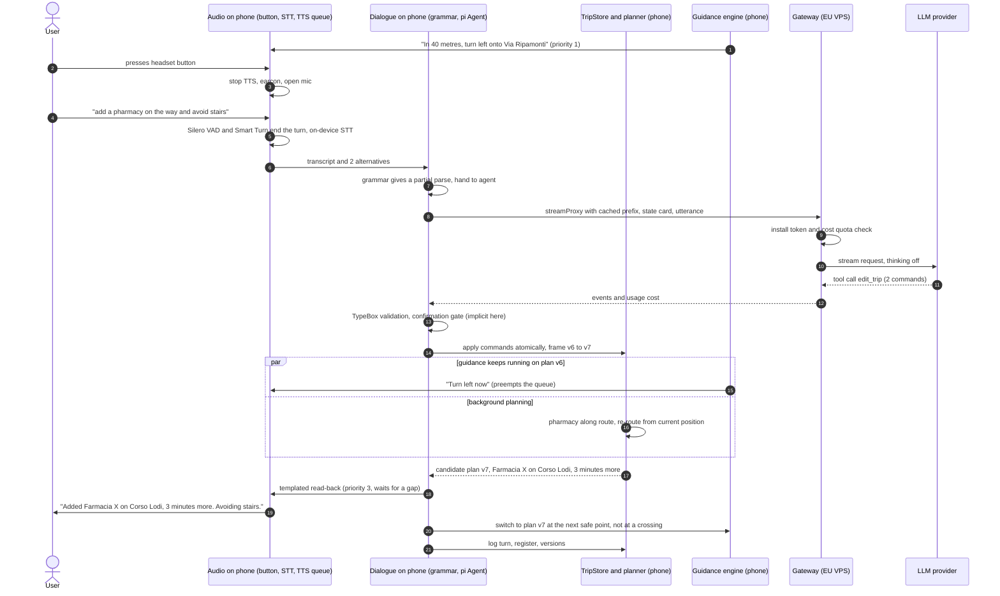

# G: Agent harness and dialogue runtime
27 Sep 2026. Tags: [V] verified in a primary source I fetched, [P] secondary source, [U] could not verify. Bracketed numbers refer to the Sources; letters A–F refer to the first-round reports.

## In short

1. **Harness: `@earendil-works/pi-agent-core` + `@earendil-works/pi-ai` (MIT), pinned to exact versions and wrapped behind Milo's own interface.** They give Milo a small agent loop with steering and follow-up queues, abort, validated tool calls, hooks that rebuild the context before every request, custom message types, JSON-serializable state, per-request cost, and one API over every provider the founders named. Runner-up: Vercel AI SDK v7. Last resort: Milo's own loop of about 300 lines, since the trip-frame design needs little orchestration.
2. **Where it runs: the dialogue loop runs on the phone, and the models sit behind a stateless quota gateway on the EU VPS.** The tools (engine, trip frame, place register) are local, so a tool call costs no network round trip. Offline, the same code falls back to the phone model. The trip memory never leaves the phone. The same package also runs in Node for corpus tests. A two-day Hermes spike decides this. If it fails, the same package runs on the VPS and the tools run on the phone over a WebSocket.
3. **OpenClaw: no.** It is a 311 MB personal-assistant gateway that stopped depending on Pi's agent core in May 2026, and it has a serious security record. Mastra, LangGraph.js, the OpenAI Agents SDK and Rasa are also out. Milo borrows two ideas from Rasa: the LLM emits commands, and failures are handled by named repair patterns.
4. **Voice: no server-side voice pipeline (Pipecat, LiveKit) in v1.** Recommended turn-taking: press to start; end on the phone with Silero VAD plus Smart Turn v3.2 (BSD-2, 8.7 MB), with a generous silence limit; stop Milo with a button, not with the voice.
5. **Models: the claim that open models beat Claude Haiku is half right.** The new open-weights Flash models are much cheaper and score higher on general intelligence. Being faster for a tool-calling turn is only partly supported: with thinking off, DeepSeek V4.1 Flash starts later than Haiku (1.16 s vs 0.65 s to first token) but streams three times faster; GLM-5.3-Flash cannot turn thinking off, Gemini 3.7/3.8 Flash cannot go below "low" thinking, and Gemini is not open-weights. No public tool-calling leaderboard covers any of them yet. Haiku 4.5 is only guaranteed until 15 Oct 2026. The harness is provider-neutral, so the corpus (plan A1) decides.

## 1. What the runtime must do

From E, the plan (§4.1) and today's decisions:
- **Multi-turn and tool-using.** The runtime must plan a trip, edit stops mid-trip, and answer questions about the map, places, junctions and earlier instructions. It chains tools only when needed.
- **The trip frame is the backbone (E §2).** The model emits typed commands; code applies them, resolves places, plans, and decides what to ask and say. The model never computes routes, distances or directions.
- **Interruptible.** A button press stops speech and cancels an in-flight request; new input can arrive while tools run.
- **Memory during the trip.** It keeps earlier requests, links between them ("the other one", "like before"), and every instruction spoken, so it can answer "what did you mean by that?".
- **Deterministic fast path first.** The grammar and router handle control commands in under 50 ms and offline; the agent only sees what they cannot parse.
- **Provider-neutral.** It must reach Anthropic, OpenAI, Gemini, DeepSeek, GLM, Qwen, Groq, Cerebras, OpenRouter and local llama.cpp, and the provider must be switchable per request so the corpus can pick.
- **Screen locked, poor network.** Guidance never depends on the network (D). Dialogue degrades to the phone model and grammar.

## 2. Candidates

| | Licence | Size, deps (npm/PyPI, 27 Sep) | Tool validation | Abort / steering | Persistence, compaction | Runs on phone (Hermes)? | Activity |
|---|---|---|---|---|---|---|---|
| **pi-ai + pi-agent-core** 0.87.1 | MIT [V 4,5] | pi-agent-core 5.1 MB unpacked; deps typebox, diff, yaml, ignore, chord, telemetry, pi-ai. pi-ai 4.7 MB, SDKs lazy-loaded [V 4,5] | TypeBox, validated before `execute`; strict mode where the provider supports it [V 2] | `abort()`, `steer()`, `followUp()` queues [V 3] | Context is plain JSON; SQLite backend (Node) in a separate package; `compact()` built in [V 2,3,5] | Core entries have no `node:` imports (tarballs inspected) [V 5]; Hermes run untested [U] | 109.7k stars; 49 releases 7 May–22 Sep 2026 [V 4,8] |
| **OpenClaw** 2026.9.6 | MIT [V 10] | 311 MB unpacked, Node ≥24.16 <25 or ≥26.1; 65 deps incl. playwright-core, @lydell/node-pty, express [V 10] | Own runtime (`@openclaw/ai`) | Gateway sessions | Markdown memory files + SQLite hybrid search [V 11] | No: server/desktop gateway plus companion apps [V 9] | 390.6k stars [V 8] |
| **Vercel AI SDK** `ai` 7.0.118 | Apache-2.0 [V 15] | 7.7 MB; deps @ai-sdk/* [V 15] | Zod or JSON Schema, `strict`, `repairToolCall` [V 18] | AbortSignal forwarded to tools; no steering queue [V 18] | Messages serializable, `pruneMessages()` in `prepareStep` [V 17] | Yes, documented for Expo ≥52 with `expo/fetch` and polyfills; recommends a server route [V 16] | 27.0k stars; majors Jul 2025, Dec 2025, Jun 2026 [V 8,15] |
| **Mastra** core 1.71.0 | Apache-2.0 except `ee/` dirs [V 20] | 69 MB, Node ≥22.13, includes hono, posthog-node [V 20] | via AI SDK | via AI SDK | Threads, working memory, semantic recall, observational memory; needs a store [V 21] | Not documented [U] | 28.4k stars [V 8] |
| **OpenAI Agents SDK JS** 0.18.0 | MIT [V 22] | core 10.4 MB, zod peer [V 22] | zod | runs, HITL approvals | Sessions [V 22] | Lists Node 22, Deno, Bun, Workers only; realtime agents in the browser [V 22] | 3.9k stars [V 8] |
| **LangGraph.js** 1.4.18 | MIT [V 23] | 4.4 MB + LangChain core [V 23] | via LangChain | interrupts | Checkpointers | `/web` entrypoint for runtimes without `async_hooks` [P 23] | 3.3k stars [V 8] |
| **Rasa CALM** (Rasa Pro) | Licence key; free Developer Edition up to 1,000 conversations/month [V 24] | Python server | LLM emits DSL commands [V 25] | repair patterns [V 26] | Tracker store | No | 21.3k stars (Open Source repo) [V 8] |
| **Pipecat** 1.12.0 | BSD-2 [V 27] | Python ≥3.11; RN transport exists [V 27] | n/a (voice pipeline) | Interruptions, Smart Turn | n/a | Client only; the pipeline runs on a server | 15.9k stars [V 8] |
| **LiveKit Agents** 1.8.3 / JS 1.9.1 | Apache-2.0 [V 28] | Python / Node server | n/a | Adaptive interruption, false-interruption resume, manual turns for push-to-talk [V 29] | n/a | Client only | 14.4k / 0.9k stars [V 8] |

**Provider coverage (pi-ai 0.87.1 catalog files vs AI SDK packages).**
- **Covered by both:**
  - Anthropic, OpenAI, Google Gemini, DeepSeek, Groq, Cerebras, OpenRouter, Mistral;
  - any OpenAI-compatible server (Ollama, vLLM, llama.cpp server). pi-ai reaches it through `createProvider()` [V 2]; the AI SDK through `@ai-sdk/openai-compatible` or the community `ollama-ai-provider-v2` [V 19].
- **Gaps in pi-ai (first-party endpoints only):**
  - its `zai` provider targets the GLM Coding Plan endpoint (`api.z.ai/api/coding/paas/v4`), so Z.ai's own pay-as-you-go endpoint needs a custom OpenAI-compatible entry;
  - Qwen's own provider is catalogued only as "Token Plan" subscriptions;
  - but third-party hosts in the same catalog already list both families: GLM-5.3-Flash under `together`, `fireworks`, `cloudflare-workers-ai` and `nvidia`; Qwen 3.x under `together`, `fireworks`, `groq`, `cerebras` and `huggingface`;
  - its DeepSeek catalog lists `deepseek-flash` and `deepseek-v4-pro` [V 2].
- **Gaps in the AI SDK:** none for the shortlist. It has official `@ai-sdk/alibaba` for Qwen and, since 26 Aug 2026, official `@ai-sdk/zai` (Apache-2.0, pay-as-you-go endpoint `api.z.ai/api/paas/v4`) for GLM; the community `zhipu-ai-provider` 0.4.0 is no longer needed [V 19].
- **Both are enough.** Every model on the shortlist is also on OpenRouter [V 41].

### Notes per candidate

**Pi (pi-ai, pi-agent-core).**
- **What it gives Milo.** The whole `Agent` is about 1,070 lines of JavaScript (`agent.js` + `agent-loop.js`) [V 5]. Its hooks match Milo's needs [V 3]:
  - `transformContext` / `prepareRequest` rebuild the model context from the canonical trip store before every request;
  - `convertToLlm` filters custom message types (guidance events, fast-path turns) out of what the model sees;
  - `beforeToolCall` can block a call, for example to hold a safety relaxation for confirmation;
  - `afterToolCall` or `terminate: true` ends the run without a second model call when every tool in the batch terminates;
  - tools run in parallel or in sequence;
  - `streamProxy` points the agent at a backend that holds the keys.
- **Provider layer.** pi-ai streams partial tool arguments, tracks tokens and cost per request (useful for quotas), passes a conversation between providers mid-session, and has a scripted "faux" provider for tests [V 2].
- **Licence.** Zechner (8 Apr 2026): "pi is MIT licensed. It will stay MIT licensed." Earendil will add Fair Source and proprietary tiers around it [V 7].
- **Risks.**
  - Churn: 49 releases in 20 weeks; `shouldStopAfterTurn` was removed in favour of `finishTurn` [V 3,4].
  - Scope creep toward the coding agent: pi-agent-core grew from 269 KB (0.73.1, deps typebox + pi-ai) to 5.1 MB (0.87.1), with coding-oriented compaction that tracks file operations and defaults to `keepRecentTokens: 20000` [V 5,6]. Milo will not use that compaction.
  - Issues from new contributors are auto-closed by default [V 1].
- **Mitigations.**
  - Pin exact versions and install with `--ignore-scripts`, as the Pi README itself does [V 1].
  - Keep a `Brain` interface in Milo so the loop can be swapped.
  - If needed, vendor the two MIT files.

**OpenClaw.** It is a personal assistant that "meets you in the channels you already use" through a Gateway [V 9]: the opposite of a light embedded runtime.
- **It no longer runs on Pi's agent core.** Its npm history shows `pi-agent-core` and `pi-ai` as dependencies (as `@mariozechner/*` up to 2026.5.10-beta.3, then as `@earendil-works/*`) up to 2026.5.27 (28 May 2026). From 2026.5.28-beta.1 only `pi-tui` remains, and from 2026.7.1-beta.4 its own `@openclaw/ai` appears [V 10,13].
- **Security record.** CVE-2026-32922 (CVSS 3.1 9.9, privilege escalation to remote code execution through device-token rotation, fixed in 2026.3.11) [V 12]. Koi Security's audit found 341 malicious skills among 2,857 on ClawHub (the "ClawHavoc" campaign, Feb 2026); Antiy later counted 1,184 [P 12].
- **What to borrow.** The memory design [V 11] is instructive: Markdown `USER.md` and `MEMORY.md`, daily notes, a "memory flush" before compaction, and "dreaming" consolidation. Milo should borrow the separation between a stable user profile and per-session notes, but keep both structured (§5.4). Free-text memory written by the model is wrong for safety preferences.

**Vercel AI SDK v7.**
- **Strengths.** It is the most mature option: `ToolLoopAgent`; `stopWhen` (`isStepCount`, `hasToolCall`, `isLoopFinished`); `prepareStep` to change model, `activeTools`, `toolChoice` and messages per step; `repairToolCall`; `toolApproval` [V 17,18]. It is also the only candidate with documented Expo support [V 16], and it has official provider packages for every shortlisted model, including GLM (`@ai-sdk/zai`) [V 19].
- **Against it for Milo.**
  - It has no steering or follow-up queue, only an AbortSignal.
  - It routes through the Vercel AI Gateway by default when given a bare model string, so it must be configured with direct providers [V 14].
  - There were three major versions in eleven months [V 15].
- **Verdict.** Choose it if the Pi spike fails on Hermes.

**Mastra, OpenAI Agents SDK, LangGraph.js.**
- **Mastra.** A full Node application framework with storage, a server (hono) and PostHog telemetry [V 20]. Its memory layers are the right idea at the wrong weight.
- **OpenAI Agents SDK.** Built around handoffs between agents and OpenAI Realtime; other providers come through an AI SDK adapter [V 22].
- **LangGraph.js.** Graphs and checkpointers solve durable workflows that Milo does not have.

**Rasa CALM.**
- **The idea to take.** E already takes its core idea: the LLM emits commands, deterministic flows execute them. The current command set includes `start flow`, `set slot`, `disambiguate flows`, `cancel flow`, `repeat message` [V 25]. Its repair patterns are a good checklist for Milo's failure handling: `pattern_correction`, `pattern_clarification`, `pattern_cannot_handle`, `pattern_skip_question`, `pattern_repeat_bot_messages`, `pattern_user_silence`, `pattern_human_handoff` [V 26].
- **Why not the product.** It is a Python server under a licence key [V 24].

**Pipecat and LiveKit Agents.** These are server-side real-time voice pipelines (WebRTC in, VAD, STT, LLM, TTS out); see §6.

## 3. Recommendation: Pi's loop, Milo's frame

**Architecture.** Create one runtime-neutral package, `@milo/dialogue`, like `@milo/engine`:
- a trip store: frame versions, registers, log;
- a command applier and templates;
- the fast path;
- a `Brain` that wraps pi-agent-core's `Agent`.

The same package runs in:
- Node for the corpus (with the faux provider and real providers);
- the phone app;
- the VPS if the spike fails.

**Model settings per turn.**
- Thinking off or minimal, because thinking time is paid before the first word (§7).
- Output at most about 200 tokens.
- Tool arguments in the language-neutral enums of E.

**Effort.**
- About 2 days for the Hermes spike.
- About 1–2 weeks for the brain, tools and context builder over the existing engine.
- About 3 days for the gateway.

These are my estimates, not measurements.

**Why not zero dependencies.** A custom loop is feasible: a typical Milo turn is one model call plus one tool batch. But pi-ai alone saves weeks of provider quirks:
- DeepSeek's `reasoning_content` must be passed back on tool turns [V 36];
- the thinking controls differ per provider [V 38,40];
- strict-mode differences;
- partial-JSON streaming;
- cost accounting.

pi-agent-core adds the queues and hooks for little weight. If Pi's churn becomes a burden, keep pi-ai and replace only the loop.

## 4. Where the agent runs

| Criterion | Loop on the phone, models via gateway (recommended) | Loop on the VPS |
|---|---|---|
| Tool calls (engine, frame, registers) | Local, no round trip | Each call crosses mobile data to the phone, or the engine and city pack are duplicated on the server |
| Offline | Same loop; `streamFn` switches to the phone model or the grammar | A second dialogue implementation on the phone |
| Privacy / GDPR (F §6) | Gateway is stateless: a request in, a stream out, no content logs. Trip memory stays on the phone | The server holds conversations and positions of disabled users: retention, breach and access obligations |
| Latency | One request per model call | Same, plus tool round trips |
| Updating prompts | Remote config (versioned prompt and tool descriptions from the gateway) | Instant |
| Runtime risk | Hermes compatibility [U] | None (Node) |
| Sighted companion view (item 5) | Phone pushes an opt-in, sanitized live state to the gateway | Server already has it |

**Runtime evidence.**
- Expo SDK 57 provides streaming `expo/fetch`, TextDecoder (UTF-8 only), web streams and `structuredClone` as globals [V 34], which covers what `streamProxy` uses (`response.body.getReader()`, `TextDecoder`) [V 5].
- pi-ai loads provider SDKs lazily [V 2]. The phone never needs them, because the gateway does the provider calls.
- **Hermes spike (must pass):** run `Agent` with the faux provider, then through the gateway, in an Expo SDK 57 dev build on a mid-range Android with the screen locked.

**The gateway (EU VPS, Node).**
- It runs pi-ai and implements the `/api/stream` endpoint that `streamProxy` calls [V 5] (about 150 lines to write).
- It authenticates a per-install token, since Milo has no accounts.
- It keeps an allow-list of models and caps daily cost from pi-ai's `usage.cost`.
- It logs nothing but counters.
- `web_search` runs there, so its key stays on the server.

**LiteLLM** (MIT core [V 44]) is the off-the-shelf alternative. It is a Python dependency in a second language, and versions 1.82.7–1.82.8 on PyPI were backdoored with a credential stealer for about 40 minutes on 24 Mar 2026 [V 44]. That argues for a small gateway on the same stack, with a lockfile and install scripts off.

## 5. Design: the harness hosts the trip frame

### 5.1 Layers

Each utterance goes through three layers:
1. **Control words** (stop, repeat, faster, where am I): handled instantly and never sent to a model.
2. **Grammar.** It handles compound sentences split at connectors (plan M9). When it produces a complete command list, code applies it directly. The turn is then written into the agent transcript as a custom `fastpath` message (the utterance, the commands and the read-back), so later turns can refer to it.
3. **Agent.** It gets everything else, including grammar partials, passed as hints.

**Offline or no quota.** The phone model makes one constrained call that returns E's command union. There is no tool loop: small models fail at multi-turn tool use (E §2, BFCL multi-turn scores). If that fails too, Milo asks one question at a time (§5.7).

### 5.2 Tool set

Eleven tools. The enums are shared with the engine (`TOOLS`, `AVOID_KINDS`, `PLACE_KINDS`). A place reference is E's `Place` (name, category, saved, here, or `ref`: last_place, ordinal, other). The tools execute on the phone unless marked otherwise.

| Tool | Arguments (sketch) | After execution | Confirmation (E policy, decided by code) |
|---|---|---|---|
| `edit_trip` | `commands`: 1–4 of E's union (`new_trip`, `edit`, `confirm`, `reject`, `undo`, `cancel`, `start`, `repeat`, `more`) | Terminates: templated read-back, no second model call | Explicit for start, safety relaxations, transit, low-confidence places; implicit otherwise. `beforeToolCall` holds these as pending |
| `clarify` | `understood`: commands (optional), `missing`: [destination, stop_kind, which_place, avoid, modes, time, unclear_words], `heard`: text | Terminates: code asks one question | – |
| `search_places` | `text` or `category`, `where`: here / along_route / near_destination, max 3 | Terminates: templated list, stored as "last list" | – |
| `ask_map` | `tool` ∈ engine `TOOLS`, `from`, `to`, `place`, `street` | Model phrases at most 2 sentences; number check | – |
| `describe_place` | `place`, `aspects`: [what_is_it, hours, entrance, access, contact] | Model phrases; number check | – |
| `describe_junction` | `which`: next / current / step, `step_id` | Crossing facts (islands, lanes, tram, tactile, signals); template or model | – |
| `trip_status` | `aspects`: [remaining, next_turn, eta, stops, gps_quality] | Terminates: template | – |
| `recall` | `kind`: instruction / request / place / list / answer, `ref`: last / previous / n_back / search, `text` | Model explains from the retrieved entry; may chain `describe_junction` | – |
| `profile` | `op`: set_preference / save_place, `key` or `name`, `value`, `scope`: trip / always | Terminates: template | Explicit when a safety preference is relaxed "always" |
| `web_search` (gateway) | `query` | Model answers, prefixed "according to the web" | – |
| `handoff_to_human` | `kind`: be_my_eyes / call_contact / share_live_view | Terminates | Always explicit |

**Final-answer checks.**
- Every free-text answer passes `speak.ts`'s number check. An answer with an unbacked number is replaced by the engine's own sentence (speaking rule 9).
- Answers are capped by the verbosity setting (E §5).
- pi-agent-core ends the run only when every tool in the batch terminates [V 3]. So "add the pharmacy and tell me when it closes" costs two model calls, and a plain edit costs one.

### 5.3 Context per turn

These are targets to measure, not facts.

| Block | Content | Tokens | Cached |
|---|---|---|---|
| System prompt | Role; never give routes, directions or "cross now"; answer in the user's language; at most 2 sentences; when to use `clarify` | ~500 | yes |
| Tool schemas | 11 tools; `edit_trip` carries E's union | ~1,200–1,800 | yes |
| State card | Mode (planning / guiding / paused / at_crossing); frame v_n; current street and next manoeuvre distance band; GPS quality; place register (≤8, with ids); last list; pending question | ~250–400 | no |
| Recent guidance | Last 3–5 spoken instructions with ids and age | ~100–150 | no |
| Request log | One code-written line per earlier request ("t3: added stop s1 pharmacy along route, +3 min") | ~100–200 | no |
| Dialogue tail | Last 3 exchanges verbatim | ~150–300 | no |
| User turn | Final transcript plus up to 2 ASR alternatives | ~30–80 | no |

**Keeping the cache.** The static prefix stays byte-identical. The dynamic blocks go into the last user message, so provider prompt caching keeps working; pi-ai exposes `cacheRetention` and `sessionId` [V 2].

**No compaction step.** Old turns survive as request-log lines written deterministically by code, not as LLM summaries. The context therefore stays at about 3k tokens for a trip of any length.

**Phone model.** It gets the ~200-token variant (E §3).

### 5.4 Memory during and across trips

**During the trip.** A `TripStore` on the phone (SQLite) persists after every turn:
- **frame versions:** every `edit_trip` makes v_{n+1}; undo goes back;
- **the place register:** every place mentioned or listed, with an id, the text heard and its source;
- **the last list read out;**
- **the trip log:** utterances, ASR alternatives, commands, read-backs, answers, and every guidance instruction with its id, step and position;
- **the serialized agent transcript:** pi's `Context` is plain JSON [V 2].

This covers each kind of recall:
- **Links to earlier requests:** `ref: last_place | other | ordinal` is resolved by code against the register (E M2).
- **"Like before":** `recall(kind: request)`.
- **"What did you mean by 'keep right at the fork'?":** `recall(kind: instruction, ref: last)` returns the instruction and the engine facts behind it. The model then explains, or calls `describe_junction(step_id)`.

The store survives the OS killing the app mid-trip.

**Across trips.** Only a structured profile carries over: preferences with scope `always`, saved places, verbosity and rate (plan M6). It is not free text, and the model never writes it without a confirmed `profile` call. Trip logs are kept for a short, user-visible period (open question).

### 5.5 Guidance events in the agent context

The guidance engine speaks by itself; the agent never generates guidance.

Each spoken instruction, off-route event, stop reached or GPS-quality change becomes a custom `AgentMessage` with role `guidance` in the transcript (declaration merging [V 3]):
- `convertToLlm` drops these messages from the message list;
- the context builder renders the latest ones in the state card (§5.3).

So guidance events never trigger a model call, and the model never answers them as if the user had spoken. Milo does not volunteer LLM speech during a walk: TIMELI found badly timed speech from multimodal models (E §1).

### 5.6 A mid-trip edit without stopping guidance

1. The edit makes frame v_{n+1}. The planner computes a candidate plan from the current snapped position and heading, while guidance keeps running on plan v_n.
2. **Speech priorities:** manoeuvre and safety instructions, then read-backs, then answers. A read-back waits for a gap and is cut and re-queued if an instruction becomes due (B: instructions always win).
3. The switch to plan v_{n+1} happens at a safe point: never inside a crossing zone and never just before a manoeuvre (plan M3). If the next manoeuvre changes, Milo says so before it is due.
4. If planning fails ("no pharmacy along this route"), guidance stays on v_n and Milo says why, offering the nearest alternative.
5. "Undo" swaps back to v_n and its plan.
6. **Open risk:** React Native runs JavaScript on one thread. A long route computation could delay the 1 Hz guidance tick. Measure planner time on a mid-range phone; above ~200 ms, move planning to a background JS runtime [U].

### 5.7 When a compound sentence is not understood (item 7)

**Signals of a failure:**
- schema validation fails twice (pi returns validation errors to the model as tool errors so it can retry [V 2,3]; allow one retry);
- the model calls `clarify`;
- a command references something unresolved or ambiguous;
- ASR confidence is low;
- the grammar leaves unparsed words.

**Response ladder, with the questions chosen by code:**
1. **Something was understood safely.** Apply the confident part, unless it is a start or a safety relaxation, and say what was understood. Then ask for the first missing slot, in a fixed order (destination, stops, avoid, modes, time): "Going to the Duomo on foot. You also mentioned a stop: what kind of place?"
2. **Nothing usable.** "I didn't get all of that. One thing at a time: where do you want to go?" Then walk the slots, each skippable with "that's all".
3. **Two failures on the same slot.** Offer to spell the name, choose from a short list, use a saved place, or type.

Every answer in the ladder is still parsed as a full utterance, so a user can recover with a compound sentence. The ladder follows plan M4 and Rasa's `pattern_clarification` and `pattern_cannot_handle` [V 26]. It should be tested against the corpus's compound and misrecognized items.

### 5.8 Barge-in and new input while working

- **A button press:** TTS stops, `agent.abort()` cancels the request [V 3], and the mic opens. If the press comes within a few seconds of the previous utterance, the two transcripts are sent as one turn.
- **An aborted `edit_trip` is never half-applied:** commands apply atomically only after validation.
- **Input that arrives while tools run** (for example "and avoid stairs" while places are being searched) goes through `agent.steer()`. It is injected after the current tool batch, so the model sees both [V 3].
- **An interrupted guidance instruction** is marked unheard and repeated if still relevant.

### 5.9 One mid-trip turn

## 6. Turn-taking for a walking user

**Start of a turn.** Push-to-talk stays the entry point (D §1): the headset button, the iOS magic tap, or the TalkBack two-finger double tap. It is a deliberate act in traffic, and it avoids wake-word licensing problems.

**End of a turn.** Blind users report being cut off by short speaking windows (E §1), so a fixed silence timer is wrong both ways. Recommended combination, all on the phone:
- **Silero VAD** (MIT [V 33]) for speech presence;
- **Smart Turn v3.2** on the audio of the whole turn:
  - BSD-2 for code and weights; 23 languages including English and Italian; 16 kHz input up to 8 s [V 31];
  - the CPU int8 ONNX file is 8.68 MB [V 32];
  - accuracy on its test set: English 94.26% (7,820 samples), Italian 94.50% (782) [V 32];
- a long ceiling (for example 3 s of silence) as a safety net;
- a second press, which always ends the turn.

**Caveats:**
- Smart Turn's test sets are mostly synthetic speech: about half of the 31,527 samples come from a set named after a TTS voice (`chirp3_1`, 16,254 samples; the `chirp3_*` sets together 24,786), and the two human-recorded sets have 492 (402 + 90) [V 32]. It has not been shown to work in street noise, so measure it on the outdoor part of corpus A1.
- The LiveKit turn detector is text-based and covers English (99.3% true positives, 87.0% true negatives) and Italian (99.3%, 85.1%) [V 30]. But its licence forbids use "on a standalone basis or with any other frameworks" than LiveKit Agents [V 30], so it is out.

**Barge-in: the button by default, not the voice.**
- Voice barge-in needs echo cancellation against Milo's own TTS. Bone-conduction and open headphones leak, and traffic and passers-by cause false interruptions.
- LiveKit had to add "false interruption" detection and resume for exactly this problem [V 29].
- A guidance instruction must not be cut by a horn.
- Offer voice barge-in as an option with a headset mic and a minimum speech duration.

**Follow-up window.** After Milo asks a question, opening the mic automatically for a few seconds saves a press, but risks capturing noise. Default it on only when the user is stationary, and never at a crossing. This must be tested with users.

**Server-side voice pipelines (Pipecat, LiveKit): not in v1.** They stream audio over a WebRTC session to a server for STT, the LLM and TTS. For Milo:
- guidance must keep working locked and offline;
- a continuous media session in the background costs battery and fails with the network;
- raw voice would leave the phone (privacy);
- their main gain, sub-second voice-to-voice latency for chatty assistants, matters little for push-to-talk commands.

**Where they could fit later:**
- a live call with a sighted helper who sees Milo's view (LiveKit or Pipecat rooms have RN clients [V 27,28]);
- a camera "describe the entrance" mode in phase 2 with a speech-to-speech model (Google lists `gemini-3.8-live` [V 39]; OpenAI Realtime through the Agents SDK [V 22]).

Revisit both then.

## 7. Models: checking the initial claim

| Model | Released | Open weights | Thinking control | AA speed / first token | Price per M tokens in/out | BFCL V4 |
|---|---|---|---|---|---|---|
| Claude Haiku 4.5 | Oct 2025 [V 41]; retirement not before 15 Oct 2026 [V 48] | no | optional | 80.9 tok/s, 0.65 s, non-reasoning [P 42] | $1 / $5 [V 41,48] | 68.70%, 1.68 s mean [V 43] |
| DeepSeek V4.1 Flash (`deepseek-flash`) | 10 Sep 2026 [V 35] | yes, MIT [V 45] | on by default, can be disabled [V 36] | 242.0 tok/s, 1.16 s with thinking off (index 25); 221.7 tok/s, 1.15 s at "max" [P 42] | $0.30 / $1.20 at DeepSeek, half off-peak [V 46]; from $0.035 / $0.29 on OpenRouter (cheapest third-party host) [V 41] | not listed [V 43] |
| GLM-5.3-Flash | 26 Aug 2026 [V 37] | yes, MIT [V 45] | "forced thinking and cannot be disabled" [V 38] | 53.3 tok/s, 3.10 s [P 42] | $0.15 / $0.50 at Z.ai [V 47]; from $0.045 / $0.14 on OpenRouter [V 41] | not listed |
| Gemini 3.8 Flash | 2 Sep 2026 on OpenRouter [V 39,41] | **no** | minimum "low" on 3.7/3.8 Flash; 3.6 Flash allows "minimal" [V 40] | 277.9 tok/s, 23.49 s at "high" [P 42] | $0.75 / $3.75 [V 41] | not listed |

**Verdict.**
- **Cheaper and "smarter" on Artificial Analysis' index:** yes. Haiku scores 15–17; the others score 39–42 at their reasoning settings, and DeepSeek V4.1 Flash still scores 25 with thinking off [P 42].
- **Faster for Milo's 1–2 s tool-call turn:** partly. DeepSeek V4.1 Flash with thinking off starts 0.5 s later than Haiku but streams three times faster, so the two are roughly even on a short tool call and DeepSeek wins on longer answers (measured on DeepSeek's own API; EU hosts will differ) [P 42]. For GLM-5.3-Flash and Gemini 3.7/3.8 Flash it is not shown: forced or minimum thinking adds time before the first token.
- **Haiku as a baseline is time-limited:** Anthropic only commits to Haiku 4.5 until 15 Oct 2026 and has no newer Haiku [V 48], another reason not to bind to Anthropic.
- **Better at tool calls:** unknown. BFCL V4, fetched today, has no rows for DeepSeek V4.x, GLM-5.x or Gemini 3.5+ Flash [V 43].
- **Hosting.** DeepSeek's and Z.ai's own APIs are Chinese services. For EU users with inferred disability data (F §6), use EU-hosted serving of the open weights [U: which hosts, with DPAs].

The harness makes this a configuration choice. The corpus runs every candidate with thinking off or at its minimum, scores exact frame match and time to the tool call, and the fastest model that meets the criteria becomes the default (plan decision 6).

## 8. What to keep from the repo

**Keep:**
- `@milo/engine`: the tools execute on it;
- `grammar.ts`, extended to compound sentences producing command lists;
- `router.ts`, with the encoder swap from E;
- `speak.ts`'s number check;
- `strings.ts` as the start of the templates.

**Replace:**
- `commands.ts` (one action per utterance), with E's union;
- `interpret.ts`, with the fast path followed by the `Brain`;
- the `llm/*` cloud adapters, with pi-ai on the gateway and `streamProxy` on the phone.

`local.ts` survives as the single-shot constrained parser. `server-py` retires. The old `web` live map is a starting point for the companion view.

## 9. Order of work (harness only)

**In parallel:**
- **S0** Hermes spike (2 days; it decides §4);
- **S1** English corpus of about 400 turns (plan A1) with compound, correction, reference and misrecognized items, part of them recorded outdoors;
- **S2** `TripStore`, command applier and templates in Node, tested;
- **S3** gateway on the VPS: pi-ai proxy endpoint, tokens, cost caps, no content logs.

**Then, in series:**
- **S4** the brain: tools, context builder, confirmation gate, number check, fast-path logging. Evaluate models on S1 (needs S2 and S3);
- **S5** audio loop on the phone: push-to-talk, STT, VAD with Smart Turn, TTS priorities, barge-in. It can start with S4 on stub brains;
- **S6** mid-trip edits with live guidance, then a field test in Milan (needs S4, S5 and guidance).

**Split between two developers:** gateway and evaluation (S1, S3, S4 scoring) on one side; phone and audio (S0, S5) on the other; S2 shared.

## 10. Open questions

1. **Hermes spike:** does pi-agent-core run on Expo SDK 57 with `streamProxy`, with the screen locked on Android and iOS?
2. **English first, in Milan:** English speech recognition must still catch Italian street names. Does the corpus need English sentences with Milanese names, and do hotwords (E §4) work in the English models?
3. **Hosting:** which EU-hosted providers serve the shortlisted open-weights models, with a DPA and no content retention?
4. **Quota and abuse without accounts:** what daily cost cap per install, and is device attestation needed?
5. **Automatic follow-up mic, and voice barge-in with bone-conduction headphones:** these need a test with blind users.
6. **Planner time on a mid-range phone:** is it fast enough for mid-trip re-planning on the JS thread (§5.6)?
7. **Trip log retention and cross-trip history:** how long, and opt-in by default?
8. **`web_search` provider:** which one, and how to mark unverified facts when they are spoken.

## Sources

1. earendil-works/pi, README (main, fetched 27 Sep 2026). https://raw.githubusercontent.com/earendil-works/pi/main/README.md
2. pi-ai README. https://raw.githubusercontent.com/earendil-works/pi/main/packages/ai/README.md (and 0.87.1 tarball catalogs: https://registry.npmjs.org/@earendil-works/pi-ai/-/pi-ai-0.87.1.tgz)
3. pi-agent-core README. https://raw.githubusercontent.com/earendil-works/pi/main/packages/agent/README.md
4. npm registry, @earendil-works/pi-ai (0.87.1, 22 Sep 2026; 49 versions since 7 May 2026). https://registry.npmjs.org/@earendil-works/pi-ai
5. npm registry, @earendil-works/pi-agent-core 0.87.1 and tarball. https://registry.npmjs.org/@earendil-works/pi-agent-core
6. npm registry, @mariozechner/pi-agent-core and pi-ai (last 0.73.1, 7 May 2026). https://registry.npmjs.org/@mariozechner/pi-agent-core
7. M. Zechner, "I've sold out", 8 Apr 2026. https://mariozechner.at/posts/2026-04-08-ive-sold-out/
8. GitHub search API, stars and dates, 27 Sep 2026. https://github.com/earendil-works/pi, https://github.com/openclaw/openclaw, https://github.com/vercel/ai, https://github.com/mastra-ai/mastra, https://github.com/openai/openai-agents-js, https://github.com/langchain-ai/langgraphjs, https://github.com/RasaHQ/rasa, https://github.com/pipecat-ai/pipecat, https://github.com/livekit/agents
9. OpenClaw README. https://raw.githubusercontent.com/openclaw/openclaw/main/README.md
10. npm registry, openclaw (2026.9.6, 23 Sep 2026; version history). https://registry.npmjs.org/openclaw
11. OpenClaw docs, Memory. https://docs.openclaw.ai/concepts/memory
12. OpenClaw security: CVE record https://app.opencve.io/cve/CVE-2026-32922; Koi Security audit as reported by The Hacker News, 2 Feb 2026 https://thehackernews.com/2026/02/researchers-find-341-malicious-clawhub.html; https://unit42.paloaltonetworks.com/openclaw-ai-supply-chain-risk/. (The earlier betterclaw.io source is a competitor's marketing blog and was dropped.)
13. npm registry, @openclaw/ai. https://registry.npmjs.org/@openclaw/ai
14. AI SDK README. https://raw.githubusercontent.com/vercel/ai/main/packages/ai/README.md
15. npm registry, ai (7.0.118; 5.0.0, 6.0.0, 7.0.0 dates). https://registry.npmjs.org/ai
16. AI SDK, Expo quickstart. https://ai-sdk.dev/docs/getting-started/expo
17. AI SDK, Loop control. https://ai-sdk.dev/docs/agents/loop-control
18. AI SDK, Tools and tool calling. https://ai-sdk.dev/docs/ai-sdk-core/tools-and-tool-calling
19. npm registry, AI SDK providers. https://registry.npmjs.org/@ai-sdk/deepseek, https://registry.npmjs.org/@ai-sdk/alibaba, https://registry.npmjs.org/@ai-sdk/zai (3.0.19, 25 Sep 2026; first published 26 Aug 2026), https://registry.npmjs.org/zhipu-ai-provider, https://registry.npmjs.org/ollama-ai-provider-v2
20. Mastra LICENSE and npm @mastra/core 1.71.0. https://raw.githubusercontent.com/mastra-ai/mastra/main/LICENSE.md, https://registry.npmjs.org/@mastra/core
21. Mastra docs, Memory overview. https://mastra.ai/docs/memory/overview
22. OpenAI Agents SDK JS README; npm @openai/agents-core and agents-extensions 0.18.0. https://raw.githubusercontent.com/openai/openai-agents-js/main/README.md, https://registry.npmjs.org/@openai/agents-extensions
23. npm @langchain/langgraph 1.4.18; LangGraph web entrypoint. https://registry.npmjs.org/@langchain/langgraph, https://reference.langchain.com/javascript/langchain-langgraph/web
24. Rasa Pro introduction and licensing. https://rasa.com/docs/pro/intro
25. Rasa, LLM command generators. https://rasa.com/docs/reference/config/components/llm-command-generators/
26. Rasa, conversation repair patterns. https://rasa.com/docs/reference/primitives/patterns/
27. PyPI pipecat-ai 1.12.0; npm @pipecat-ai/react-native-daily-transport 1.8.0. https://pypi.org/pypi/pipecat-ai/json, https://registry.npmjs.org/@pipecat-ai/react-native-daily-transport
28. PyPI livekit-agents 1.8.3; npm @livekit/agents 1.9.1, @livekit/react-native 3.0.0. https://pypi.org/pypi/livekit-agents/json, https://registry.npmjs.org/@livekit/agents
29. LiveKit Agents, Turns overview. https://docs.livekit.io/agents/logic/turns/
30. LiveKit turn-detector model card and LiveKit Model License. https://huggingface.co/livekit/turn-detector
31. Smart Turn v3.2 README. https://raw.githubusercontent.com/pipecat-ai/smart-turn/main/README.md
32. Smart Turn v3 files and v3.2 CPU benchmark. https://huggingface.co/pipecat-ai/smart-turn-v3
33. Silero VAD licence (MIT); PyPI 6.2.3. https://raw.githubusercontent.com/snakers4/silero-vad/master/LICENSE
34. Expo SDK 57, `expo` package (fetch, streams, TextDecoder, structuredClone). https://docs.expo.dev/versions/latest/sdk/expo/
35. DeepSeek API change log. https://api-docs.deepseek.com/updates/
36. DeepSeek, thinking mode. https://api-docs.deepseek.com/guides/thinking_mode
37. Z.ai release notes. https://docs.z.ai/release-notes/new-released
38. Z.ai, thinking mode. https://docs.z.ai/guides/capabilities/thinking-mode
39. Gemini API, models. https://ai.google.dev/gemini-api/docs/models
40. Gemini API, thinking. https://ai.google.dev/gemini-api/docs/thinking
41. OpenRouter models and endpoints API (prices, release timestamps), 27 Sep 2026. https://openrouter.ai/api/v1/models
42. Artificial Analysis model pages. https://artificialanalysis.ai/models/claude-4-5-haiku, https://artificialanalysis.ai/models/deepseek-v4-1-flash, https://artificialanalysis.ai/models/deepseek-v4-1-flash-non-reasoning, https://artificialanalysis.ai/models/glm-5-3-flash, https://artificialanalysis.ai/models/gemini-3-8-flash
43. Berkeley Function Calling Leaderboard V4, overall CSV (fetched 27 Sep 2026). https://gorilla.cs.berkeley.edu/data_overall.csv
44. LiteLLM licence and March 2026 security incident. https://raw.githubusercontent.com/BerriAI/litellm/main/LICENSE, https://docs.litellm.ai/blog/security-update-march-2026
45. Hugging Face model pages (licence MIT, open weights). https://huggingface.co/deepseek-ai/DeepSeek-V4.1-Flash, https://huggingface.co/zai-org/GLM-5.3-Flash
46. DeepSeek API pricing. https://api-docs.deepseek.com/quick_start/pricing
47. Z.ai pricing. https://docs.z.ai/guides/overview/pricing
48. Anthropic, Models overview (Haiku 4.5 price and retirement date), fetched 27 Sep 2026. https://platform.claude.com/docs/en/models/overview

## Verification (27 Sep 2026)

An adversarial check of 30 claims, against the npm registry and tarballs, Hugging Face, PyPI, the GitHub search API and official docs.

**Confirmed as written:**
- Pi: `@earendil-works/pi-ai` and `pi-agent-core` 0.87.1 published 22 Sep 2026; 49 versions since 7 May; `@mariozechner/*` stopped at 0.73.1 (7 May); MIT; dependency lists and sizes (5.1 MB, 4.7 MB, 269 KB for 0.73.1).
- The pi-agent-core tarball: `agent.js` 433 + `agent-loop.js` 637 lines. No `node:` imports anywhere in the import closure of the main entry, including `@earendil-works/chord/context` and `pi-telemetry`. Node-only code sits under `./node`. `streamProxy` calls `fetch` on `${proxyUrl}/api/stream` with `getReader()` + `TextDecoder`. `keepRecentTokens: 20000`. `shouldStopAfterTurn` was replaced by `finishTurn`. Steering is still polled after a terminating tool batch, so §5.8 holds. The README confirms `--ignore-scripts` and the auto-closing of issues from new contributors.
- pi-ai: `zai` points at `api.z.ai/api/coding/paas/v4`; the DeepSeek catalog is `deepseek-flash` and `deepseek-v4-pro`; provider SDKs load lazily.
- OpenClaw 2026.9.6 (23 Sep): MIT, 311.4 MB, Node `>=24.16.0 <25 || >=26.1.0`; the Pi agent core was dropped from 2026.5.28-beta.1.
- Zechner quote and the Fair Source and proprietary tiers.
- AI SDK: `ai` 7.0.118, Apache-2.0, 7.7 MB; majors 31 Jul 2025, 22 Dec 2025 and 25 Jun 2026; `isStepCount`, `hasToolCall` and `isLoopFinished` are exported; the Expo guide requires SDK ≥52 and uses `expo/fetch` and polyfills; bare model strings go to the AI Gateway by default.
- Expo SDK 57 installs `expo/fetch` as the global `fetch`, with streams, `structuredClone` and a UTF-8-only `TextDecoder`.
- LiveKit licence clause and the Italian 99.3% / 85.1%.
- Smart Turn: BSD-2, 23 languages, 16 kHz input up to 8 s, v3.2 CPU file 8,679,182 bytes, English 94.26% (7,820) and Italian 94.50% (782).
- Z.ai: forced thinking on GLM-5.3 and GLM-5.3-Flash. GLM-5.3-Flash released 26 Aug 2026.
- Gemini: thinking levels for 3.8, 3.7 and 3.6 Flash; `gemini-3.8-live` listed.
- DeepSeek: V4.1 Flash released 10 Sep as `deepseek-flash`; thinking on by default at `high` and can be disabled; `reasoning_content` must be passed back.
- Artificial Analysis figures for all four models; Haiku reasoning index 17.
- BFCL V4: Haiku 4.5 (FC) 68.70% at 1.68 s, and no rows for DeepSeek V4.x, GLM-5.x or Gemini 3.5+ Flash.
- OpenRouter prices for Haiku ($1 / $5) and Gemini 3.8 Flash ($0.75 / $3.75); Haiku 4.5 is still the newest Haiku.
- Rasa Developer Edition: 1,000 conversations per month. Rasa commands and patterns.
- The LiteLLM backdoor (first-party post). Star counts. Mastra, OpenAI Agents SDK, LangGraph, Pipecat and LiveKit versions and licences.

**Corrected:**
- **AI SDK GLM support.** There is an official `@ai-sdk/zai` (Apache-2.0, first published 26 Aug 2026), so "GLM only through the community `zhipu-ai-provider`" was wrong.
- **pi-ai "gaps".** Only the first-party Z.ai and Qwen endpoints are missing. GLM-5.3-Flash and Qwen 3.x are already catalogued through Together, Fireworks, Groq, Cerebras, Cloudflare and others.
- **DeepSeek V4.1 Flash price.** $0.035 / $0.29 is the single cheapest third-party host on OpenRouter; DeepSeek's own price is $0.30 / $1.20 ($0.15 / $0.60 off-peak). Both are now shown.
- **GLM-5.3-Flash price.** Now sourced to Z.ai ($0.15 / $0.50), with the OpenRouter minimum ($0.045 / $0.14) added.
- **Open weights.** "Open weights, MIT" for DeepSeek V4.1 Flash and GLM-5.3-Flash is upgraded from [P] to [V] via Hugging Face.
- **Speed verdict.** It now uses Artificial Analysis' thinking-off DeepSeek figures (242.0 tok/s, 1.16 s, index 25) and changes from "not shown" to "partly". The recommendation is unchanged: the corpus still decides, because no tool-calling benchmark exists.
- **Haiku retirement.** Haiku 4.5's commitment runs only to 15 Oct 2026 (Anthropic models page); this is added.
- **OpenClaw.** The dependency timeline is made precise (the Pi agent core stays until 2026.5.27; `@openclaw/ai` appears from 2026.7.1-beta.4), and the dependency count is 65, not ~60.
- **OpenClaw security.** The CVE is now [V] via its CVE record. The skills count is made specific: 341 of 2,857 (Koi), later 1,184 (Antiy). The betterclaw.io source, a competitor's marketing blog, is replaced.
- **Smart Turn.** Its human-recorded test data is 492 samples (402 + 90), not 402, and `chirp3_1` is about half of all samples.
- **LiveKit.** English turn-detector figures added (99.3% / 87.0%).
- **LiteLLM incident.** Upgraded from [P] to [V].

**Not checked:** the Unit 42 article's content (the URL resolves); Mastra's memory docs; the LangGraph `/web` entrypoint; the effort estimates in §3, which are the author's own.
