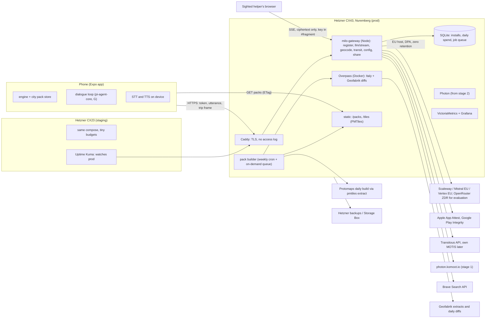

# I: Own server (VPS): architecture, quota, costs, data pipeline, GDPR minimum
27 Sep 2026. Tags: [V] verified in a primary source I fetched, [P] secondary source, [U] could not verify, [M] my own measurement or calculation. Bracketed numbers refer to the Sources; letters A–H refer to the other reports. Not legal advice.

## In short

1. **One Hetzner CX43 in Germany for production (8 vCPU, 16 GB, 160 GB, €15.99/month) plus one CX23 for staging (€5.49).** Both prices are the new ones, in force since 15 June 2026, and exclude the primary IPv4, which is billed separately [V 1,4]. Every server workload at 10 users fits on the CX43; self-hosted Photon (stage 2, around 100 users) needs a rescale to a CX53 (§3, §13). At 1,000 users, add a data server for geocoding and Overpass.
2. **The LLM gateway is a thin Node service built on pi-ai, as G recommends.** It has an allow-list of models, per-install daily budgets in SQLite, failover on time-to-first-token, and writes no content anywhere. LiteLLM is the runner-up. It needs Postgres for budgets, and by default it writes one spend-log row per request (key, user, model, cost, time), which amounts to a per-install activity log unless it is turned off [V 12,13]. OpenRouter is used for corpus evaluation and as a secondary failover, not as the EU default.
3. **The default model is served in the EU, under a DPA and with zero retention.** Candidates: Scaleway (DeepSeek V4 Flash, Mistral), Mistral's EU endpoint, Gemini on Vertex EU. The cheapest per-token prices the founders have seen come from hosts outside the EU. DeepSeek's own API is excluded: on 30 Jan 2025 the Garante ordered DeepSeek's two Chinese operating companies to stop processing Italian users' data [V 32]. The order names the chatbot service, and I did not check whether it has since been lifted [U]; the exclusion stands anyway, because content would go to China.
4. **Quota without accounts:** an anonymous install token issued after App Attest (iOS) or Play Integrity (Android) [V 34,35,36], plus invite codes for the beta. It is backed by per-install and per-IP rate limits, a daily per-install cost cap and a global circuit breaker. When the quota runs out, Milo falls back to the grammar and the phone model. Guidance never stops.
5. **City packs** are built on the server from Geofabrik extracts by a private Overpass instance. It runs the engine's own queries, so parity is exact and the engine does not change. Packs are split into 1 km tiles in the engine's current Overpass JSON, gzipped, and served as static files from the VPS. Central Milan measures about 0.8 MB gzipped per 9 km² [M]. The companion map uses a PMTiles extract of the Protomaps daily build [V 53].
6. **Geocoding and transit go through our server,** so users' IP addresses never reach third parties. Early on, the server forwards to public Photon and Transitous. Later it hosts its own Photon, and its own MOTIS if Transitous declines: Transitous forbids commercial use and asks to be contacted before routing traffic [V 64].
7. **Live share for a sighted helper:** the gateway relays only ciphertext. The key sits in the link's `#fragment`, as in Excalidraw [V 69]. I found no public Be My Eyes API to push a link into a call [U]; the realistic version is a link sent through any messenger.
8. **The GDPR minimum comes before the first external tester:**
   - a privacy policy, which both stores require even for testing tracks [V 80,83];
   - explicit consent for special-category data (Art. 9(2)(a) [V 75]), and Apple's explicit permission before sharing data with "third-party AI" [V 83];
   - the AI Act Art. 50 disclosure, applicable since 2 Aug 2026 [V 85];
   - DPAs with every processor, a one-page Art. 30 record [V 76], and a DPIA written before external testers use the server.

   Until a legal entity exists, the founders are joint controllers as natural persons.
9. **Cost:**
   - about €26–30/month at 10 users;
   - €50–95 at 100 users;
   - €190–700 at 1,000 users, depending mostly on the model [M, §13].

## 1. What the server does, and what it must not do

The plan's principle "nessun server nostro che riceva dati degli utenti" (plan §3) no longer holds. The new principle: **the server sees only what a single turn needs, keeps it in memory for that turn, and stores nothing but counters.**

| Function | Why on the server | What reaches it | Stored |
|---|---|---|---|
| LLM gateway | No user API keys; keys and budget stay server-side | Utterance, trip frame (place names, rounded positions), install token | Daily cost counter per install |
| Install registration | Abuse control without accounts | Attestation object, install ID | Hash of the install ID, creation date, platform, flags |
| City packs | Replaces per-trip Overpass queries from phones (plan §3, problem 2) | City name or bbox for on-demand builds | Nothing per user |
| Geocoding and transit proxy | Hides user IPs from komoot and Transitous; lets us swap backends without an app update | Query text, rounded bias point, trip endpoints | Nothing; responses cached by query only |
| Live-share relay | The phone cannot reach the helper directly | Ciphertext only | Last message in RAM, with a TTL |
| Remote config | Prompts and tool descriptions versioned without app releases (G §4) | Nothing | — |

**It must not:**
- hold trip memory or history (it stays on the phone, G §5.4);
- keep access logs with IPs, request bodies, or content in error reports;
- use analytics SDKs, or send install IDs to model providers;
- sit on the safety path: if the server is down, guidance continues on the phone (D, G);
- send content to a provider without a DPA and a zero- or short-retention setting;
- send content to Chinese first-party APIs.

## 2. Deployment

| Component | Software (licence, version seen 27 Sep 2026) | Role | Effort |
|---|---|---|---|
| Reverse proxy | Caddy (Apache-2.0). No access log unless the `log` directive is set; an `ip_mask` filter exists [V 73] | TLS, static files, routing | 0.5 day |
| Gateway | Node + Hono 4.13.9 (MIT) or Fastify 5.12.5 (MIT) [V 74]; `@earendil-works/pi-ai` 0.87.1 (MIT) [V 19] | LLM proxy, budgets, geocode and transit proxy, share relay | 3–4 days (G's S3) |
| Rate limiting | rate-limiter-flexible 11.2.1 (ISC), in-memory [V 41] | Per install and per IP | Included above |
| Attestation check | node-app-attest 1.0.1 (MIT, Feb 2026) [V 40]; Google `decodeIntegrityToken` through googleapis (Apache-2.0) [V 74] | Registration | 2–3 days |
| Storage | better-sqlite3 13.0.3 (MIT) [V 74] | Registry, counters, job queue | — |
| Overpass | wiktorn/overpass-api Docker image (image updated 1 Aug 2026, ~669k pulls; Overpass itself AGPL-3.0) [V 44,48] | Pack source, private fallback | 1 day |
| Pack tools | osmium-tool (GPL-3.0) [V 49], pyosmium 4.3.1 (BSD-2) [V 50], pmtiles 4.5.0 (BSD-3) [V 54] | Extracts, companion tiles | 3–5 days |
| Metrics | prom-client 15.1.3 (Apache-2.0), VictoriaMetrics (Apache-2.0), Grafana, Uptime Kuma (MIT) [V 74] | Counters only | 1 day |
| Deploy | Docker Compose; GitHub Actions → GHCR → SSH `compose pull && up -d` | prod and staging | 1 day |

These are server-side tools that we do not distribute, so AGPL and GPL are compatible with an MIT app. If we modify Overpass and expose it, we must publish the changes.

## 3. VPS providers and sizing

| Provider | Plan: vCPU / RAM / disk | €/month excl. VAT | Notes |
|---|---|---|---|
| **Hetzner** DE/FI | CX23 2/4 GB/40 GB; CX33 4/8/80; **CX43 8/16/160**; CX53 16/32/320 | 5.49; 8.49; **15.99**; 29.49, excl. IPv4 [V 1] | 20 TB traffic in the EU [V 2]. The primary IPv4 is billed separately from the server [V 4]; its fee (under €1/month) is left out of §13 [U: amount]. On 15 Jun 2026 CX/CAX rose 30–38% and CPX/CCX 2.1–2.75×; servers ordered earlier keep their legacy price, but a rescale moves them to current pricing [V 1][P 3]. Backups cost 20% of the server price for 7 slots [V 4] |
| OVHcloud | VPS-2 4/8/75; VPS-3 6/12/100; VPS-4 8/24/200 | "from" 7.21; 10.40; 19.96 (links to 12-month upfront pricing) [V 7] | Daily backup included [V 7]; best RAM per euro |
| netcup | VPS 1000 4/8/128; VPS 2000 8/16/256 | 14.50; 26.92 on a 12-month term [V 8] | Vienna, Nuremberg, Amsterdam [V 8] |
| IONOS | VPS L+ 4/8/240; XL+ 8/16/480 | $25; $47 after a 3-month promo (US storefront) [V 9] | Datacentres in DE and ES [V 9] |
| Scaleway | DEV1-M 3/4 | ~14.74, plus IPv4 and storage [V 10] | Expensive as a VPS; useful for its LLM APIs (§4) |
| Contabo | — | page returned 403 [U] | — |

**Recommendation.**
- **Hetzner CX43 (x86)** in Nuremberg or Falkenstein. The x86 CX43 is cheaper than the Arm CAX31 (€20.99 [V 1]) and avoids Arm image gaps.
- Rescaling reprices only servers still on pre-June legacy prices [V 1]. A server ordered now is already on current prices, so start with the size needed now (CX43) and rescale to a CX53 when self-hosted Photon arrives. (Corrected on verification: the earlier advice to buy 12 months of headroom up front rested on a misreading of the repricing rule.)
- The plans page showed "not available" at fetch time; check stock [U].
- Runner-up: OVH VPS-3 or VPS-4, if RAM matters more than the network allowance.

| Workload | RAM | Disk | Source |
|---|---|---|---|
| Gateway and relay | 0.25–0.5 GB | <1 GB | [U] estimate; I/O-bound |
| Overpass, Italy only, no metadata or history | 2–4 GB | ~10–20 GB | [U] scaled from the full planet: 200–300 GB compressed with metadata and history, 32 GB RAM on the main instance [V 45]; Italy PBF 2.1 GB vs Europe 32.6 GB [V 42,43] |
| Pack builds | 2–4 GB, in bursts | 5–10 GB | Planetiler guidance: RAM about 0.5× the PBF size [V 52] |
| Photon for Italy plus 2–3 countries | 4–8 GB | 10–20 GB | [U]; Italy JSON dump 594.6 MB [V 60] |
| Photon for Europe | 32–64 GB | 60–100 GB | [U]; Europe DB dump 32.1 GB compressed; planet needs ~95 GB disk and "at least 64GB RAM" [V 58,60] |

**Staging:**
- A CX23 running the same Compose file, with separate provider keys capped at a few euros.
- A separate app build flavour points to it.
- `main` deploys to staging; a tag promotes to prod.
- Staging also runs Uptime Kuma against prod.

**Backups:**
- Hetzner backups (+€3.20) from day 1.
- `restic` of the SQLite file and configs to a Storage Box BX11 (1 TB, €3.20 in a Feb 2026 listing [P 6]; Hetzner's page loads the live price by script and I could not read it, so recheck it after the June changes) once invite codes or registrations matter.
- Packs and tiles can be rebuilt, so skip them.

## 4. LLM gateway

| Option | State | Per-install budget | Failover | Content logging | Verdict |
|---|---|---|---|---|---|
| **Thin Node gateway on pi-ai** | MIT; pi-ai 0.87.1, 22 Sep 2026 [V 19] | Write it: SQLite counter from pi-ai's per-request cost (G §4) | Write it: ordered list per model role, switch if no first token in ~2.5 s, 60 s cooldown per provider | Nothing written by default | **Recommended.** Same stack as the phone, ~300 lines |
| LiteLLM proxy | MIT core; 1.102.1 latest, uploads to 25 Sep 2026 [V 15] | Virtual-key and end-user budgets, TPM/RPM limits; **needs Postgres**; per-model budgets are Enterprise [V 12] | `fallbacks`, `num_retries`, `allowed_fails`, `cooldown_time` [V 14] | Content is not stored by default (opt-in `store_prompts_in_spend_logs`), but spend and error rows are written per request unless `disable_spend_logs` and `disable_error_logs` are set. Callbacks forward messages unless `turn_off_message_logging` is set [V 13]. PyPI backdoor episode in March 2026 (G) | Runner-up, if we want zero gateway code |
| Portkey gateway | Repository LICENSE is MIT [V 16]; everything open-sourced 24 Mar 2026, including governance and cost controls [V 17]; Palo Alto Networks announced it would acquire Portkey on 30 Apr 2026 [P 18]; last npm release 1.15.2, 12 Jan 2026 [V 16] | Yes, per [V 17] | Yes | Configurable | No: ownership is in flux (deal not yet closed per [P 18]) and it is too large |
| OpenRouter as upstream | 5.5% fee; EU in-region routing only on Business (8%) or Enterprise [V 20]; per-request `provider.zdr: true` [V 21]; does not store prompts by default [V 22]; DPA "via Terms of Service" on every plan, signed copy on request on Business [V 20] | Prepaid credit is a hard cap | Built-in provider fallback | Off by default | Use it for corpus runs and as last failover, with `zdr: true` |

**EU-hosted serving (prices per million tokens, input/output):**

| Host | Model | Price | Retention |
|---|---|---|---|
| Scaleway Generative APIs, Paris | DeepSeek V4 Flash (`deepseek-v4-flash-0731`) | €0.40 (€0.08 cached) / €0.80 [V 25] | Zero retention by default; full request content may be kept up to two weeks only when a request causes errors (e.g. HTTP 500) or looks malicious [V 26] |
| | Mistral Small 3.2 | €0.15 / €0.35 [V 25] | |
| | GLM-5.2 | €1.80 / €5.50 [V 25] | |
| Mistral, EU endpoint | Mistral Small 2603 | $0.165 / $0.66 (`mistral/eu`) [V 23] | 30 days for abuse monitoring [P 29]; zero retention on request, pay-as-you-go only, approved at Mistral's discretion [V 28] |
| OVHcloud AI Endpoints | gpt-oss-120b | $0.09 / $0.47 [V 27] | [U] |
| | Qwen3.8-27B | $0.47 / $3.19 [V 27] | |
| | Mistral Small 3.2 | $0.10 / $0.31 [V 27] | |
| Vertex AI, EU | Gemini 3.8 Flash | $0.75 / $3.75 is the global endpoint [V 23]; the EU endpoint is about $0.83 / $4.13 (~10% more) [P 31] | EU residency reported for 3.8 Flash [P 31]. Paid tier: no training; logs kept briefly for abuse [V 30] |
| Bedrock eu-west-1 / Vertex europe | Claude Haiku 4.5 | $1.10 / $5.50 [V 23] | [U] |

**Founders' claim, from the server side.**
- The prices in G (DeepSeek V4.1 Flash $0.035/$0.29) are real, but come from the cheapest host on OpenRouter (InferenceNet) [V 23].
- DeepSeek's own endpoint charges $0.15/$0.60 [V 23].
- None of the 27 DeepSeek V4.1 Flash endpoints or 33 GLM-5.3-Flash endpoints is tagged EU [V 23].
- Scaleway serves V4 Flash, not V4.1 [V 25].
- Gemini is not open-weights. The free AI Studio tier may not be offered to EEA, Swiss or UK users [V 30].
- So "open and cheap" is not the same as "EU-hosted with a DPA". The corpus (G §7, H) should rank only models that pass this filter.
- H's default guess is DeepSeek V4.1 Flash through Fireworks (US, zero retention) until an EU host serves it. H also reports Nebius (Finland and France) serving GLM-5.3-Flash. From the server's side, a US host is acceptable only for the closed beta, and only if:
  - the consent screen names it;
  - a DPA is signed;
  - the transfer is covered by the Data Privacy Framework or standard clauses. I did not check Fireworks' certification [U].

  Move to an EU host before public release.

**Prompt caching.**
- Keep a byte-stable prefix: system prompt, then tool schemas, then city context. Append the trip frame and the recent turns after it, and keep timestamps and IDs out of the prefix.
- Cached input costs about 10% of normal input: Gemini 3.8 Flash $0.075 vs $0.75, Haiku $0.11 vs $1.10 on its EU endpoints [V 23], Scaleway DeepSeek €0.08 vs €0.40 [V 25].

**Budgets and limits (starting values).**
- €0.10 per install per day, about 70 turns on a Scaleway-class model [M].
- €1.50 per install per month.
- 20 requests per minute per install, 60 per minute per IP.
- A global daily breaker at €5 in stage 1.
- Beyond a limit, the response is a typed `quota` error. The phone then says so once and falls back to the grammar and the phone model.
- Provider accounts are prepaid wherever possible, so a bug cannot run up a bill.

## 5. Quota and abuse prevention without accounts

**Flow.**
1. The app creates a random install ID and asks for a server challenge.
2. **iOS:** App Attest `attestKey` [V 35]. **Android:** Play Integrity standard request [V 35]. The server verifies the result and issues a signed token valid for 7 days. It stores only the hash of the install ID.
3. The token is refreshed with an App Attest assertion or a new integrity token. Refresh at most daily: Play Integrity's default quota is 10,000 requests a day per Cloud project, and raising it requires the app to be live on Play [V 34].
4. **Devices that cannot attest get an invite-code path, which the closed beta uses anyway.** These are the iOS Simulator (App Attest does not run there [V 35]), Android phones without Google Play, and sideloaded builds.
5. **Reinstall farming:** App Attest keys do not survive a reinstall [V 35]. DeviceCheck gives two persistent bits per device [V 37], enough to mark "free quota used" or "abusive".

**Notes:**
- The Expo module `@expo/app-integrity` 57.0.2 (MIT) is labelled alpha with "frequently" breaking changes [V 35]. Pin it.
- Apple asks for a gradual rollout, at most 10 million users a day, and a sandbox environment during development [V 36]. Neither limit matters at our scale.
- **Precedent:** Google's own route for calling Gemini from client apps is Firebase App Check with App Attest or Play Integrity, with one-time tokens. Enforcement becomes mandatory on 2 Nov 2026 [V 38]. We do the same without Firebase.
- **Web:** if a web Milo ever calls the LLM, use Cloudflare Turnstile (free, unlimited challenges [V 39]). The helper viewer does not need it.
- **Per-IP limits:** at most 5 registrations per IP per day. Counters live in RAM only.

## 6. City data packs

**Measured baseline [M].** The engine's fixture `test/fixtures/porta-romana` is the Overpass answer for a 3 km square in central Milan, fetched 27 Sep 2026:

| File | Content | Raw | Gzipped |
|---|---|---|---|
| network | 30,997 nodes, 8,573 ways | 5.0 MB | 0.68 MB |
| features | map features | 0.62 MB | 0.11 MB |

Scaled linearly to about 180 km² for the city of Milan [U: area], that gives **≤16 MB gzipped**. It is an upper bound, since the centre is denser than the outskirts.

The engine plans a trip in a zone of at most 6 km span plus a 1.5 km margin (`engine.ts`, `maxSpan`, `margin`). Parsing a whole-city JSON on the phone is therefore neither needed nor wise.

**Pack v1 (no engine change):**
- The city is cut into 1 km tiles. Each tile is gzipped Overpass JSON: ways crossing the tile, plus their nodes.
- A `manifest.json` lists version, OSM timestamp, bbox, per-tile SHA-256, completeness statistics (plan §4.9) and the ODbL attribution.
- The phone merges the tiles covering a trip zone and deduplicates by ID. The result is the same `OverpassResponse` that `runOverpass` returns today. The pack store thus replaces the network call, not the engine.
- v2, a compact binary format, waits for the Hermes parse-time measurement.

**Build pipeline:**
1. **Source.** A private Overpass instance (Docker, `OVERPASS_MODE=init`), fed with Geofabrik's `italy-latest.osm.pbf` (2.1 GB, data of 26 Sep 2026) and Geofabrik's daily diffs [V 42,44].
2. **Queries.** The builder imports `networkQuery` and `featuresQuery` from `@milo/engine` and runs them against localhost, one query per tile or one per city followed by a split. Parity with today's behaviour is exact.
3. **Parity test.** Rebuild the Porta Romana box from the pack and compare element IDs with the fixture.
4. **Runner-up.** osmium extract and tags-filter, then a pyosmium converter to Overpass JSON (~150 lines). It works for any Geofabrik extract without a database, but it re-implements the Overpass regex and polygon semantics. Switch to it when many countries are needed.
5. **Weekly rebuild** (Sunday night). The phone checks the manifest ETag on Wi-Fi and downloads only the tiles that changed.
6. **On-demand city for a tester:**
   - `POST /packs/request` puts a job in a SQLite queue with one worker, limited to 3 new cities per install per day.
   - Inside a loaded country, the job uses the local Overpass.
   - Elsewhere, it makes about 2 server-side queries to public Overpass per build. That is shared by all users and far below the policy's 10,000 queries and 1 GB per day [V 47].
   - A country with repeat demand gets loaded into the private instance.
7. **Companion map.** `pmtiles extract` from the Protomaps daily build (planet ~120 GB, z0–15), with `--bbox` and `--maxzoom`. Protomaps discourages hotlinking and asks you to copy files to your own storage [V 53]. The viewer uses MapLibre GL 6.11.2 (BSD-3) and pmtiles (BSD-3) [V 54,71]. It needs a static host with HTTP range requests; Caddy should do [U: verify on staging].
8. **Licence.** Packs and tiles are ODbL data: an ODbL derivative database and a Produced Work [V 53]. The app stays MIT; the data carries "© OpenStreetMap contributors" and the ODbL. OSMnx 2.1.1 (MIT) [V 51] is not needed; the engine already reproduces its walk filter.

**Storage and egress.** Serve from the VPS.

| Option | Price | Assessment |
|---|---|---|
| **VPS (recommended)** | 20 TB traffic included [V 2] | 1,000 users × 4 downloads × 16 MB ≈ 64 GB/month [M], about 0.3% of the allowance |
| Hetzner Object Storage | €6.49 a month with 1 TB storage and 1 TB egress (current starting price; it was €4.99 at launch in Dec 2024) [V 5] | When disk runs short |
| Cloudflare R2 | $0.015/GB-month, no egress fee, EU-jurisdiction buckets [V 55,56] | A US processor that would see the IPs of people downloading a blind-navigation pack |
| Bunny CDN | $0.01/GB for Europe and North America, $1 minimum [V 57] | Only if users outside Europe need faster downloads |

## 7. Geocoding

| Option | Facts | Fit |
|---|---|---|
| Public Photon | Allowed "as long as the number of requests stay in a reasonable limit. Extensive usage will be throttled or completely banned" [V 58] | Stage 1, proxied by us |
| **Self-hosted Photon** | Apache-2.0; 1.3.0 of 7 Aug 2026 [V 58,59]; Java 21+ [V 58]; planet ~95 GB disk, "at least 64GB RAM"; updates need twice the disk [V 58]. Weekly dumps (27 Sep): planet DB 62.8 GB compressed, Europe DB 32.1 GB, Italy JSON dump 594.6 MB [V 60] | **Stage 2:** tester countries on the CX53. **Stage 3:** Europe on a 64 GB dedicated server |
| Nominatim | Public: at most 1 request/s, no autocomplete, results must be cached [V 61]. Self-hosted planet: 1 TB disk, 128 GB RAM (5.3.2) [V 62] | No: search-as-you-speak needs autocomplete-like queries |
| Pelias | MIT; Elasticsearch plus placeholder, PIP, interpolation and libpostal services [V 63] | No: heavier than Photon for the same data |

**How the proxy calls Photon:**
- The proxy drops the client IP and rounds the location bias to 2 decimals (~1 km).
- It sends Milo's User-Agent and caches answers by query.
- The phone keeps its fallback to pack names (`places.ts`).

## 8. Overpass

- **Public instances.**
  - Policy: under ~10,000 queries and 1 GB a day is safe. An app "for more than just OSM mappers" should run its own instance [V 47].
  - The wiki lists the main instance as "currently overloaded" [V 46].
  - `maps.mail.ru` is run by VK and has no rate limits.
  - `overpass.kumi.systems` is the former name of `overpass.private.coffee` [V 46].
  - So `DEFAULT_OVERPASS_ENDPOINTS` in `packages/engine/src/osm/overpass.ts` holds a Russian operator and a duplicate [M].
- **Private instance.**
  - A full planet needs 200–300 GB compressed; SSD is strongly advised [V 45].
  - Italy only fits on the CX43 (§3).
  - The Docker image supports Geofabrik PBF plus diffs, or a full-planet clone with minute diffs [V 44].
- **Recommendation.**
  - The phone stops calling public Overpass. It reads packs, and `our-server/overpass` serves as the fallback for areas outside packs, with no logs.
  - Remove `maps.mail.ru` now (plan §3, problem 1).

## 9. Transit

- **Transitous rules:**
  - it is for open-source, non-commercial projects that are "light on our resources";
  - contact the maintainers before using routing or making many requests;
  - send a User-Agent with contact details;
  - link to transitous.org/sources;
  - "commercial use is not allowed" [V 64].

  Milo qualifies today. Write to them before the beta, and route requests through our proxy so they see one well-behaved client.
- **Self-hosted MOTIS:**
  - MIT; supports GTFS and NeTEx, plus GTFS-RT and SIRI real time;
  - built for "planet-sized deployments on affordable hardware" [V 65];
  - JS client 2.11.3, 10 Sep 2026 [V 67];
  - RAM for an Italy import is not published [U].

  Plan it in case Transitous says no.
- **Feeds:**
  - Transitous's per-country feed lists are reusable as-is. Italy has 83 sources, including `Lombardia-ATM` and `Lombardia-Trenord` [V 66].
  - The Mobility Database lists 6,000+ feeds in 99+ countries [V 68].
  - Milan has no GTFS-RT (F §3).

## 10. Live-share relay for a sighted helper

- **Flow:**
  - The phone creates a share with a 128-bit random ID and a 256-bit key. The link is `https://…/s/<id>#k=<key>`; browsers never send the fragment to the server [V 69].
  - The phone encrypts each state update with AES-GCM using `@noble/ciphers` 2.4.0 (MIT) [V 70]. An update carries position, heading, current instruction, next stop and a "needs help" flag, about 300 bytes at most 1 Hz.
  - Updates go by `POST` or over a WebSocket (`ws` 8.22.0 [V 74]).
  - The viewer receives them over **SSE**, which works through proxies with no WebSocket, and decrypts with WebCrypto.
- **What the server holds:** the last ciphertext only, in RAM, with a TTL (end of trip or 2 h). There is no database.
- **Controls:** the share needs an explicit action and is announced by voice when it starts and ends. It can be revoked with one command.
- **Viewer:** the old `web/` live map is its starting point (G §8).
- **Be My Eyes:** it offers business integrations with company agents [P 72], but I found no public API to push a link into a volunteer call [U]. The realistic version is sharing the link through WhatsApp, SMS or a Be My Eyes private group chat. Ask Be My Eyes about a partnership once the MVP works.

## 11. Observability without personal data

- **Metrics (counters and histograms only):**
  - requests by route and status;
  - time to first token and total latency by model;
  - tokens and cost by model;
  - cache-hit ratio;
  - quota rejections by reason;
  - attestation failures;
  - pack builds and their duration;
  - active shares (a gauge).

  No install IDs or IPs in labels.
- **Logs:**
  - Caddy access log off (it is off unless configured) [V 73]. If it is ever needed, use `ip_mask`.
  - The app logs error class and route, never bodies.
  - journald retention 7 days; core dumps off.
- **Errors:** GlitchTip, self-hosted (MIT, active on 26 Sep 2026 [V 74]). Server and React Native SDKs run with default PII off and no HTTP-body breadcrumbs.
- **Uptime:** Uptime Kuma on staging.

## 12. GDPR and store minimum

**Controller.** With no company, the two founders decide the purposes and means together. They are joint controllers as natural persons: GDPR Art. 4(7) and 26 [my reading]. This needs a one-page arrangement and a contact address in the privacy policy.

**DSA trader status.** On the App Store, a trader must publish an address, phone number and email on the EU product page [V 84]. A free app with no business activity can declare non-trader; the store then shows a consumer-rights notice [V 84].

**Special-category data.** Usage reveals a disability, so the data is special-category (F §6, C-184/20). Art. 9(1) covers "data concerning health". The practical legal basis is explicit consent under Art. 9(2)(a) [V 75].

| Obligation | Source | Can it wait? |
|---|---|---|
| Privacy policy: public URL, linked in the app | Play: "All apps must post a privacy policy", even apps with no personal data [V 80]. Apple 5.1.1(i) [V 83] | **No.** Needed before any store track |
| Play Data safety form; Apple privacy labels | [V 80] | **No** |
| Play Health apps declaration | Required for all apps, including closed and open testing [V 81]. The category "Physical Therapy and Rehabilitation" includes "tools for those with disabilities to improve accessibility and mobility" [V 81] | **No.** Decide what to declare together with the MDR wording (F §6) |
| Explicit consent screen, spoken and accessible | Art. 9(2)(a) [V 75]; Apple 5.1.2: disclose sharing "with third-party AI" and obtain explicit permission [V 83] | **No.** Before the first cloud turn |
| AI disclosure at the first interaction, accessible | AI Act Art. 50, applicable since 2 Aug 2026 [V 85]; left out of the Omnibus delay [P 86] | **No** |
| Processor DPAs: Hetzner (online, in the account [P 11]), LLM hosts, search API | Art. 28 | **No** |
| Record of processing | Art. 30(5): the small-company exemption does not apply to Art. 9 data [V 76] | **No** (one page) |
| DPIA | High risk: sensitive data, vulnerable subjects, innovative technology (WP248 criteria 4, 7, 8, adopted by the Garante [V 77]); two criteria usually mean a DPIA [P 78] | Draft before external testers use the server, final before public release. The free CNIL PIA tool is enough [P 79] |
| Transfers outside the EU | EU–US Data Privacy Framework upheld by the General Court on 3 Sep 2025; appeal filed Oct 2025 and pending [P 87] (case number C-703/25 P [U]). China: see the Garante order on DeepSeek [V 32] | Avoid them: EU hosts only for content |
| Breach procedure: 72 h to the Garante | Art. 33 | Half a page now |
| DPO, EU representative | Art. 37: only for "large scale" processing; the founders are established in the EU | Can wait |
| Lawyer review, legal entity, product liability (F §6) | — | Can wait until public release. Revisit the entity question before open testing |

**Play production access** for personal accounts created after 13 Nov 2023 requires a closed test with ≥12 testers opted in for 14 days [V 82]. Plan the Milan testers for it.

## 13. Costs at 10, 100 and 1,000 active users

**Assumptions [M]:**
- An active user makes 12 trips a month, with 10 model calls per trip. Simple commands go to the grammar for free (G).
- Each call has 6,000 input tokens (3,500 cached, 2,500 new) and 150 output tokens.
- Per user per month: 300k new input, 420k cached input, 18k output.
- Gemini at "low" thinking adds 300 output tokens per call.
- Speech recognition and speech run on the device.
- 10 web searches per user per month.
- Excluded: VAT, the Haiku cache-write surcharge, OpenRouter's 5.5% fee, and the Hetzner primary IPv4 fee.

**Model cost per active user per month [M], from the prices in §4:**

| Model | Cost | Note |
|---|---|---|
| Mistral Small 2603, EU | $0.07 | |
| DeepSeek V4 Flash, Scaleway | €0.17 | |
| DeepSeek V4.1 Flash, cheapest host | $0.016 | not EU |
| Gemini 3.8 Flash | $0.46 | global price; ~$0.50 at the EU price [P 31] |
| Claude Haiku 4.5, EU | $0.48 | |

**Infrastructure (€/month):**

| Item | 10 users | 100 users | 1,000 users |
|---|---|---|---|
| Prod | CX43 15.99 | CX53 29.49 (Photon added) | 2× CX43 31.98 (app) |
| Data server | on prod | on prod | CX53 29.49 to a 64 GB machine: netcup VPS 8000 €67.11 on a 12-month term [V 8] or Hetzner AX42 €97.30 plus €49 setup, excl. IPv4 [V 1] |
| Hetzner backups (20%) | 3.20 | 5.90 | 6.40–12.30 |
| Staging CX23 | 5.49 | 5.49 | 5.49 |
| Storage Box BX11 | — | 3.20 | 3.20 |
| Packs, egress | 0 | 0 | 0 (6.49 if Object Storage is used) |
| Brave Search ($5 per 1,000 requests, $5 free credit a month [V 33]) | 0 | 0 | ~$45 |
| **Infrastructure total** | **≈ €25** | **≈ €44** | **≈ €120–200** |

**Model cost by user count:**

| Model | 10 users | 100 users | 1,000 users |
|---|---|---|---|
| Cheap EU model: Mistral Small or DeepSeek V4 Flash on Scaleway | €1–2 | €7–17 | €70–170 |
| Gemini 3.8 Flash or Haiku 4.5 | ~€5 | ~€45–50 | ~€450–500 |

**All-in:**
- 10 users: **~€26–30**;
- 100 users: **~€50–95**;
- 1,000 users: **~€190–700** (infrastructure €120–200 plus model €70–500; the earlier €230–740 did not add up from these tables).

Infrastructure dominates until about 100 users; after that, the model choice dominates. A heavy user (3 trips a day) costs about 7× the average, which is why the per-install cap exists.

## 14. Order of work (server only)

**In parallel, from now:**
- **V1** VPS, Caddy, Compose, CI deploy, staging (1–2 days).
- **V2** gateway MVP: pi-ai stream endpoint, model roles, SQLite budgets, rate limits, no logs. This is G's S3 (3–4 days).
- **V3** Overpass Italy plus the pack builder, Milan tiles and manifest, and the parity test against the Porta Romana fixture (3–5 days).
- **V4** legal minimum:
  - privacy policy (English and Italian);
  - consent and AI-disclosure texts;
  - the Art. 30 record and the joint-controller note;
  - DPAs signed;
  - DPIA draft.

  2–3 days; one founder with an agent, no code.

**In series:**
- **V5** attestation and invite codes. It needs the Expo app shell and developer accounts.
- **V6** the phone's pack store replaces `runOverpass`. It needs V3.
- **V7** geocode and transit proxy, and removal of the public Overpass endpoints. It needs V2.
- **V8** share relay and viewer. It needs V2; the viewer comes from `web/`.
- **V9** metrics and uptime. It needs V1.
- **V10** self-hosted Photon, when stage 2 starts or at the first throttling.

**Gates:**
- Before the first external tester: V1, V2, V4, V5 (or invite codes only), V7, V9.
- Before public release: the final DPIA, a decision on the entity, the store forms, and Transitous's answer.

**Split between the two developers:**
- server: V1–V3, V7, V9;
- app: V5 client, V6, V8 viewer;
- V4 shared.

## 15. Open questions

1. **Entity:** set one up before open testing? It affects DSA trader status, liability, and who signs the DPAs.
2. **Where do the English-speaking testers live?** That decides which countries go into Overpass and Photon first.
3. **Which EU host signs a DPA with zero retention for the corpus winner?** Scaleway, Mistral or Vertex EU. Does anyone host DeepSeek V4.1 or GLM-5.3 in the EU [U]?
4. **Default cap values,** and whether the beta uses invite codes only.
5. **Will Transitous accept Milo's routing traffic** through one proxy IP?
6. **Health apps declaration on Play:** declare the disability category or not? Consistency with the MDR "intended purpose" wording (F §6).
7. **Share links:** default duration; should the helper be able to talk back (a call), or view only?
8. **Retention of the install registry:** delete after 90 days of inactivity?

## Sources

1. Hetzner Docs, Price Adjustment 15 June 2026 (table of old and new prices). https://docs.hetzner.com/general/infrastructure-and-availability/price-adjustment/
2. Hetzner, Cost-Optimized cloud plans (specs, 20 TB traffic; the page shows prices "incl. IPv4", while source 1 lists them excl. IPv4). https://www.hetzner.com/cloud/cost-optimized/
3. PrivateDevOps, "Hetzner more than doubled some cloud prices" (resize reprices). https://privatedevops.com/news/hetzner-june-2026-cloud-price-increase-what-to-do
4. Hetzner Docs, billing FAQ (backups 20%, 7 slots; Primary IPs billed separately from servers). https://docs.hetzner.com/cloud/billing/faq/
5. Hetzner Object Storage product page (starting price €6.49 in the page data, fetched 27 Sep 2026); press release of 3 Dec 2024 (launch price €4.99). https://www.hetzner.com/storage/object-storage/, https://www.hetzner.com/pressroom/object-storage/
6. WHTop, Hetzner Storage Box BX11 €3.20. https://www.whtop.com/plans/hetzner.com/128269
7. OVHcloud VPS. https://www.ovhcloud.com/en-ie/vps/
8. netcup VPS. https://www.netcup.com/en/server/vps
9. IONOS VPS. https://www.ionos.com/servers/vps
10. Scaleway, Instances pricing. https://www.scaleway.com/en/pricing/virtual-instances/
11. Hetzner Docs, Data protection at Hetzner (DPA in the account). https://docs.hetzner.com/general/company-and-policy/data-protection-at-hetzner/
12. LiteLLM docs, Budgets and rate limits. https://docs.litellm.ai/docs/proxy/users
13. LiteLLM docs, UI Logs (defaults: content not stored, spend and error rows stored) and Logging (`turn_off_message_logging`). https://docs.litellm.ai/docs/proxy/ui_logs, https://docs.litellm.ai/docs/proxy/logging
14. LiteLLM docs, Reliability (fallbacks). https://docs.litellm.ai/docs/proxy/reliability
15. PyPI, litellm JSON. https://pypi.org/pypi/litellm/json
16. Portkey gateway LICENSE and npm. https://raw.githubusercontent.com/Portkey-AI/gateway/main/LICENSE, https://registry.npmjs.org/@portkey-ai/gateway
17. GlobeNewswire, "Portkey's Gateway is Now Fully Open Source", 24 Mar 2026. https://www.globenewswire.com/news-release/2026/03/24/3261574/0/en/portkey-s-gateway-is-now-fully-open-source-processing-over-1-trillion-tokens-every-day.html
18. Tetrate, Portkey and Palo Alto acquisition. https://tetrate.io/learn/ai/portkey-palo-alto-acquisition
19. npm, @earendil-works/pi-ai. https://registry.npmjs.org/@earendil-works/pi-ai
20. OpenRouter, Pricing (fees, EU in-region routing by plan). https://openrouter.ai/pricing
21. OpenRouter, Zero Data Retention. https://openrouter.ai/docs/guides/features/zdr
22. OpenRouter, Data collection. https://openrouter.ai/docs/guides/privacy/data-collection
23. OpenRouter API, models and per-model endpoints (prices, provider tags), fetched 27 Sep 2026. https://openrouter.ai/api/v1/models, https://openrouter.ai/api/v1/models/deepseek/deepseek-v4.1-flash/endpoints (likewise for z-ai/glm-5.3-flash, google/gemini-3.8-flash, mistralai/mistral-small-2603, anthropic/claude-haiku-4.5)
24. (Superseded by 20: a secondary source says the DPA is enterprise-only, but the pricing table says "Via Terms of Service" on all plans.) https://openrouter.zendesk.com/hc/en-us/articles/47828437697051
25. Scaleway, Generative APIs pricing. https://www.scaleway.com/en/pricing/model-as-a-service/
26. Scaleway docs, Generative APIs data privacy (via search). https://www.scaleway.com/en/docs/generative-apis/reference-content/data-privacy/
27. OVHcloud AI Endpoints, public model list with prices. https://oai.endpoints.kepler.ai.cloud.ovh.net/v1/models
28. Mistral Help, zero data retention. https://help.mistral.ai/en/articles/347612-can-i-activate-zero-data-retention-zdr
29. Anarlog, Mistral data retention (30 days). https://anarlog.so/blog/mistral-data-retention-policy/
30. Gemini API Additional Terms (last modified 28 Apr 2026). https://ai.google.dev/gemini-api/terms
31. Requesty, Vertex Gemini 3.8 Flash EU. https://www.requesty.ai/models/vertex/gemini-3.8-flash-eu
32. Garante privacy, press release on DeepSeek, 30 Jan 2025. https://www.garanteprivacy.it/home/docweb/-/docweb-display/docweb/10097450
33. Brave Search API pricing. https://brave.com/search/api/
34. Android Developers, Play Integrity setup (quota). https://developer.android.com/google/play/integrity/setup
35. Expo docs, AppIntegrity; npm @expo/app-integrity. https://docs.expo.dev/versions/latest/sdk/app-integrity/, https://registry.npmjs.org/@expo/app-integrity
36. Apple, Preparing to use the App Attest service (JSON). https://developer.apple.com/documentation/devicecheck/preparing-to-use-the-app-attest-service
37. Apple, DeviceCheck overview. https://developer.apple.com/documentation/devicecheck
38. Firebase, AI Logic and App Check. https://firebase.google.com/docs/ai-logic/app-check
39. Cloudflare Turnstile plans. https://developers.cloudflare.com/turnstile/plans/
40. npm, node-app-attest. https://registry.npmjs.org/node-app-attest
41. npm, rate-limiter-flexible. https://registry.npmjs.org/rate-limiter-flexible
42. Geofabrik, Italy. https://download.geofabrik.de/europe/italy.html
43. Geofabrik, Europe. https://download.geofabrik.de/europe.html
44. wiktorn/Overpass-API README; Docker Hub metadata. https://raw.githubusercontent.com/wiktorn/Overpass-API/master/README.md, https://hub.docker.com/v2/repositories/wiktorn/overpass-api/
45. OSM Wiki, Overpass API/Installation. https://wiki.openstreetmap.org/wiki/Overpass_API/Installation
46. OSM Wiki, Overpass API (public instances). https://wiki.openstreetmap.org/wiki/Overpass_API
47. Overpass API doc, Commons (usage limits). https://dev.overpass-api.de/overpass-doc/en/preface/commons.html
48. Overpass API COPYING (AGPL-3.0). https://raw.githubusercontent.com/drolbr/Overpass-API/master/COPYING
49. osmium-tool LICENSE (GPL-3.0). https://raw.githubusercontent.com/osmcode/osmium-tool/master/LICENSE.txt
50. PyPI, osmium (pyosmium). https://pypi.org/pypi/osmium/json
51. PyPI, osmnx. https://pypi.org/pypi/osmnx/json
52. Planetiler README, LICENSE, Maven metadata (0.10.2). https://raw.githubusercontent.com/onthegomap/planetiler/main/README.md, https://repo1.maven.org/maven2/com/onthegomap/planetiler/planetiler-core/maven-metadata.xml
53. Protomaps docs, Basemap downloads. https://docs.protomaps.com/basemaps/downloads
54. npm, pmtiles. https://registry.npmjs.org/pmtiles
55. Cloudflare R2 pricing. https://developers.cloudflare.com/r2/pricing/
56. Cloudflare R2 data location. https://developers.cloudflare.com/r2/reference/data-location/
57. bunny.net pricing. https://bunny.net/pricing/
58. Photon README. https://raw.githubusercontent.com/komoot/photon/master/README.md
59. Photon CHANGELOG. https://raw.githubusercontent.com/komoot/photon/master/CHANGELOG.md
60. GraphHopper, Photon dumps (planet, Europe, Italy). https://download1.graphhopper.com/public/
61. OSMF, Nominatim usage policy. https://operations.osmfoundation.org/policies/nominatim/
62. Nominatim 5.3.2, Installation. https://nominatim.org/release-docs/latest/admin/Installation/
63. Pelias. https://pelias.io/
64. Transitous, API usage policy. https://transitous.org/api/
65. MOTIS README and LICENSE (MIT). https://raw.githubusercontent.com/motis-project/motis/master/README.md
66. Transitous, feeds/it.json and README. https://raw.githubusercontent.com/public-transport/transitous/main/feeds/it.json
67. npm, @motis-project/motis-client. https://registry.npmjs.org/@motis-project/motis-client
68. Mobility Database. https://www.mobilitydatabase.org/
69. Excalidraw, End-to-end encryption. https://plus.excalidraw.com/blog/end-to-end-encryption
70. npm, @noble/ciphers. https://registry.npmjs.org/@noble/ciphers
71. npm, maplibre-gl. https://registry.npmjs.org/maplibre-gl
72. Be My Eyes app and business integration (via search). https://www.bemyeyes.com/bme-app/
73. Caddy docs, `log` directive. https://caddyserver.com/docs/caddyfile/directives/log
74. npm registry (hono, fastify, ws, better-sqlite3, prom-client, googleapis); Uptime Kuma and VictoriaMetrics LICENSE files; GitLab API for GlitchTip activity. https://registry.npmjs.org/, https://raw.githubusercontent.com/louislam/uptime-kuma/master/LICENSE, https://raw.githubusercontent.com/VictoriaMetrics/VictoriaMetrics/master/LICENSE, https://gitlab.com/glitchtip/glitchtip-backend
75. GDPR Art. 9. https://gdpr-info.eu/art-9-gdpr/
76. GDPR Art. 30. https://gdpr-info.eu/art-30-gdpr/
77. Garante, Provvedimento n. 467 of 11 Oct 2018 (DPIA list, WP248 criteria). https://www.garanteprivacy.it/home/docweb/-/docweb-display/docweb/9058979
78. ICO, When do we need to do a DPIA. https://ico.org.uk/for-organisations/uk-gdpr-guidance-and-resources/accountability-and-governance/data-protection-impact-assessments-dpias/when-do-we-need-to-do-a-dpia/
79. CNIL, open-source PIA software. https://www.cnil.fr/en/open-source-pia-software-helps-carry-out-data-protection-impact-assessment
80. Play Console Help, User Data policy (privacy policy, Data safety). https://support.google.com/googleplay/android-developer/answer/10144311
81. Play Console Help, Health apps declaration. https://support.google.com/googleplay/android-developer/answer/14738291
82. Play Console Help, testing requirements for new personal accounts. https://support.google.com/googleplay/android-developer/answer/14151465
83. Apple, App Review Guidelines (5.1.1, 5.1.2). https://developer.apple.com/app-store/review/guidelines/
84. Apple, EU DSA trader requirements. https://developer.apple.com/help/app-store-connect/manage-compliance-information/manage-european-union-digital-services-act-trader-requirements/
85. European Commission, FAQ on Art. 50 transparency obligations. https://digital-strategy.ec.europa.eu/en/faqs/transparency-obligations-under-article-50-ai-act
86. Morgan Lewis, "EU AI Act's transparency rules: what went into effect on 2 August", Aug 2026. https://www.morganlewis.com/blogs/sourcingatmorganlewis/2026/08/eu-ai-acts-transparency-rules-what-went-into-effect-on-2-august
87. IAPP on Latombe (T-553/23); Berkeley Technology Law Journal on appeal C-703/25 P. https://iapp.org/news/a/european-general-court-dismisses-latombe-challenge-upholds-eu-us-data-privacy-framework, https://btlj.org/2026/02/third-times-the-charm-the-fate-of-the-eu-u-s-data-privacy-framework/

## Verification (27 Sep 2026)

An adversarial check on the same day re-fetched the primary sources below. WebSearch was unavailable (session quota), so only direct fetches count.

**Confirmed as written:**
- Hetzner new prices (CX23 €5.49, CX33 €8.49, CX43 €15.99, CX53 €29.49, CAX31 €20.99), rises of 30–38% for CX/CAX and 2.13–2.75× for CPX/CCX, backups at 20% for 7 slots, 20 TB EU traffic, "currently unavailable" stock notice [1,2,4].
- OVHcloud "VPS 2027" prices and daily backup [7]; netcup VPS 1000/2000 prices [8].
- OpenRouter endpoint prices and counts: 27 DeepSeek V4.1 Flash and 33 GLM-5.3-Flash endpoints, none tagged EU; InferenceNet $0.035/$0.29; DeepSeek $0.15/$0.60; GLM $0.045/$0.14; Haiku 4.5 $1.10/$5.50 on `amazon-bedrock/eu-west-1` and `google-vertex/europe`; Mistral Small 2603 `mistral/eu` $0.165/$0.66 [23]. OpenRouter fees, EU routing and DPA rows [20]; `provider.zdr` [21].
- Scaleway prices (`deepseek-v4-flash-0731`, Mistral Small 3.2, GLM-5.2) [25]; OVH AI Endpoints prices [27].
- LiteLLM content-logging defaults, `disable_spend_logs`/`disable_error_logs`, database requirement for budgets, and Enterprise-only per-model budgets [12,13]; litellm 1.102.1 [15].
- Portkey: MIT licence, npm 1.15.2 of 12 Jan 2026, open-sourcing on 24 Mar 2026 [16,17]; Palo Alto announcement on 30 Apr 2026, not yet closed [18].
- Play Integrity: 10,000 token requests and 10,000 decryptions a day per Cloud project; a raise needs the app on Google Play [34]. Expo AppIntegrity is alpha; App Attest not on the Simulator; keys lost on reinstall [35]. Apple's rule of thumb of at most 10 million users a day [36].
- Firebase AI Logic: App Check enforcement required from 2 Nov 2026 [38].
- Gemini API terms: only Paid Services for users in the EEA, Switzerland and the UK; page last updated 28 Apr 2026 [30].
- AI Act Art. 50 applies from 2 Aug 2026; the only grace period (to 2 Dec 2026) covers Art. 50(2) marking for systems already on the market [85,86].
- Apple 5.1.2 "including with third-party AI, and obtain explicit permission" [83]; Play privacy-policy rule [80]; Health apps declaration for closed and open testing and its disability wording [81]; 12 testers for 14 days [82].
- Transitous terms, including "commercial use is not allowed" [64]; 83 Italian feeds with Lombardia-ATM and Lombardia-Trenord [66]; MOTIS licence and features [65].
- Photon 1.3.0 of 7 Aug 2026, ~95 GB disk and 64 GB RAM for the planet, dumps of 62.8 GB, 32.1 GB and 594.6 MB [58,59,60]. Nominatim 1 TB and 128 GB [62]. Overpass limits (10,000 requests and 1 GB a day) and planet requirements [45,47]. Geofabrik sizes [42,43]. Docker Hub pulls and date [44]. Planetiler RAM guidance [52]. Protomaps ~120 GB, no hotlinking [53]. Garante order of 30 Jan 2025 [32]. Latombe judgment of 3 Sep 2025 [87].
- The npm and PyPI versions and licences in §2, §9 and §10, and the Porta Romana fixture measurements (30,997 nodes, 8,573 ways, 5.0 MB and 0.68 MB) [M].

**Changed:**
- **IPv4:** Hetzner lists cloud prices excl. IPv4 and bills Primary IPs separately, so "IPv4 included" was wrong. Fixed in §3 and In short; the small fee stays out of §13.
- **Rescale advice:** only pre-June legacy servers are repriced on rescale, so the advice to buy 12 months of headroom up front is dropped. The new advice is to start on the CX43 and rescale to a CX53 when Photon arrives. In short #1 no longer claims that 100 users fit on the CX43, which contradicted §7 and §13.
- **Hetzner Object Storage:** €6.49, not €4.99, which was the launch price.
- **Data server:** the 64 GB option is now sourced: netcup VPS 8000 at €67.11, or Hetzner AX42 at €97.30 plus setup.
- **Costs at 1,000 users:** the total was €230–740, which did not follow from the tables. It is now €190–700, and at 100 users €50–95. In short #9 is aligned.
- **Gemini on Vertex EU:** $0.75/$3.75 is the global price; the EU price is about 10% higher [P 31]. Haiku cache pricing now uses the EU endpoint.
- **Tags:** Scaleway zero retention is now [V 26], with its exception of up to two weeks for failing or abusive requests. Hetzner backups are [V 4], the Portkey press release is [V 17] and GlitchTip is MIT [V 74]. The Mistral ZDR note adds "at Mistral's discretion".
- **Garante:** the order is dated, not described as still in force [U]. `overpass.kumi.systems` is described as the former name of `overpass.private.coffee`; I saw no redirect. The Latombe appeal case number is marked [U].

**Still unverified:** BX11's current price [P 6], Mistral's 30-day retention [P 29], Fireworks' DPF status, and whether any EU host serves DeepSeek V4.1 or GLM-5.3. The Overpass, Photon and MOTIS sizing for Italy remains [U] estimates, as flagged.
