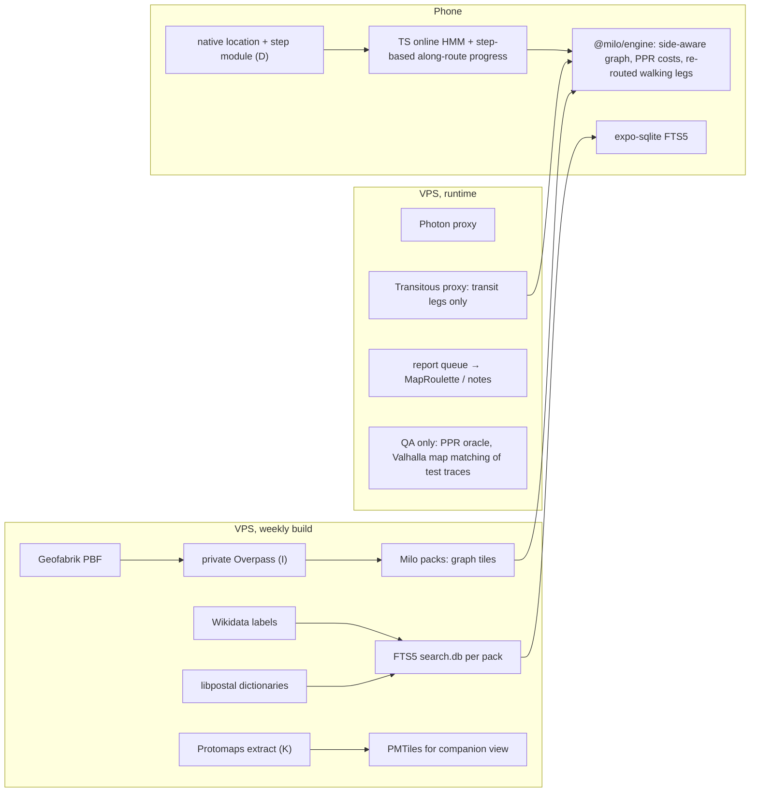

# N: Open-source repos: pedestrian routing, map matching, map data processing, geocoding, blind navigation apps
Research date: 27 Sep 2026. Tags: [V] verified in a primary source I fetched (repo file, registry, official docs, API); [P] secondary source; [U] could not verify; [M] my own count, reading of Milo's code, or estimate. Bracketed numbers point to Sources; letters point to the other reports in this folder. "Activity" = last push seen through the GitHub search API on 27 Sep 2026 [7]. Effort is in developer-days and is my estimate [M].

## Key findings

1. **Keep Milo's own engine. None of the open routers replaces it.** None runs in TypeScript on the phone, and none weighs acoustic signals together with the side of the street. The closest design is **PPR** (Per Pedes Routing, MIT). Its edges carry a street side (LEFT/RIGHT/CENTER), a crossing type (generated, unmarked, marked, island, signals) and whether the signal has sound or vibration. Its profiles price every crossing type per road class and set a maximum detour to reach a marked crossing [V 1–3]. Port these three ideas into `packages/engine`. Run PPR in Docker on the VPS as a reference router for tests.
2. **Transitous does not use PPR.** Transitous runs MOTIS 2. MOTIS 2 depends on `osr`, not `ppr` [V 4], and its API offers only `FOOT` and `WHEELCHAIR` pedestrian profiles [V 5]. `osr`'s foot profile has no crossing or signal costs [V 6]. Today `plan.ts` keeps Transitous's walking legs and only annotates crossings within 10 m of them [M 25]. **Re-route every walking leg of a transit trip with Milo's engine**, from stop to stop.
3. **No maintained open-source HMM map matcher exists in JS/TS** [V 23], and there is no open-source production-grade pedestrian dead-reckoning library for phones [V 7]. The only maintained TypeScript PDR and route-projection matcher on npm, Wemap's `@wemap/providers`/`@wemap/positioning` 14.7.1 (25 Sep 2026), is proprietary ("All rights reserved"), so Milo cannot use it [V 23]. Write an online HMM matcher of about 400 lines on Milo's own graph, taking Valhalla Meili's defaults as the starting parameters [V 14]. Use the platform step detector for dead reckoning along the matched route. `expo-sensors`' Pedometer "will not" deliver updates in the background [V 24], which confirms D: Milo needs its own native location module.
4. **Soundscape-Android (MIT) is the richest source of ideas, not of code.** Its GeoEngine now sits in a Kotlin Multiplatform `shared` module with iOS targets [V 28], and Soundscape 2.0 ships to iPhone through TestFlight from that codebase [V 29]. Milo is TypeScript/React Native, so porting its ideas is cheaper than embedding its code:
   - it names pavements after the road beside them;
   - it joins ways across tile edges with zero-length "JOINER" ways;
   - it looks ahead "three seconds of travel, clamped to between 25m and 150m";
   - it regression-tests by replaying GPX files into a callout transcript [V 27];
   - its tiles carry crossing points with `traffic_signals:sound`, `tactile_paving`, `kerb` and `button_operated` [V 26].
5. **Valhalla has a `blind` pedestrian type** that announces crossed streets, stairs, bridges, tunnels, gates and bollards, and adds information about traffic signals on crosswalks [V 12]. Valhalla 3.9.0 (19 Sep 2026) routes through pedestrian areas along a generated medial axis [V 13]. `valhalla-mobile` runs `route` and map matching on-device on iOS and Android [V 16]. None of this should replace Milo's router. Use Valhalla on the VPS as an independent map-matching baseline for field-test traces.
6. **English first in Milan means Milo cannot rely on OSM's English names.** Italy has 13,248 `name:en` tags against 4,158,258 `name` tags (0.3%) [V 45], and `name:pronunciation` has 11,451 uses worldwide [V 45]. Build the pack's search index from three sources:
   - English labels from Wikidata, through the 169,886 `wikidata=*` tags in Italy [V 45];
   - libpostal's Italian and English abbreviation dictionaries (MIT data, 151 and 411 lines) [V 44];
   - SQLite FTS5, which `expo-sqlite` enables by default [V 46].
7. **Crowdsourcing must not post anonymous OSM notes from a server.** Since Feb 2026 the osm.org web note form hides after 10 anonymous notes; this is a per-browser cookie limit and, in the PR's own words, "the API is still not protected" [V 54]. The API-level block is moderation zones (merged 3 May 2026): anonymous notes inside them are refused with HTTP 403 [V 55]. Triage Milo reports on the VPS. Publish them from a team account or as MapRoulette tag-fix tasks [V 56]. Point users with an OSM account to StreetComplete: its tactile-paving quests are enabled in IT and GB [V 53].
8. **Data to reuse, and data to skip:**
   - Overture places (CDLA-P-2.0 / Apache-2.0 / CC0; 81.5 M places in release 2026-09-23.0) [V 42]: optional, later.
   - Foursquare OS Places (Apache-2.0, now gated on Hugging Face) [V 43]: optional, later.
   - Project Sidewalk (data CC0, code MIT): none of its 59 cities is in Italy or the UK [V 49,50].
   - OpenSidewalks schema: CC BY-ND 4.0, wheelchair-oriented, with no acoustic-signal field [V 8]. Borrow its topology rules; do not adopt the schema.

## 1. Where Milo's engine stands, and the gaps these repos can fill

From the code [M 25]:
- `osm/overpass.ts` reproduces osmnx's walk filter, including `["area"!~"yes"]`, so pedestrian squares mapped as areas are not walkable.
- `graph.ts` and `routing.ts` run Dijkstra with per-node penalties for `unsignalled_crossings`, `signals_without_sound`, `steps`, `construction` and `main_roads` (`plan.ts`).
- `navigate.ts` has no map matching and no step counting (plan §"Stato attuale").
- `places.ts` falls back to pack names when Photon is unavailable.

| Gap | Best source | Decision |
|---|---|---|
| A street tagged `sidewalk=both` is one centreline, so Milo cannot say which side to walk on or where to cross | PPR side-aware graph and generated crossings [V 3] | Port the idea (§2) |
| Crossing costs are flat penalties | PPR road-class × crossing-type matrix, `max_crossing_detour_*` [V 2] | Port the idea |
| Squares (`area=yes`) are skipped | Valhalla 3.9 medial axis [V 13] | For blind users, route along the square's perimeter, not across it: an open square has no edge to follow with the cane [M] |
| Transit walking legs come from MOTIS | osr foot profile [V 6] | Re-route them with Milo's engine |
| No map matching | Meili defaults [V 14], Barefoot online HMM [V 21] | Write it in TS (§3) |
| Test corpus | STA GPX replay transcripts [V 27], PPR as oracle | Adopt |
| English place search | Wikidata, libpostal dictionaries, FTS5 | Build into the pack (§6) |

## 2. Pedestrian and accessible routing

**PPR (motis-project/ppr), MIT [V 1], C++, last push 27 May 2025 [V 7].** It was built for mobility-impaired pedestrians. Verified in its source:
- **Edge types** CONNECTION, STREET, FOOTWAY, CROSSING, ELEVATOR, ENTRANCE, CYCLE_BARRIER.
- **Crossing types** NONE, GENERATED, UNMARKED, MARKED, ISLAND, SIGNALS.
- **Sides** CENTER, LEFT, RIGHT.
- **Tri-state fields** for `traffic_signals_sound`, `traffic_signals_vibration` and handrail [V 3].
- **An accessibility test**, `is_signals_crossing_with_sound_or_vibration()`, and a stored `marked_crossing_detour` [V 3].
- **Profiles** are JSON. Each of `crossing_primary|secondary|tertiary|residential|service` has entries for `signals`, `blind_signals`, `marked`, `island` and `unmarked`, each with a duration, an accessibility cost, `allowed` and penalties. Separate entries cover stairs (with or without handrail), elevators, escalators and doors. `max_crossing_detour_primary` defaults to 300 m [V 2].
- The repository has `backend`, `preprocessing` and `routing` sources and Docker builds [V 1].

What to take:
1. **Port the model into the engine (5–8 d).** At graph build, split each street tagged `sidewalk=both|left|right` into LEFT and RIGHT side edges. Join them at junctions with generated crossings, whose type comes from the crossing node on that arm. Replace the flat penalties with the road-class × crossing-type matrix. This is what lets Milo say "stay on the right-hand pavement" and "cross Via X at the signal with the sound".
2. **Run `ppr-backend` on the VPS as an oracle (1–2 d).** Diff routes on a Milan corpus. Do not ship it to users: it is C++ and server-side.

**MOTIS 2 / osr / Transitous.** MOTIS is MIT, active and self-hostable (I §9) [V 4]. `osr` is MIT, active, "a planet import should not need more than 10GB of RAM" [V 6]. Its foot profile walks at 1.2 m/s (0.8 m/s for wheelchairs). It blocks steps only for wheelchairs and has no crossing semantics; its only extra costs are a slower effective speed on big streets, a fixed penalty on roads whose sidewalks are mapped separately, and a penalty for elevators [V 6]. Decision: **keep Transitous for transit legs only** (plan and I).

**OpenSidewalks / AccessMap / unweaver (Taskar Center, UW).**
- The schema is CC BY-ND 4.0 [V 8]: data can follow it, but a modified schema file cannot be redistributed.
- The latest version is 0.3, dated 27 Jan 2026 (0.2 was 30 Jan 2024). 0.3 adds custom entities and trees, not acoustic signals [V 8].
- Two rules are worth adopting in Milo's graph:
  - crossings exist only on the carriageway and never connect to sidewalk centrelines, so a plain footway links them;
  - kerb nodes sit at edge endpoints, "important decision points when simulating a pedestrian" [V 8].
- Its "Adjacent Entities" use a blind user as the example (vegetation on the right, a lake on the left) [V 8]. That is exactly Soundscape-style context.
- The schema has no `traffic_signals:sound` field [V 8], so it cannot express Milo's key constraint.
- `unweaver` is Apache-2.0, Python, last push 2022–23 [V 7,9]; `sidewalkify` is Apache-2.0 [V 10]. Idea only: costs are computed at request time from per-user profile parameters, which Milo already does.

**GraphHopper** (Apache-2.0, 11.0 on Maven, updated 14 Oct 2025, active) [V 11]. It stores a `crossing` value (traffic_signals, uncontrolled, marked, unmarked, …) and `sidewalk` per direction, and custom models can weight both [V 11]. It has map matching and a `/navigate` endpoint for MapLibre Navigation and Ferrostar. Its Android support is documented only up to version 1.0 [V 11]. It has no acoustic-signal value. Skip for routing. It is the runner-up to Valhalla as a VPS map-matching baseline.

**Valhalla** (MIT, 3.9.0 of 19 Sep 2026, very active) [V 12,13,15]:
- **Pedestrian costing** offers `type: blind`, plus `step_penalty`, `walkway_factor`, `sidewalk_factor`, `alley_factor`, `driveway_factor` and `elevator_penalty` [V 12].
- **Node bindings:** `@valhallajs/valhallajs` 3.7.0 (MIT) [V 15].
- **valhalla-mobile** (MIT per the GitHub licence API [V 16]; builds Valhalla 3.6.3) exposes `route`, `trace_route` and `trace_attributes` on iOS and Android against on-device tiles [V 16].

It does not replace Milo's engine: its graph IDs differ from Milo's, so a match on Valhalla's graph cannot drive Milo's cues. Take two things:
1. The `blind` narration list, as a checklist for the cue vocabulary.
2. The Node binding on the VPS, to map-match recorded field traces as an independent baseline (1–2 d).

**OSRM** (BSD-2, npm `@project-osrm/osrm` 26.9.0 of 1 Sep 2026) [V 17]. **BRouter** (MIT, Java/Android, offline; its profile lookups include `crossing` values but not `traffic_signals:sound`) [V 18]. **OpenTripPlanner** (LGPL-3.0) [V 19]. All three are active [V 7]. Skip them all: none adds anything for blind pedestrians, and BRouter and OTP need a JVM.

**WalkersGuide** (GPL-3.0, Android client and Python server; the server precomputes intersection tables in PostGIS/pgRouting) [V 34]. It is the one other open router built for blind users. Take the idea only: precompute an intersection description for each junction in the pack. GPL code cannot enter an MIT app.

## 3. Map matching and positioning

| Library | Licence | Activity | Verdict |
|---|---|---|---|
| Valhalla Meili | MIT | Active | Source of defaults: `sigma_z` 4.07, `beta` 3, `search_radius` 50, pedestrian `turn_penalty_factor` 100, `interpolation_distance` 10 [V 14]. VPS baseline |
| Barefoot (BMW Car IT) | Apache-2.0 | Last push 2022–23 | Readable Java reference for online HMM (Goh et al.) and offline HMM (Newson & Krumm) [V 21] |
| FMM | Apache-2.0 | Last push 2023–24 | C++/Python, built for large vehicle datasets [V 20]. Skip |
| GraphHopper map-matching | Apache-2.0 | Active | VPS runner-up |
| LeuvenMapMatching; NREL mappymatch | Apache-2.0; BSD-3 | 2023–25; — | Python notebooks for tuning. Optional |
| JS/TS on npm | — | — | Nothing maintained and open-source: registry searches for "map-matching", "hidden markov map matching" and "pedestrian dead reckoning" return unrelated packages [V 23]. The exception, Wemap's `@wemap/providers` 14.7.1 (a `PdrProvider` and a route-projection `MapMatchingHandler`, not HMM), is proprietary: skip [V 23] |
| PDR on GitHub | mostly none or GPL | Student and research code (top repository ~100 stars) | Skip [V 7] |
| `kalman-filter` (npm) | MIT | 2.3.0, May 2023 | Optional heading smoothing [V 47] |

**Recommended design** [M]:
1. **Candidates.** Fixes come from the platform's fused location (D §4). Find candidate edges within max(2·accuracy, 25 m) with the engine's existing `flatbush` index.
2. **HMM.**
   - States are (edge, side).
   - Emission is Gaussian on distance, with σ from the reported accuracy × 1.6, clamped to at least Meili's 4.07.
   - Transition uses |route distance − straight-line distance| with β = 3.
   - Add a route prior: the planned route's edges get a bonus.
   - A fixed-lag Viterbi over the last 5–8 fixes gives an online answer (Goh et al., as in Barefoot [V 21]).
3. **During GPS dropouts** (porticoes, canyons), advance along the matched edge by steps × stride, calibrated per user (D: blind walkers' strides differ). Along a known route, a heading error does not matter. The native module reads Android's step detector and iOS CMPedometer in the background.
4. **Effort.** 4–6 d for the matcher and tests, plus the native module already planned in D.

**Test harness.** Adopt STA's method [V 27]: replay a recorded GPX through the whole pipeline and write a transcript of cues, one golden file per walk. Log field walks with an event button ("at kerb", "crossed") as ground truth. Map-match them on the VPS with Valhalla to get a second opinion.

## 4. Blind navigation apps with source

| App | Licence (exact) | Activity | What to take |
|---|---|---|---|
| **Soundscape-Android** (Scottish Tech Army) | MIT: new code © STA 2024; assets and strings © Microsoft; es/fi translations © Soundscape Community; `gradlew` Apache-2.0 [V 28] | Active; 2.0 in closed beta; iOS from the shared code [V 29] | Ideas above (key finding 4). Also: its planetiler-openmaptiles fork (below); zoom-14 tiles, "60cm" resolution, simplification off at max zoom [V 26]; the list of crossing attributes; the audio menu and VoiceOver fixes (C) |
| microsoft/soundscape | MIT [V 30] | Last push 2022–23 | Callout and intersection generators as a readable spec (C lists the files) |
| soundscape-community/soundscape | MIT [V 30] | Active | NaviLens and Bose integrations (C) |
| HULOP NavCogIOSv3 | MIT (IBM, CMU) [V 31] | Last push 2023–25 | Idea: separate tools for preview and for "simulate blind user navigation commands" [V 31], i.e. Milo's virtual walk as a test tool. The localization is BLE: skip |
| Clew | No licence file [V 32] | Last push 2023–25 | Idea only (C) |
| OsmAnd | GPLv3 code, CC BY-NC-ND artwork [V 33] | Active | Idea only (C) |
| WalkersGuide | GPL-3.0 [V 34] | Android repo last push 9 May 2026; server 9 Feb 2026 [V 7] | Idea only (§2) |
| iMove | Proprietary, free [P 35] | — | Skip |
| Ferrostar (Stadia Maps) | BSD-3 [V 36] | Core 0.57.0 on npm, 22 Sep 2026 [V 36] | A generic turn-by-turn SDK: a Rust core with line snapping and a navigation state machine; production-ready on iOS and Android; React Native is "pre-alpha" [V 36]. Skip the code; it is built for vehicle routes from Valhalla or OSRM |

**Should the STA GeoEngine replace Milo's?** No [M]:
- It is Kotlin.
- It does no routing (C).
- Its data model is MVT tiles.

Milo already has the equivalent in TypeScript with parity tests. Port four behaviours instead: name confection, the look-ahead window, tile-edge joining (needed once packs are 1 km tiles, I §6) and GPX transcript tests. Effort 3–5 d.

## 5. Map data tooling

- **Pack build: keep I's pipeline.** A private Overpass instance runs the engine's own queries, with osmium and pyosmium as the runner-up (I §6).
  - **osmium-tool:** GPL-3.0, 1.19.1 (7 Apr 2026) [V 39]. Running a GPL command-line tool on our server puts no obligation on the MIT app [M].
  - **libosmium:** BSL-1.0 [V 39].
  - **pyosmium:** BSD-2, 4.3.1 [V 39].
  - **osm2pgsql:** GPL-2.0 [V 40]. Skip it: Milo needs no PostGIS.
  - **OSMnx:** MIT, 2.1.1 (21 Jul 2026) [V 41]. Keep it only in `server-py` parity tests.
- **Companion map (K): a Protomaps extract plus MapLibre.**
  - Draw Milo's route, crossings and position as GeoJSON from the engine. This shows sound signals without building custom tiles.
  - Build custom tiles only if the map must show every crossing's attributes offline. Use planetiler (Apache-2.0, 0.10.2, Mar 2026) [V 38] with STA's `davecraig/planetiler-openmaptiles` fork.
  - That fork's code is BSD-3, but the OpenMapTiles schema design is CC-BY 4.0: every map must visibly credit "© OpenMapTiles" [V 37]. Effort 3–4 d.
- **One tile source for audio and screen?** STA argues for it: "graphical and audio UI … served from the same data source" [V 26]. For Milo it would mean moving packs from Overpass JSON to z14 MVT, which quantizes geometry (~60 cm) and drops tags outside the schema. Defer it to the multi-country stage (open question 1).
- **Overture Maps.**
  - Licences: places are CDLA-P-2.0 (Meta, Microsoft and others), Apache-2.0 (Foursquare, which must be credited) and CC0 (AllThePlaces). Transportation, base and buildings are ODbL [V 42].
  - Release 2026-09-23.0 has 81,455,425 places, distributed as GeoParquet on S3/Azure [V 42].
  - Use: places may fill POI gaps in the UK test cities. Transportation adds nothing over OSM for pedestrians.
  - Later: 2 d with DuckDB on the VPS.
- **Foursquare OS Places:** Apache-2.0; access on Hugging Face is gated (updated 15 Sep 2026) [V 43]. It is already inside Overture places, so skip the direct feed.
- **libpostal:** MIT; last push between Jan 2025 and Jun 2026 [V 7,44].
  - The C library needs a 1.8 GB model (2.2 GB for the Senzing model) [V 44]: skip it.
  - Reuse the data: `resources/dictionaries/{it,en}/street_types.txt` map `p.za`→piazza, `v.le`→viale, `c.so`→corso, and English `rd`, `ave`, … [V 44].
  - Use them to expand abbreviations in transit stop names and user queries before FTS and TTS (0.5–1 d).
  - OSM `name` tags are unabbreviated by convention, so most of the benefit is on GTFS names [U: not measured on ATM stop names].
- **Pronunciation:** `name:pronunciation` (11,451 uses) and `name:en:pronunciation` (100) are too rare to matter [V 45]. Keep Milo's own lexicon (E, L).

## 6. Geocoding

The server side is settled in I §7:
- public Photon through our proxy, then self-hosted Photon (Apache-2.0);
- Nominatim is GPL-3.0 [V 48] and has no autocomplete;
- Pelias is MIT but heavier [V 48].

On the phone, replace `places.ts`'s linear name scan with an **FTS5 table shipped in each pack** (2–3 d) [M]:
- `expo-sqlite` 57.0.3 (MIT) enables FTS3/4/5 by default (`enableFTS: true`) [V 46,47]. `op-sqlite` 18.2.5 (MIT) is the runner-up [V 47].
- **Columns:** `name`, `name:en`, `alt_name`, `old_name`, `official_name`, the English Wikidata label and aliases (fetched at build time through `wikidata=*`), `addr:street` + `addr:housenumber`, and the category words in English and Italian.
- **Normalization:** unaccented, with the libpostal expansions applied to both the index and the query.
- **Ranking:** bm25 × distance decay from the user or the route.
- Wikidata's structured data is CC0 [V 58], so adding it to the ODbL pack creates no new obligations.

## 7. Accessibility data and crowdsourcing

- **Project Sidewalk:** code MIT [V 50]; data "dedicated to the public domain under CC0 1.0" [V 49]. Of its 59 cities, 37 are in the US, and the rest include Amsterdam, Zurich, Winterthur and Bayonne. None is in Italy or the UK [V 49]. Take its label taxonomy (curb ramp, obstacle, surface problem, no sidewalk, pedestrian signal) as the shape of Milo's report categories. Skip the data.
- **accessibility.cloud / A11yJSON:** the A11yJSON schema is MIT [V 51]. accessibility.cloud mixes data sources under different licences; Wheelmap's own data is ODbL [P 51,52]. It is wheelchair-first: skip for now, and revisit for station lifts.
- **StreetComplete** (GPL-3.0, active) [V 53]:
  - **The quests blind users need exist:** `AddTactilePavingCrosswalk/BusStop/Kerb/Steps`, `AddTrafficSignalsSound`, `AddTrafficSignalsVibration`, `AddTrafficSignalsButton`, `AddKerbHeight`, `AddCrossingKerbHeight`, `AddCrossingIsland`, `AddCrossingMarkings`, `AddCrossingSignals`, `AddSidewalk`, `AddStepCount` and `AddHandrail` [V 53].
  - **Country limits:** tactile-paving quests run only where tactile paving is common, and that list includes IT, GB, IE, US, CA and AU. The vibration quest is disabled in BG, FI, RU and CZ [V 53].
  - **Coverage today:** worldwide, `traffic_signals:sound` has 490,880 uses and `traffic_signals:vibration` 403,133 [V 45].
  - **Use:** a "help map your city" link, plus a mapping party in Milan with UICI.
- **Feeding Milo reports to OSM** [M]:
  1. The phone sends a structured report to the VPS: position, OSM element, category, the user's words, and optionally a photo, stored only with consent.
  2. The team triages reports weekly.
  3. Confirmed tag facts (e.g. `traffic_signals:sound=no` on node X) become a MapRoulette cooperative **tag-fix** challenge. Mappers approve or edit each change inside MapRoulette, generated with `mr cooperative tag` from `mr-cli` [V 56]. MapRoulette's backend and `mr-cli` are Apache-2.0 [V 56]. The `mr-cli` repository was pushed in Sep 2026, but its last npm release is 0.1.4 of Oct 2021 [V 47]: pin it and expect to fix it.
  4. Anything else becomes an OSM note from a Milo team account.
  5. Users with an OSM account can post their own notes through OAuth2 (`osm-auth` 3.2.0, ISC [V 47]).
  6. Never proxy anonymous notes: moderation zones refuse anonymous notes through the API with 403 [V 55], and the community is actively throttling them (the web form hides after 10 anonymous notes per browser, PR merged 4 Feb 2026) [V 54].

  Effort: 3–4 d for the server queue and a simple admin page.
- **OSM guidance:** the wiki's "Guidelines for pedestrian navigation" (edited 3 Aug 2026) covers `sidewalk:*=separate`, crossing nodes and ways, `kerb` and `tactile_paving` [V 57]. Link it from the mapping-party material.

## 8. Inventory table

"MIT ✓" means code or data can be used by, or alongside, an MIT app with commercial use. ✗ = not in the app. Share-alike data licences (ODbL) bind the data, not the app.

| Name | What | Licence | MIT ✓? | Activity | Reuse | Effort | Recommendation |
|---|---|---|---|---|---|---|---|
| PPR | Accessible pedestrian router | MIT [V 1] | ✓ | May 2025 | Idea + VPS oracle | 5–8 d + 1–2 d | **Adopt model, run as oracle** |
| MOTIS 2 / osr | Transit + street router | MIT [V 4,6] | ✓ | Active | Service (Transitous) | – | Transit legs only |
| OpenSidewalks schema | Pedestrian network schema | CC BY-ND 4.0 [V 8] | ✓ to use, ✗ to modify | Pushed after 27 Jun 2026 [V 7] | Idea | 1 d | Topology rules only |
| unweaver, sidewalkify, crossify | UW routing and generation | Apache-2.0; crossify MIT/Apache-2.0 dual [V 9,10] | ✓ | 2022–26 | Idea | – | Skip |
| GraphHopper | Router, map matching | Apache-2.0 [V 11] | ✓ | Active | – | – | Skip (runner-up baseline) |
| Valhalla (+ Node, mobile) | Router, Meili, `blind` type | MIT [V 15,16] | ✓ | Active | VPS baseline; idea | 1–2 d | **Baseline and cue checklist** |
| OSRM | Router | BSD-2 [V 17] | ✓ | Active | – | – | Skip |
| BRouter | Offline Android router | MIT [V 18] | ✓ | Active | – | – | Skip (Android only) |
| OpenTripPlanner | Transit planner | LGPL-3.0 [V 19] | server ✓ | Active | – | – | Skip |
| WalkersGuide | Blind router and app | GPL-3.0 [V 34] | ✗ | Active | Idea | – | Intersection tables idea |
| FMM | Map matching (C++/Py) | Apache-2.0 [V 20] | ✓ | 2023–24 | – | – | Skip |
| Barefoot | Online HMM (Java) | Apache-2.0 [V 21] | ✓ | 2022–23 | Idea | – | Reference for our matcher |
| JS/TS HMM, PDR libraries | — | — | — | none [V 23] | Write our own | 4–6 d | **Build** |
| Soundscape-Android | Blind audio navigation (KMP) | MIT [V 28] | ✓ | Active | Ideas, strings, sounds | 3–5 d | **Port behaviours** |
| microsoft/soundscape, community fork | iOS app | MIT [V 30] | ✓ | 2022–23 / active | Idea, spec | – | Per C |
| NavCogIOSv3 | BLE indoor, blind | MIT [V 31] | ✓ | 2023–25 | Idea | – | Simulator idea |
| Clew | AR path retrace | none [V 32] | ✗ | 2023–25 | Idea | – | Per C |
| OsmAnd | Navigation app | GPLv3 + CC BY-NC-ND [V 33] | ✗ | Active | Idea | – | Per C |
| Ferrostar | Navigation SDK | BSD-3 [V 36] | ✓ | Active | – | – | Skip |
| osmium-tool / libosmium / pyosmium | PBF tools | GPL-3 / BSL-1.0 / BSD-2 [V 39] | server ✓ | Active | Code on VPS | per I | Pack runner-up |
| planetiler + STA OpenMapTiles fork | Vector tiles | Apache-2.0; BSD-3 + CC-BY credit [V 37,38] | ✓ with credit | Active | Code on VPS | 3–4 d | Later |
| PMTiles, MapLibre | Tile archive, renderer | BSD-3; BSD-3/MIT (K) | ✓ | Active | Code | per K | Per K |
| OSMnx | Python OSM graphs | MIT [V 41] | ✓ | Jul 2026 | Tests | – | Parity tests only |
| osm2pgsql | PBF→PostGIS | GPL-2.0 [V 40] | server ✓ | Active | – | – | Skip |
| Overture places | POIs | CDLA-P-2.0 / Apache / CC0 [V 42] | ✓ with credits | Monthly | Data | 2 d | Later, UK POI gaps |
| FSQ OS Places | POIs | Apache-2.0 [V 43] | ✓ | Sep 2026 | – | – | Via Overture |
| libpostal | Address NLP | MIT [V 44] | ✓ | 2025–26 | **Data (dictionaries)** | 0.5–1 d | Adopt dictionaries |
| Wikidata labels | English names | CC0 [V 58] | ✓ | Live | Data at build | 1 d | **Adopt** |
| Photon / Nominatim / Pelias | Geocoders | Apache-2.0 / GPL-3.0 / MIT [V 48] | server ✓ | Active | Service | per I | Photon per I |
| expo-sqlite FTS5 | On-device search | MIT [V 46] | ✓ | Sep 2026 | Code | 2–3 d | **Adopt** |
| Project Sidewalk | Sidewalk audits | code MIT, data CC0 [V 49,50] | ✓ | Active | Taxonomy idea | – | Skip data |
| A11yJSON / accessibility.cloud | Accessibility schema, API | MIT / mixed [V 51] | ✓ / check each source | Active | – | – | Later (lifts) |
| StreetComplete | OSM quest app | GPL-3.0 [V 53] | ✗ (link only) | Active | Point users to it | – | **Promote** |
| MapRoulette + mr-cli | Micro-task challenges | Apache-2.0 [V 56] | ✓ | Active (mr-cli npm release: Oct 2021) | Service | 3–4 d incl. queue | **Report pipeline** |

## 9. Architecture: where each piece runs

Sequencing [M]:
- **In parallel from now:** FTS5 plus the Wikidata build step (§6), the report queue (§7), and the PPR oracle setup.
- **In series:** side-aware graph → PPR cost matrix → re-routed transit walking legs, all in the engine. The HMM matcher follows the side-aware graph, because its states are (edge, side). GPX transcript tests start with the matcher.
- **Later:** a custom planetiler tile schema, Overture places, and MVT packs.

## 10. Corrections to initial assumptions

- **"PPR, used by Transitous".** Transitous runs MOTIS 2 on `osr`, which has no crossing or signal model [V 4–6]. So Milo cannot trust MOTIS walking legs for a blind user; they must be re-routed.
- **"Reuse the Soundscape GeoEngine".** It is Kotlin Multiplatform and does no routing. Its value for Milo is its behaviours and its test method, not a library to embed.
- **"OpenSidewalks as the standard".** Its schema cannot be modified and redistributed (ND), and it has no acoustic-signal field. Milo's constraints go beyond it.
- **"There must be a JS map matcher".** There isn't one [V 23]; about 400 lines of TS is the cheapest path.
- **"Users' reports go straight into OSM Notes".** Anonymous notes are being throttled on the web form and blocked through the API in moderation zones [V 54,55]. Reports need a triage step and a named account.
- **"English first is only a UI language".** Milan's map is almost entirely Italian-named (0.3% `name:en` in Italy) [V 45]. English search needs Wikidata aliases, and speaking Italian names with an English voice is an open TTS problem (E, L).

## 11. Open questions

1. **Pack format at multi-country scale:** keep Overpass-JSON tiles (exact engine parity, I) or move to z14 MVT like STA (one source for audio and map, ~60 cm quantization)? Decide before adding a second country.
2. **Pedestrian squares:** is routing around the perimeter always right? Ask the O&M instructors at the first field test.
3. **OSM edits:** who owns the team account, and does the report pipeline need an Organised Editing declaration? Settle before the first MapRoulette challenge.
4. **Field-test logging:** traces are location data. Consent and retention must follow I §11 before testers record GPX.
5. **Can PPR's preprocessing import an Italy extract on the CX43 with 16 GB?** [U] Not published. Test it on staging.

## Sources

1. motis-project/ppr: README, LICENSE (MIT), `src/` tree. https://github.com/motis-project/ppr ; https://raw.githubusercontent.com/motis-project/ppr/master/LICENSE
2. PPR default profile. https://raw.githubusercontent.com/motis-project/ppr/master/profiles/default.json
3. PPR `edge.h`, `enums.h`. https://raw.githubusercontent.com/motis-project/ppr/master/include/ppr/common/edge.h ; https://raw.githubusercontent.com/motis-project/ppr/master/include/ppr/common/enums.h
4. MOTIS README, LICENSE, dependency list `.pkg`. https://raw.githubusercontent.com/motis-project/motis/master/README.md ; https://raw.githubusercontent.com/motis-project/motis/master/.pkg
5. MOTIS OpenAPI (`PedestrianProfile`). https://raw.githubusercontent.com/motis-project/motis/master/openapi.yaml
6. osr README, LICENSE, foot profile. https://raw.githubusercontent.com/motis-project/osr/master/README.md ; https://raw.githubusercontent.com/motis-project/osr/master/include/osr/routing/profiles/foot.h
7. GitHub repository search API (stars, `pushed:` ranges), queried 27 Sep 2026. https://api.github.com/search/repositories
8. OpenSidewalks Schema README and LICENSE (CC BY-ND 4.0). https://raw.githubusercontent.com/OpenSidewalks/OpenSidewalks-Schema/main/README.md
9. unweaver README and LICENSE. https://raw.githubusercontent.com/nbolten/unweaver/main/README.md
10. AccessMap sidewalkify LICENSE. https://raw.githubusercontent.com/AccessMap/sidewalkify/main/LICENSE
11. GraphHopper README, LICENSE, `Crossing.java`, custom models doc, Maven metadata. https://raw.githubusercontent.com/graphhopper/graphhopper/master/README.md ; https://raw.githubusercontent.com/graphhopper/graphhopper/master/docs/core/custom-models.md ; https://repo1.maven.org/maven2/com/graphhopper/graphhopper-core/maven-metadata.xml
12. Valhalla route API reference (pedestrian costing, `type: blind`). https://valhalla.github.io/valhalla/api/route/api-reference/
13. Valhalla CHANGELOG (3.9.0, pedestrian areas). https://raw.githubusercontent.com/valhalla/valhalla/master/CHANGELOG.md
14. Valhalla config generator (Meili defaults). https://raw.githubusercontent.com/valhalla/valhalla/master/scripts/valhalla_build_config
15. Valhalla README, COPYING (MIT); npm `@valhallajs/valhallajs`; PyPI `pyvalhalla` 3.9.0. https://raw.githubusercontent.com/valhalla/valhalla/master/README.md ; https://registry.npmjs.org/@valhallajs/valhallajs
16. Rallista/valhalla-mobile README and repository page. https://github.com/Rallista/valhalla-mobile
17. OSRM LICENSE; npm `@project-osrm/osrm`. https://raw.githubusercontent.com/Project-OSRM/osrm-backend/master/LICENSE.TXT ; https://registry.npmjs.org/@project-osrm/osrm
18. BRouter README, LICENSE, `lookups.dat`. https://raw.githubusercontent.com/abrensch/brouter/master/README.md ; https://raw.githubusercontent.com/abrensch/brouter/master/misc/profiles2/lookups.dat
19. OpenTripPlanner LICENSE. https://raw.githubusercontent.com/opentripplanner/OpenTripPlanner/dev-2.x/LICENSE
20. FMM README and repository page (Apache-2.0). https://github.com/cyang-kth/fmm
21. Barefoot README and LICENSE. https://raw.githubusercontent.com/bmwcarit/barefoot/master/README.md
22. LeuvenMapMatching and NREL mappymatch LICENSE files. https://raw.githubusercontent.com/wannesm/LeuvenMapMatching/master/LICENSE ; https://raw.githubusercontent.com/NREL/mappymatch/main/LICENSE
23. npm registry search, 27 Sep 2026. https://registry.npmjs.org/-/v1/search?text=map-matching (also "map matching hmm", "mapmatching", "pedestrian dead reckoning", "kalman filter gps"); Wemap `@wemap/providers` 14.7.1 tarball (LICENSE "All rights reserved", `PdrProvider`, `MapMatchingHandler`). https://registry.npmjs.org/@wemap/providers
24. Expo Pedometer docs. https://docs.expo.dev/versions/latest/sdk/pedometer/
25. Milo engine source read on 27 Sep 2026: `packages/engine/src/osm/overpass.ts`, `graph.ts`, `routing.ts`, `plan.ts`, `transit.ts`, `places.ts`, `navigate.ts`.
26. Soundscape-Android, Mapping data. https://scottish-tech-army.github.io/Soundscape-Android/developers/mapping.html
27. Soundscape-Android, GeoEngine. https://scottish-tech-army.github.io/Soundscape-Android/developers/geoengine.html
28. Soundscape-Android LICENSE.md, `shared/build.gradle.kts`, `shared/src/commonMain/.../geoengine`. https://raw.githubusercontent.com/Scottish-Tech-Army/Soundscape-Android/main/LICENSE.md ; https://github.com/Scottish-Tech-Army/Soundscape-Android/tree/main/shared/src/commonMain/kotlin/org/scottishtecharmy/soundscape
29. Soundscape-Android release notes. https://scottish-tech-army.github.io/Soundscape-Android/release-notes.html
30. microsoft/soundscape and soundscape-community LICENSE.txt. https://raw.githubusercontent.com/microsoft/soundscape/main/LICENSE.txt ; https://raw.githubusercontent.com/soundscape-community/soundscape/main/LICENSE.txt
31. hulop/NavCogIOSv3 README and LICENSE. https://raw.githubusercontent.com/hulop/NavCogIOSv3/master/README.md
32. occamLab/Clew (no LICENSE file at root). https://github.com/occamLab/Clew
33. OsmAnd LICENSE. https://raw.githubusercontent.com/osmandapp/OsmAnd/master/LICENSE
34. WalkersGuide-Server README and LICENSE; WalkersGuide-Android LICENSE. https://raw.githubusercontent.com/scheibler/WalkersGuide-Server/master/README.md
35. iMove on the App Store; Blind Help Project. https://apps.apple.com/gb/app/imove/id593874954 ; https://blindhelp.net/software/imove
36. Ferrostar LICENSE.txt, guide, architecture, npm `@stadiamaps/ferrostar`. https://stadiamaps.github.io/ferrostar/ ; https://stadiamaps.github.io/ferrostar/architecture.html ; https://registry.npmjs.org/@stadiamaps/ferrostar
37. davecraig/planetiler-openmaptiles LICENSE (OpenMapTiles code BSD-3, design CC-BY 4.0). https://raw.githubusercontent.com/davecraig/planetiler-openmaptiles/main/LICENSE.md
38. planetiler LICENSE; Maven metadata. https://raw.githubusercontent.com/onthegomap/planetiler/main/LICENSE ; https://repo1.maven.org/maven2/com/onthegomap/planetiler/planetiler-core/maven-metadata.xml
39. osmium-tool LICENSE and CHANGELOG; libosmium LICENSE; pyosmium LICENSE and PyPI. https://raw.githubusercontent.com/osmcode/osmium-tool/master/CHANGELOG.md ; https://pypi.org/pypi/osmium/json
40. osm2pgsql COPYING. https://raw.githubusercontent.com/osm2pgsql-dev/osm2pgsql/master/COPYING
41. OSMnx LICENSE and PyPI. https://pypi.org/pypi/osmnx/json
42. Overture attribution and licensing; 2026-09-23 release notes. https://docs.overturemaps.org/attribution/ ; https://docs.overturemaps.org/blog/2026/09/23/release-notes/
43. Foursquare OS Places on Hugging Face (API metadata). https://huggingface.co/datasets/foursquare/fsq-os-places ; https://huggingface.co/api/datasets/foursquare/fsq-os-places
44. libpostal README, LICENSE, dictionaries. https://raw.githubusercontent.com/openvenues/libpostal/master/resources/dictionaries/it/street_types.txt
45. taginfo (OSM, worldwide) and taginfo Geofabrik Italy, data of 26–27 Sep 2026. https://taginfo.openstreetmap.org/api/4/key/stats?key=name:pronunciation ; https://taginfo.geofabrik.de/europe:italy/api/4/key/stats?key=name:en
46. Expo SQLite docs (`enableFTS`). https://docs.expo.dev/versions/latest/sdk/sqlite/
47. npm registry metadata, 27 Sep 2026: expo-sqlite, @op-engineering/op-sqlite, flatbush, kalman-filter, osm-auth, @maproulette/mr-cli. https://registry.npmjs.org/expo-sqlite
48. Nominatim COPYING and README; Pelias README. https://raw.githubusercontent.com/osm-search/Nominatim/master/COPYING ; https://raw.githubusercontent.com/pelias/pelias/master/README.md
49. Project Sidewalk API page (data licence) and cities API. https://sidewalk-sea.cs.washington.edu/api ; https://sidewalk-sea.cs.washington.edu/v3/api/cities
50. ProjectSidewalk/SidewalkWebpage LICENSE.md. https://raw.githubusercontent.com/ProjectSidewalk/SidewalkWebpage/develop/LICENSE.md
51. sozialhelden/a11yjson LICENSE; accessibility-cloud README. https://raw.githubusercontent.com/sozialhelden/a11yjson/main/LICENSE ; https://github.com/sozialhelden/accessibility-cloud
52. Wheelmap FAQ. https://news.wheelmap.org/en/faq/
53. StreetComplete LICENSE and quest sources (`TactilePavingUtil.kt`, `AddTrafficSignalsVibration.kt`, …). https://raw.githubusercontent.com/streetcomplete/StreetComplete/master/app/src/commonMain/kotlin/de/westnordost/streetcomplete/quests/tactile_paving/TactilePavingUtil.kt
54. openstreetmap-website PR #6593 (anonymous note limit, merged 4 Feb 2026). https://github.com/openstreetmap/openstreetmap-website/pull/6593
55. openstreetmap-website PR #6713 (moderation zones where anonymous notes are not allowed, merged 3 May 2026); issue #7276 (note error reporting, opened 29 Jul 2026, closed 14 Sep 2026 by PR #7373, which shows the API's 403 message). https://github.com/openstreetmap/openstreetmap-website/pull/6713 ; https://github.com/openstreetmap/openstreetmap-website/issues/7276 ; https://github.com/openstreetmap/openstreetmap-website/pull/7373
56. MapRoulette backend LICENSE; mr-cli README; Cooperative Challenges wiki. https://raw.githubusercontent.com/maproulette/maproulette-backend/main/LICENSE ; https://www.npmjs.com/package/@maproulette/mr-cli ; https://github.com/osmlab/maproulette3/wiki/Cooperative-Challenges
57. OSM wiki, Guidelines for pedestrian navigation. https://wiki.openstreetmap.org/wiki/Guidelines_for_pedestrian_navigation
58. Wikidata licensing (CC0 for structured data). https://www.wikidata.org/wiki/Wikidata:Licensing

## Verification (27 Sep 2026)

An adversarial check re-fetched the primary sources for 30 claims: raw repo files, the npm, PyPI, Maven and Hugging Face registries, the Expo, Valhalla, Ferrostar, Overture and Soundscape docs, taginfo, the Project Sidewalk API, the OSM wiki API, and GitHub metadata through the search API.

**Confirmed as written:**
- MOTIS `.pkg` lists `osr` and no `ppr`. `PedestrianProfile` is `FOOT` and `WHEELCHAIR` only.
- osr `foot.h`: 1.2 and 0.8 m/s, steps infeasible only for wheelchairs, no crossing or signal costs.
- PPR: MIT, pushed 27 May 2025, the enums, tri-state sound and vibration, `blind_signals`, `max_crossing_detour_primary` 300.
- Valhalla: 3.9.0 of 19 Sep 2026 with `mjolnir.pedestrian_areas`, `type: blind`, the Meili defaults.
- valhalla-mobile: `route`, `trace_route` and `trace_attributes` on iOS and Android, Valhalla 3.6.3.
- Package and release versions: valhallajs 3.7.0 (it exposes `traceRoute`), OSRM 26.9.0, GraphHopper 11.0, Ferrostar 0.57.0 (React Native pre-alpha), expo-sqlite 57.0.3 with `enableFTS` true.
- Expo Pedometer: no updates in the background.
- Soundscape-Android: licences, KMP `shared` module with iOS targets, 2.0 closed beta on TestFlight.
- STA mapping: z14, 60 cm, crossing attributes. GeoEngine: the 3 s look-ahead clamped to 25–150 m, JOINER ways, GPX transcripts.
- OpenSidewalks: CC BY-ND 4.0, no signal field. The OpenMapTiles CC-BY credit.
- taginfo: all six counts.
- libpostal: 1.8 GB and 2.2 GB models; dictionaries of 151 and 411 lines.
- Data sets: Overture 81,455,425 places and its licences, FSQ Apache-2.0 and gated, Project Sidewalk (59 cities, 37 in the US, none in Italy or the UK, CC0 data, MIT code).
- OSM notes: PR #6593 merged 4 Feb 2026, issue #7276 opened 29 Jul 2026.
- StreetComplete: country lists and quest files.
- Other licences: NavCog MIT, Clew with no licence, WalkersGuide GPL-3.0, OsmAnd GPLv3 plus CC BY-NC-ND.

**Changed:**
- OpenSidewalks' latest version is **0.3 (27 Jan 2026)**, not 0.2. The recommendation is unchanged, because 0.3 adds no acoustic-signal field.
- The npm "nothing exists" claim now says "open-source". Wemap's `@wemap/providers` 14.7.1 is a maintained TypeScript package with pedestrian dead reckoning and route-projection map matching, but it is proprietary. The recommendation to build our own matcher is unchanged, because the licence forbids use.
- The OSM notes rationale is corrected. The 10-note cap is a per-browser web-form cookie and does not touch the API. The API-level block is the moderation zones added by PR #6713 (3 May 2026), which return 403. Issue #7276 closed on 14 Sep 2026 via PR #7373. The recommendation is unchanged, and its reason now rests on the moderation zones.
- WalkersGuide-Android: last push 9 May 2026, not Aug 2026 (Aug was a metadata update).
- `mr-cli`: the repository is active, but its last npm release is 0.1.4 (Oct 2021). A caution is added.
- Tags upgraded to [V]: valhalla-mobile MIT (GitHub licence API), Wikidata CC0 (Wikidata:Licensing), MapRoulette tag-fix via `mr cooperative tag` (mr-cli README).
- Additions: crossify is MIT/Apache-2.0 dual-licensed. The `blind` type also announces tunnels and traffic signals on crosswalks. osr's only extra foot costs are for big streets, separately mapped sidewalks and elevators.

**Not re-checked:** iMove's licence [P 35] and the Wheelmap data licence [P 51,52] remain as tagged.
