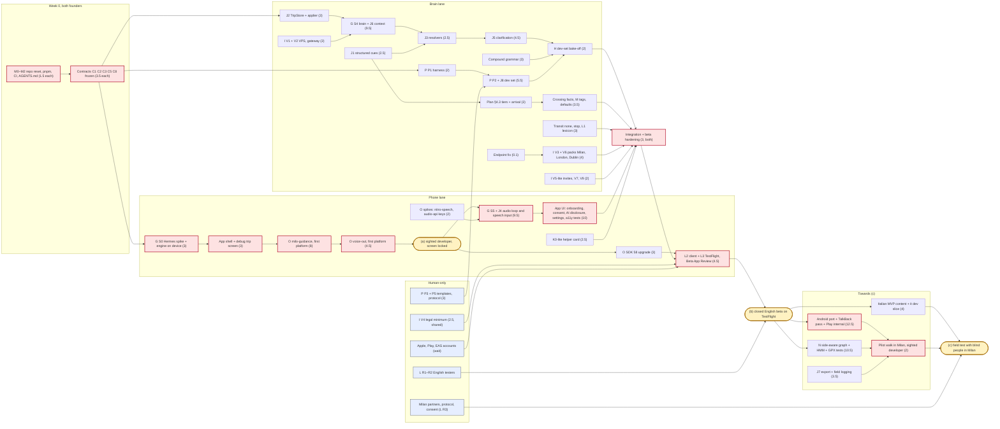

# Q: Engineering workflow for two developers and their coding agents: repo, contracts, CI, migration, critical path
Research date: 27 Sep 2026. Tags: [V] verified in a primary source I fetched (official docs, package registry, repo file, API); [P] secondary source; [U] could not verify; [M] my own measurement in this repo, a test I ran in the scratchpad, or my calculation. Bracketed numbers point to the Sources; letters point to the other reports of this folder (A–P); "plan" is `docs/piano-di-lavoro.md` v1. Report R (runtime rules) was not in the folder when this was written, so §4.2 leaves a slot for it.

This report does not repeat the work items of G–P. It adds what none of them covers: the repo layout, the interfaces between work streams, CI, how the agents coordinate, what happens to the existing code, and one combined critical path.

## In short

1. **Keep the engine and about 1,000 lines of the assistant. Archive `server-py/` and `web/` under a tag, after porting four things they do that the TypeScript packages do not** (§6.2). The engine has 7,051 lines and a 324-case parity oracle [M]. Scrapping it would cost weeks and lose the oracle.
2. **One pnpm workspace, no task runner.**
   - Layout: `apps/mobile` (with its native Expo modules), `apps/gateway`, `apps/viewer`; `packages/contracts`, `engine`, `dialogue`, `eval`; `tools/` for the pack builder, city overlays, replay and licence checks.
   - pnpm is chosen for its defaults: it does not run dependency install scripts [V 24], and it does not install a version until a day after it is published [V 24].
   - Turborepo and Nx are unnecessary. The engine's whole test suite runs in 25 s [M], and pnpm can already select only the packages changed since `main` [V 25].
3. **TypeScript 7 works for type-checking and for Metro, but not for tools that use the TypeScript API.**
   - Metro strips types with Babel, and Expo CLI only checks that `typescript/package.json` exists [V 13].
   - TS 7.0.2 exports no compiler API: only `version.cjs` and `unstable/*` [V 14], and its README says "API: not ready" [V 15]. So typescript-eslint, which requires TypeScript below 6.1, cannot run [V 16].
   - The engine source cannot run under Node's built-in type stripping (parameter properties, extensionless imports) [V 17][M]. Node deployables are therefore bundled with esbuild.
4. **Contracts first.**
   - Eight interfaces are frozen in week 0, in `packages/contracts` (§2).
   - TypeBox 1.x is the single schema source. It is already a pinned dependency of Pi [V 20], its types are JSON Schema 2020-12, and it was developed against TypeScript 7 [V 19].
   - Kotlin and Swift types come from quicktype, generated one type per union variant. Given a whole union, quicktype 26 merges the variants into one type whose fields are all optional [M].
   - The gateway speaks OpenAI-compatible chat completions with logical model names (H), not Pi's `streamProxy` protocol (G).
5. **CI costs almost nothing.**
   - GitHub Actions is free on standard runners, macOS included, for public repositories [V 27], and `DaMa02/milo` is public [V 39].
   - EAS Free gives 15 iOS and 15 Android builds a month on a low-priority queue, plus updates to 1,000 monthly users [V 8]. Starter ($19 a month plus usage) is needed only in months of heavy native work.
6. **Agents.**
   - `AGENTS.md` is canonical: one at the root and five nested (the closest file wins [V 1]). `CLAUDE.md` holds a single line, `@AGENTS.md` [V 2].
   - Parallel work uses git worktrees, locally for native work and as cloud sessions for TypeScript [V 3].
   - The other human approves every PR. A ruleset requires the last push to be approved by someone other than its author [V 30].
   - Agents only ever get capped staging keys.
7. **Task cards as GitHub Issue Forms on one Project board, plus MADR decision records** [V 32, 35]. GitHub Spec Kit is not adopted; its "constitution" becomes the non-negotiables section of `AGENTS.md` (§4.6).
8. **Effort (§7): the constraint is founder hours, not the order of the work.** At 20 h a week each, the effort model gives about 12 weeks to (a), 28 to (b) and 38 to (c) (ranges in §7.4). The least compressible work is native Kotlin and Swift, device tests and street tests. The founders' hours per week are unknown; they are the parameter that matters most.
9. **MVP cut for (b):**
   - **In:** iOS only, English, walking only, one stop by category; honest uncertainty tiers; crossing facts; packs for Milan, London and Dublin; dialogue with typed commands and targeted clarification; the helper card; voice feedback.
   - **Out:** Android for external testers, the live link, the side-aware graph and map matcher, transit guidance, wake word, offline ASR and on-device LLM, camera.

## 0. What the repo is today (re-measured)

| Path | Files | Lines [M] | Notes |
|---|---|---|---|
| `packages/engine/src` | 27 | 7,051 | Runtime dependencies flatbush, jsts, proj4. `tsc` with TS 7.0.2 finishes in 1.3 s |
| `packages/engine/test` | 7 tests + 2 helpers | 473 | Plus three gzipped fixtures (1.96 MB); `reference.json.gz` holds **324 parity cases** from the Python engine. **166 tests pass in 25 s** [M] |
| `packages/assistant/src` | 13 | 1,777 | Plus `grammar.test.ts` (309 lines). Only runtime dependency: `@anthropic-ai/sdk` |
| `server-py/` | 36 | 7,113 | 6,865 lines of Python. `tests/guidance_transcript.txt` is a 217-line golden guidance transcript |
| `web/src` | 38 | 4,752 | Plus 31 Playwright specs (5,763 lines), which encode the hackathon's voice flows |
| `contracts/` | 5 schemas, 12 fixtures, 2 Python scripts | – | Draft-07. The engine's `contracts.test.ts` validates every result against them with Ajv, in both languages |

- **Correction to the brief.** "13 test files, 7,512 lines" counts the gzipped fixtures as text. The engine's test code is 473 lines; the 324-case oracle lives in the data.
- **Precedent.** The squashed history starts at PR #11. On 26 Sep the two founders merged about 47 PRs. Daniele owned the engine, server and contracts; Leonardo owned the web app and the voice flows. PR #11 ("Validate shared fixtures before the web checks") shows that contracts first is already their habit [M].
- **Evidence of a Mac.** `server-py` runs `parakeet-mlx` (Apple Silicon only) and macOS `say`; the commits are Daniele's. So Daniele appears to have an Apple Silicon Mac [M]. Open question 3.

## 1. Target monorepo

### 1.1 Tree

```text
milo/
├─ AGENTS.md                       # canonical agent instructions (§4.2)
├─ CLAUDE.md                       # one line: @AGENTS.md
├─ .claude/settings.json           # shared deny rules, worktree sparsePaths, hooks
├─ .github/
│  ├─ CODEOWNERS
│  ├─ ISSUE_TEMPLATE/ task.yml  decision.yml  bug.yml
│  ├─ pull_request_template.md
│  └─ workflows/ pr.yml  nightly.yml  release-app.yml  deploy-gateway.yml  eval-test.yml
├─ pnpm-workspace.yaml             # apps/*, packages/*, tools/*; allowBuilds, minimumReleaseAge
├─ apps/
│  ├─ mobile/                      # Expo SDK 57 → 58, dev builds, iOS + Android (Expo web later, plan Phase A)
│  │  ├─ src/                      # screens, settings, onboarding and consent, helper card (K0)
│  │  ├─ modules/                  # local Expo modules, Kotlin + Swift (O §11)
│  │  │  ├─ milo-guidance/         # location service/session, steps, heading, voice-out, earcons, haptics, call state
│  │  │  ├─ milo-media-keys/       # only if O's audio-api spike fails
│  │  │  ├─ milo-speech/           # DictationTranscriber, only if the nitro-speech spike fails
│  │  │  └─ milo-precision/        # phase 2: ARCore Geospatial + crossing model
│  │  ├─ e2e/                      # Maestro flows
│  │  └─ app.config.ts, eas.json
│  ├─ gateway/                     # Node 24 LTS + Hono: /v1/chat/completions, register, config, geocode,
│  │  └─ deploy/                   #   transit, feedback, /s share relay; Dockerfile, compose, Caddyfile
│  └─ viewer/                      # static helper page (Vite + MapLibre + PMTiles), started from web/LiveMap
├─ packages/
│  ├─ contracts/                   # TypeBox sources → schemas/*.json (2020-12, generated, committed),
│  │                               #   openapi/gateway.yaml, fixtures/, legacy/ (today's draft-07 files)
│  ├─ engine/                      # @milo/engine (kept)
│  ├─ dialogue/                    # @milo/dialogue: fast path, TripStore, applier, templates, Brain, speak check
│  └─ eval/                        # @milo/eval: harness, metrics, CLI milo-eval (P §9)
├─ eval/                           # public corpus: dev/, train/, seeds/<licence>/, NOTICE.md,
│                                  #   test.manifest.json (SHA-256 and canary only, no items)
├─ tools/
│  ├─ pack-builder/                # Overpass → 1 km tiles, manifest, FTS5 search.db (I §6, N §6)
│  ├─ overlays/                    # city fetchers: APS, closures, entrances (M §3.4, §7)
│  ├─ replay/                      # GPX/JSONL → engine → cue transcript (N §3); the fake native stream
│  ├─ asr-bench/                   # Python (uv): noise mixing, jiwer (P §5.2)
│  └─ licences/                    # licence manifest for models, datasets, Pods, Gradle
└─ docs/ piano-di-lavoro.md, ricerca/, decisions/ (MADR), runbooks/
```

- **The private held-out test set lives in a separate private repo**, for example `DaMa02/milo-eval-private`. It holds the test split, the audio, the speaker sheet and the annotation log.
  - Only the manual `eval-test.yml` workflow fetches it, with a deploy key stored as a secret of a GitHub environment `eval-test` that requires a reviewer. On GitHub Free, environment secrets and required reviewers are available in public repositories [V 31].
  - The public repo keeps only the manifest of hashes and the canary GUID (P §10).
  - Runner-up: `age`-encrypted files in the public repo (P §10). Rejected, because git history is permanent and one leaked key exposes every past version.
  - Claude Code deny rules are "not a security boundary around the program" [V 5]. So the protection is that test items are never on an agent's disk.
- **Placement conflict between G and P.** The harness gets its own package, `packages/eval`, which depends on `@milo/dialogue` and `@milo/contracts`. `packages/assistant` disappears (§6).
- **Native modules as local modules inside the app.** `npx create-expo-module --local` puts them in `modules/` [V 11]. This keeps one build and one owner path (`apps/mobile/modules/**` in CODEOWNERS). Runner-up: standalone module packages, worth it only if another app will reuse them.

### 1.2 Package manager and task runner

| Option | Version (27 Sep) | For Milo | Against |
|---|---|---|---|
| **pnpm workspace (recommended)** | 12.6.0 [V 23] | Dependency `postinstall` scripts are off since v10, with an `allowBuilds` allowlist. `minimumReleaseAge` defaults to 1,440 minutes. `trustPolicy: no-downgrade` and `blockExoticSubdeps` [V 24]. Strict dependencies catch the undeclared imports an agent adds. `--filter "...[origin/main]"` [V 25]. Expo supports its isolated layout from SDK 54, with `nodeLinker: hoisted` as the documented escape hatch [V 6] | Half a day to migrate from npm; a second lockfile format to learn |
| npm workspaces (current) | 11.20.0 / 12.1.0 [V 23] | Zero migration. npm 11 now has `min-release-age`, `allow-scripts` and `ignore-scripts` [V 26] | Permissive by default. Node 24 LTS ships npm 11.19 [V 18], so the flags depend on the installed version |
| bun | 1.4.2 [V 23] | Fast; Expo supports it [V 6] | A second runtime next to Node, which the gateway, Vitest and Metro all use |

- **Why pnpm matters here.** The LiteLLM backdoor was on PyPI for about 40 minutes (G). A one-day minimum release age would have skipped it. Set `minimumReleaseAge: 4320` (three days) and add an exception list for urgent security fixes.
- **Task runner: none.** Nothing needs caching at 25 s of tests plus a 1.3 s type-check [M]. Add Turborepo (2.11.4 [V 23]) if the PR job goes over about 10 minutes. Nx (23.2.1) is heavier and not needed.
- **Expo in a monorepo.**
  - Metro is configured automatically since SDK 52 [V 6].
  - "Duplicate React Native versions in a single monorepo are not supported" [V 6]. So one React Native version across the workspace, and `apps/viewer` pins the same React major as `apps/mobile`.
  - Current SDK: `expo` 57.0.25 bundles React Native 0.86.3 and React 19.2.3; `next` is 58.0.0-preview.7 [V 12]. Start on SDK 57 and take O's SDK 58 upgrade (about 3 days) right after milestone (a), so the beta never changes SDK mid-way.

### 1.3 TypeScript 7 across Metro, tests and Node

| Consumer | Works with TS 7.0.2? | Evidence | Rule |
|---|---|---|---|
| `tsc` type-check (engine, dialogue, app) | Yes | Engine type-checks in 1.3 s [M]. `expo/tsconfig.base` uses `module: preserve` and `moduleResolution: bundler` [V 12], which TS 7 supports | Pin `typescript@7.0.2` exactly |
| Metro and Babel (the app bundles `@milo/engine` from source) | Not involved | Babel strips types. Expo CLI only checks that `typescript/package.json` and `@types/react` exist [V 13] | Keep `isolatedModules` and `verbatimModuleSyntax` on (already in `tsconfig.base.json` [M]) |
| Vitest 5.0.2 | Yes | 166 engine tests pass [M] | – |
| typescript-eslint and other TS-API tools | **No** | TS 7 exports no compiler API [V 14, 15]. typescript-eslint 8.70.1 requires `typescript >=4.8.4 <6.1.0` [V 16] | No ESLint in v1. oxlint 1.85.0 (MIT) if a linter is wanted [V 40]. Accessibility checks go through RNTL instead (O §9) |
| Node's native type stripping (gateway, pack builder) | **No, for the engine source** | Stripping needs `.ts` extensions on imports and erasable syntax only [V 17]. The engine has 6 parameter-property constructors and extensionless imports [M] | Bundle Node deployables with esbuild 0.28.2; run tools with tsx 4.23.15 [V 40] |

### 1.4 Other runtime pins

- **Node 24 LTS "Krypton"** (24.21.0, 7 Sep 2026) for CI, the gateway and tools [V 18]. Metro 0.87.1 and Vitest 5 both accept it [V 40]. The root `engines` field (`>=22.12.0`) can stay as the minimum.
- **Hono 4.13.9** for the gateway, as I proposed [V 40].

## 2. Contracts first

### 2.1 One schema source

| Option | Verdict | Why |
|---|---|---|
| **TypeBox 1.x** (`typebox` 1.3.34, MIT, no dependencies, 18 Sep 2026) [V 19] | **Recommended** | Its types *are* JSON Schema. Its compiler handles drafts 3 to 2020-12 and falls back to dynamic validation where JIT code generation is restricted [V 19]. It is "developed against the TypeScript 7 native compiler", ESM only [V 19]. Pi already pins `typebox` 1.3.27 [V 20], so tool schemas, validators and contracts are one object with no conversion. Tested: a union compiled with `Compile()` accepts a valid fix and rejects a partial one [M] |
| Zod 4 (`zod` 4.6.5) [V 21] | Runner-up | `z.toJSONSchema()` emits 2020-12 or draft-07 correctly for a discriminated union [M]. But it would be a second schema library next to Pi's TypeBox, and it needs a conversion step. Choose it only if the S0 spike moves the loop to the Vercel AI SDK |
| Hand-written JSON Schema | Only for the legacy files | No TypeScript types without codegen; drift between types and schema |

**Native types.** quicktype 26.0.0 (Apache-2.0) turns JSON Schema into Kotlin and Swift [V 22]. I tested it on a TypeBox union of three native events [M]:
- Given the whole `anyOf`, it produced one `NativeEvent` struct and class where every field outside `kind` and `t` was optional, in both Kotlin and Swift.
- Given **one schema per variant**, it produced correct types (`FixEvent` with required `lat`, `lon`, `acc_m`).

So `packages/contracts` emits one schema file per variant for the native boundary. The native side dispatches on `kind` with a ten-line switch. Generated files are committed, and CI fails if they drift.

**What to do with today's `contracts/`.**
- Move the five draft-07 schemas to `packages/contracts/legacy/` unchanged. They remain the engine's result contracts (overview, explore step, answer, plan, fact); `contracts.test.ts` keeps validating them with Ajv. Port a schema to TypeBox only when it has to change.
- Keep the 12 fixtures as test data. They are server-py outputs on the city zone, so use them as schema examples and viewer fixtures, not as parity cases.
- Archive `validate.py`, `make_fixtures.py` and `scripts/check-contracts.mjs`. They need Python and a macOS osmnx cache.

### 2.2 Contract table

Common rule: a contract changes only through a PR to `packages/contracts` that updates the TypeBox source, the generated files, at least one fixture and `CHANGELOG.md`. Both humans must approve it (CODEOWNERS). The version rule: additive changes (a new optional field, a new enum value its consumers ignore) bump the minor version; anything else bumps the major, with an overlap period.

| # | Interface | Between | Format and location | Owner (co-approver) | Version rule | Stub or fixture to build against | Freeze |
|---|---|---|---|---|---|---|---|
| C1 | **Native event stream** | `milo-guidance` (Kotlin, Swift) → engine and app (JS) | `NativeEvent` union: `fix` {t_mono_ms, t_wall, lat, lon, acc_m, acc_conf, speed, course, course_acc, provider, mock}; `steps` {count, t}; `heading` {deg, acc_deg, source}; `tts` {utterance_id, state: queued, started, finished, interrupted, failed; latency_ms}; `audio_route`; `call` {state: idle, ringing, in_call, voip; source}; `button` {kind: headset, magic_tap, previous_track}; `lifecycle`. Plus `NativeCommand` {speak, stop, earcon, haptic, start_guidance, stop_guidance, set_rate}. Files: `contracts/src/native.ts` → per-variant schemas → quicktype | Native owner (engine owner) | `v` in a handshake event. JS accepts v and v−1 for one app release | `tools/replay`: a TypeScript `FakeGuidance` that plays JSONL recordings, and GPX converted to JSONL, into the same interface. Three fixture walks: Porta Romana synthesised now, real ones from (a) | Week 0 |
| C2 | **Engine cue output (J1)** | engine → app speech queue, dialogue (`recall`, "repeat"), viewer | `Cue` {id, plan_v, step, cls: instruction, warning, confirmation, arrival, gps; priority 1–4 (safety … info); maneuver; dir; rel_deg; onto {osm, label}; landmarks[]; at_m and a distance band; tier: now, next_junction or uncertain (plan §4.3); facts[] per `fact.schema`; template key and parameters}. **No rendered text.** `render(cue, lang, lexicon)` turns it into words, so "repeat" can regenerate the cue at the current position (J §4.7) | Engine owner (dialogue owner) | Enums additive only. A new `cls` or `maneuver` value is a minor bump that consumers must ignore safely | The golden transcripts `server-py/tests/guidance_transcript.txt` and the Porta Romana replay, converted to cue JSONL | Week 0; J1 implements it |
| C3 | **E-v2 command union and Place refs** | parser (grammar, LLM, phone model) → applier; eval | `Commands` (1–4) from E §2 with the merges of §2.3. Two schemas: the model-facing one, plus a strict variant for cloud strict modes (E), and the *stored* form in which places are `resolved {id}` | Dialogue owner (eval owner) | `union_version` travels in the gateway's remote config and in every eval item. Any change re-runs the dev eval | 40 examples: E §2, J §5.5, G §5.9 | Week 0 |
| C4 | **TripStore schema (J2)** | dialogue ↔ app (persistence, forget, export) | SQLite DDL in `dialogue/src/store/schema.sql` plus TypeBox row types (events, register, frames, profile, summary). Forward-only numbered migrations with `PRAGMA user_version`. The export JSONL (J §4.2) doubles as corpus input | Dialogue owner (app owner) | A migration per change; never edit a shipped migration | An in-memory driver in Node plus one scripted trip fixture | Week 1 |
| C5 | **Gateway API** | app, dialogue, eval → gateway | OpenAI Chat Completions subset at `POST /v1/chat/completions`: SSE stream, `tools`, `tool_choice`, `response_format` json_schema, `stream_options.include_usage`. Logical models `milo-fast`, `milo-strong`, `milo-answer`. Plus `/v1/register`, `/v1/config`, `/v1/geocode`, `/v1/reverse`, `/v1/transit`, `/v1/feedback`. Typed errors `{error: {type: quota, auth, upstream, invalid}}`. Described in `contracts/openapi/gateway.yaml` | Server owner (dialogue owner) | `/v1` prefix; additive within v1. A `/v2` ships with an app release and keeps v1 for ≥90 days, the life of a TestFlight build (L) | pi-ai's scripted "faux" provider (G) plus a Hono mock with recorded streams; the staging URL | Week 0 |
| C6 | **City pack** | pack builder (VPS) → engine pack store (phone); viewer tiles | `manifest.json` {format: "milo-pack/1", city, version, osm_timestamp, bbox, tile scheme (1 km), tiles [{id, sha256, bytes}], overlays [{kind: aps, hazard, closures, entrances; licence; attribution; source_url; fetched_at; file}], search {file: `search.db`, sha256, fts}, completeness, licence ODbL-1.0}. Tiles are gzipped Overpass JSON (I §6); overlays sit apart with their own licence (M §3.4); FTS5 index (N §6). PMTiles for the viewer stay separate (K) | Server/data owner (engine owner) | `format` major version: the phone refuses an unknown major, and the builder emits the previous major for one app release | The Porta Romana fixture packaged as a pack (I §6's parity test) | Week 1–2 |
| C7 | **Live-share message** | app publisher → relay → viewer | K §5.2's wire: `POST /s` returns id and writeToken; `PUT /s/{id}` sends {seq, iv, ct}; `GET /s/{id}/events` is SSE; `DELETE`. AES-GCM with `seq` in the additional data. Plaintext `ShareState v1` (K §9.2, column b) and `ShareRoute v1`, the route sent only when it changes | Server owner (app owner) | `v` inside the plaintext, which the relay never sees. The viewer supports v and v−1 | A recorded trip fixture (K §9.1) | When K1 starts (after b) |
| C8 | **Eval item JSONL** | corpus authors, TripStore export → harness | P §9 fields plus `union_version`, `canary`, `expected_action` (apply, ask, refuse, answer; When2Call, P) and `licence` | Eval owner (dialogue owner) | A `schema` field. The frame canonicaliser is versioned with C3 | 20 hand-made items | Week 0 |

### 2.3 Where the reports disagree, and the recommendation

| Topic | Positions | Recommendation |
|---|---|---|
| **undo vs revert** | E and G: `undo`. J: `revert {to: original, request}` | One command, `revert {to: previous, original or request; request?}`. The parser accepts `undo` as an alias for `revert{to: previous}` for one union version. One command covers "annulla" and "go back to what I asked first" |
| **clarify vs split** | G: a `clarify` tool {understood, missing[], heard}. H: a `clarify/split` command. J: code decides whether to ask a targeted question or go one at a time | One `clarify {missing[], unsure[], heard}` in the union; no `split`. Splitting is a policy that code applies (J §5.4, rung 8), not something the model chooses. H's "rate of asking to split" becomes the rate at which the policy picks one-at-a-time, measured by the harness |
| **Place refs** | E: `last_place`, `ordinal`, `other`. J: adds `mentioned {category, text, ago_min}`, `list_item {list, ordinal}` and a stored `resolved {id}` | Model-facing `ref` ∈ {`last_place`, `other`, `list_item`, `mentioned`}. E's `ordinal` becomes `list_item`, with `list` defaulting to the last list read. `resolved {id}` exists only in stored frames (C4). The model never sees ids it could invent |
| **Gateway protocol** | G: Pi's `streamProxy` (`/api/stream`, pi's event stream). H: OpenAI-compatible with logical names. I: "pi-ai stream endpoint" | **OpenAI-compatible (H), implemented on pi-ai inside the gateway.** On the phone, pi-agent-core reaches it as a custom OpenAI-compatible provider (G says `createProvider()` supports these). Why: the wire stays stable when Pi ships one of its roughly two releases a week (49 in 20 weeks, G), or is replaced after the Hermes spike. The eval runner and curl can use it. Every shortlisted host speaks it (H §5.4). Runner-up: `streamProxy`, which is less phone code but ties every Pi upgrade to an app release |
| **Live-share rate and payload** | I §10: position, heading, instruction, next stop, "needs help"; about 300 bytes at up to 1 Hz; POST or WebSocket. K §5.2: PUT with a write token, SSE, event-driven plus every 5 s walking and 30 s still, richer state | **K's wire and rate, with the fields of K §9.2.** A helper cannot act on 1 Hz updates, and 1 Hz costs battery and data. The "needs help" flag from I joins the status enum |
| **Where map matching runs** | D: in the native module. N: an HMM in TypeScript on Milo's graph | **TypeScript (N)**, since its states are the engine's (edge, side) pairs. C1 therefore carries raw fused fixes and steps. If S0 shows the JS thread is too slow while locked (G §5.6), move the matcher native behind the same interface. Record this in an ADR |

**Accuracy semantics in C1.** Android's `getAccuracy()` is "the 68th percentile confidence level" [V 41]. Apple's `horizontalAccuracy` is only "the radius of uncertainty… in meters" [V 41]. So C1 carries `acc_conf: 0.68 | "unspecified"`, and the engine converts to the plan's 95% radius: about 1.62 × the 68% radius under a circular Gaussian (Rayleigh) [M], as O noted for ARCore.

## 3. CI/CD

### 3.1 Pipeline

| Trigger | Where | Jobs | Budget |
|---|---|---|---|
| **Every PR** (`pr.yml`) | ubuntu-latest | 1. `pnpm install --frozen-lockfile`, with builds allowlisted. 2. `tsc -b` on changed packages and their dependents (`--filter "...[origin/main]"`). 3. Vitest: engine (166 tests, 25 s [M]), contracts, dialogue, gateway, eval. 4. Contracts: regenerate the TypeBox outputs and check `git diff --exit-code`; validate every fixture with TypeBox `Compile`; run the legacy Ajv test. 5. en/it key and placeholder parity for the engine, dialogue templates and app strings (L1). This replaces `scripts/i18n.test.mjs`, which only covers `web/`. 6. `apps/mobile`: jest-expo with React Native Testing Library and `react-native-accessibility-engine` (O §9). 7. Grammar-only eval on the dev set, gated: exact-frame accuracy no lower than the committed baseline, and **zero safety violations** on the safety set (P §9). 8. Licence gate (§3.3). 9. The replay transcript diff for the engine, once J1 lands (N §3) | < 10 min |
| **Nightly, or the `device` label** (`nightly.yml`) | ubuntu-latest with KVM; macos-latest | Android: `expo prebuild`, a Gradle debug build, an API 35 emulator (2-vCPU Linux runners have hardware acceleration [V 28]), Maestro flows and O's TalkBack logcat capture. iOS (weekly): a simulator build and the Appium `performAccessibilityAudit` (O §9) | Free in a public repo [V 27] |
| **Weekly or on demand** (`eval-cloud`) | ubuntu | Dev-set bake-off through the **staging** gateway (H §5.1), with a hard budget in the gateway (for example €5 a run). Writes JSONL and a Markdown summary as an artifact | ~€10–20 a month [M] |
| **Manual, per decision** (`eval-test.yml`) | ubuntu, environment `eval-test` with a required reviewer | Fetches the private test repo and prints aggregate metrics only. It logs who ran it and why (P §10) | Rare |
| **Tag `app-v*`** (`release-app.yml`) | EAS | EAS Build (iOS, and Android later) with the `beta` profile; submit to TestFlight and the Play internal track. JavaScript-only fixes go out with `eas update --channel beta` | Within EAS Free (§3.2) |
| **Push to `main` touching `apps/gateway`** | ubuntu → GHCR → SSH | Build the image, deploy to **staging** (I §3, CX23) | – |
| **Tag `gw-v*`** | environment `production` | The same image goes to prod after one reviewer approves. "Prevent self-review" stops the person who started the deploy from approving it [V 31] | – |

- **EAS Update channels.** A build is tied to a channel, an update is published to a branch linked to that channel, and it applies only to builds with exactly the same runtime version. Updates cannot change native code [V 10]. So wording and template fixes reach testers without a new TestFlight build, but native fixes do not.
- **EAS Workflows is not used.** The Free plan includes 60 CI minutes a month [V 8]. Maestro and builds run on GitHub runners instead, which are free for a public repo [V 27].

### 3.2 Costs and limits

| Item | What is free | When to pay |
|---|---|---|
| GitHub Actions | Free on standard GitHub-hosted runners, macOS included, for **public** repositories [V 27]. `DaMa02/milo` is public [V 39] | If the repo ever turns private: 2,000 minutes a month on Free; macOS costs $0.062 a minute against $0.006 on Linux [V 27] |
| Rulesets, CODEOWNERS, environments | Rulesets and protected branches on public repositories with GitHub Free [V 30]. Required reviewers and environment secrets only in public repositories on Free [V 31] | – |
| EAS Build | **Free:** 15 iOS and 15 Android builds a month, low-priority queue, 45-minute timeout, one build at a time, updates to 1,000 monthly users, 60 workflow minutes [V 8] | **Starter:** $19 a month plus usage, with $45 of build credit (iOS $2 and Android $1 per medium build), a high-priority queue and 2-hour timeout, updates to 3,000 monthly users [V 8] |
| Local builds | `eas build --local` works on macOS and Linux, but without caching or "Secret" EAS variables [V 9] | Useful on the founder's Mac during native iteration |
| Apple and Google accounts | – | $99 a year and $25 once [P, per L] |
| Staging VPS | – | Hetzner CX23, €5.49 a month (I) |

**Expected usage [M].**
- A weekly beta needs about 4–5 builds per platform a month, plus dev-client rebuilds after native changes.
- iOS will go over 15 in the months of `milo-guidance` work. Use the Mac for local builds then, or take Starter for that month (≈ $19–40).
- Revisit if the Free queue waits more than an hour. Its length is not published [U].

### 3.3 Supply chain and licences

- **Pins.**
  - Exact versions (`save-exact`), a committed lockfile, `--frozen-lockfile` in CI.
  - `allowBuilds` limited to what needs it (for example `better-sqlite3` in the gateway, esbuild).
  - `minimumReleaseAge: 4320`, `trustPolicy: no-downgrade`, `blockExoticSubdeps` [V 24].
  - Pi installed with scripts off and pinned exactly, as G says.
- **Licence gate on PRs.** `actions/dependency-review-action` with an `allow-licenses` list. It runs on public repositories; `deny-licenses` is "deprecated for possible removal", so use the allowlist [V 33].
  - Allowlist: MIT, Apache-2.0, BSD-2-Clause, BSD-3-Clause, ISC, 0BSD, CC0-1.0, Unlicense, BlueOak-1.0.0, Zlib, Python-2.0.
  - MPL-2.0 only after a human review.
  - This blocks GPL, AGPL and LGPL (static linking on iOS, O), and non-commercial or no-derivatives licences.
- **What the action does not see:** CocoaPods, Gradle, model weights and datasets. `tools/licences/manifest.json` lists each with an SPDX id, attribution and source; a script fails the PR if an entry is missing or outside the allowlist. Examples to list: Parakeet CC-BY-4.0 with attribution (O); corpus folders by licence class (P §7); pack data under ODbL (I).
- **Server-side GPL and AGPL** (osmium-tool, Overpass) are allowed only inside the `apps/gateway/deploy` Docker images, never in the app bundle (I, N).

## 4. Coding-agent workflow

### 4.1 AGENTS.md or CLAUDE.md

**Recommended: `AGENTS.md` as the single source, at the root and in five packages, plus a one-line root `CLAUDE.md` that contains `@AGENTS.md`.**
- `AGENTS.md` is "now stewarded by the Agentic AI Foundation under the Linux Foundation". In a monorepo "the closest AGENTS.md to the edited file wins; explicit user chat prompts override everything". Codex, Cursor, Gemini CLI and GitHub Copilot's coding agent read it [V 1].
- Claude Code reads `AGENTS.md` when no `CLAUDE.md` exists. Reading it directly needs v2.1.277 or later, and some sessions cannot load it; for those, the docs recommend importing it from a `CLAUDE.md`. The import never makes Claude read the file twice [V 2]. The current Claude Code is 2.1.283 [V 40].
- Keep each file under about 200 lines; longer files "reduce adherence" [V 2]. Path-scoped rules go in `.claude/rules/` [V 2].
- Auto memory is machine-local and not shared across machines or cloud environments [V 2]. **So everything an agent must know lives in the repo:** AGENTS files, cards, ADRs and PR hand-offs.

Runner-up: `CLAUDE.md` only. Rejected, because a second agent (Codex, Cursor) would need a copy.

### 4.2 Outline of the root AGENTS.md

1. **What Milo is**, in three lines, with links to plan v2 and the index of reports.
2. **Commands:**
   - `pnpm i`
   - `pnpm -r typecheck`
   - `pnpm -r test`
   - `pnpm --filter @milo/engine test`
   - `pnpm contracts:gen`
   - `pnpm eval:grammar --split dev`
   - `pnpm replay <walk.jsonl>`
   - `pnpm --filter mobile expo run:ios|android` (dev build)
   - `pnpm --filter gateway dev` (staging keys only)
3. **Repo map and ownership** (points to CODEOWNERS), and the list of **hot files** with their owner and queue (§4.4).
4. **Non-negotiables** (the "constitution"):
   1. **Blind-impact check.** Every PR that changes what Milo says or how it is operated answers the 10 questions of plan §0.1 in the PR template.
   2. **Speaking rules** (`docs/speaking-rules.md`) and the **number rule**: every spoken number is a fact with evidence (`fact.schema`), and model text passes the `speak.ts` check or is replaced by the engine's sentence.
   3. **Never say "cross now"**, never "you have arrived" inside the GPS error, and never ask a question at a crossing. At the kerb Milo informs; it does not command (plan §1.5, §4.3, §4.4).
   4. **The model never computes routes, distances or directions.** It emits commands; code applies them (E, G).
   5. **Never open, read, copy or paraphrase the private test set.** Tune on dev only. Test items never go into prompts, grammar rules, few-shot examples or LoRA data (P §10).
   6. **Licences:** the allowlist of §3.3; datasets by licence folder (P §7); attribution in NOTICE files.
   7. **Privacy:** no location, utterance or IP logging on the server; no analytics SDKs; no coordinates in LLM context (I §11, J §4.8).
   8. **Keys:** staging only; never commit `.env*`; never print secrets.
   9. **Contracts:** never hand-edit generated schemas. Change the TypeBox source, a fixture and the changelog; both humans review.
   10. **Runtime rules** (slot for report R, if it confirms them). Candidates: guidance must not depend on JS timers or the network; all speech goes through `milo-guidance`; one owner for the audio session (O §3).
5. **Workflow.** One card, one branch, one PR, one worktree. PRs under about 400 changed lines, generated files excluded. Run the commands. Fill in the Hand-off section. Write or update an ADR when a decision changes.
6. **Tests.**
   - Engine golden transcripts are regenerated only with `pnpm replay --update` and a stated reason.
   - The Python parity tests are frozen at tag `engine-parity-v0.2`. After the first deliberate change in behaviour they become golden transcripts.

**Nested AGENTS.md files (≤80 lines each):**
- `packages/engine`: a single owner, the queue for hot files, the golden-transcript rules, and "no network in the engine except the pack store and Photon".
- `packages/dialogue`: atomic application of commands, the confirmation gate, the rule that stored refs are resolved ids, and the context budgets (G §5.3, J §4.8).
- `apps/mobile`: the device test checklist (locked screen, VoiceOver and TalkBack on and off, Bluetooth headset, a Samsung), the audio session owned by `milo-guidance`, and "never `expo-location` in the background".
- `apps/gateway`: stateless, no request bodies in logs, typed `quota` errors, prepaid providers.
- `packages/eval`: splits, the canary, the rule of opening the test set once per decision, and statistics (Wilson intervals, McNemar).

**`.claude/settings.json`** (shared):
- `worktree.sparsePaths` per area [V 4];
- deny rules `Read(./.env*)` and `Read(./eval-private/**)` as a speed bump, not a boundary [V 5];
- a hook that runs `pnpm contracts:gen --check` after edits under `packages/contracts`.

### 4.3 Running several agents at once

| Work | Where | Why |
|---|---|---|
| Native modules, app UI on a device, street tests | Local `claude --worktree <card-id>`, one worktree per card [V 3] | They need Xcode or Android Studio, a phone, sometimes the Mac |
| Engine, dialogue, eval, gateway, pack builder, overlays | Cloud sessions or local worktrees | Headless tests; long unattended runs. Cloud environment secrets hold staging values only |
| Research, ADR drafts, corpus paraphrases | Cloud sessions | No repo writes outside `docs/` or `eval/` |

- **Limits.** Each founder runs at most two or three concurrent agent PRs; review capacity is the bottleneck (§7). Never two agents on the same hot file.
- **Hand-off between agents.** Always through the card, the branch and the PR's "Hand-off" section: state, what is left, how to verify, which traps were found. Never through chat history.

### 4.4 Ownership, review and hot files

- **CODEOWNERS** (in `.github/`; owners are requested for review automatically, and "an approval from any of the owners is sufficient" [V 29]):
  - `packages/engine/**`, `tools/pack-builder/**`, `tools/overlays/**`: the engine owner.
  - `packages/dialogue/**`, `packages/eval/**`, `eval/**`: the dialogue owner.
  - `apps/mobile/**`, `apps/viewer/**`: the app owner.
  - `apps/gateway/**`: the server owner.
  - `packages/contracts/**`, `AGENTS.md`, `.github/**`, `docs/decisions/**`: **both**.
- **Ruleset on `main`** (free for public repositories [V 30]):
  - a PR is required, with 1 approval and review from code owners;
  - **the most recent reviewable push must be approved by someone other than the person who pushed it** [V 30]. With two humans, the founder whose agent wrote a PR can never be its only approver;
  - the `pr.yml` checks must pass;
  - linear history, no force pushes, conversations resolved.
  - A review turnaround of 48 hours or less is a team rule, not a GitHub setting.
- **One engine owner (J §7) and queues for the known collisions** (a card holds its files in the Project's "files owned" field; one card per hot file at a time):
  - `navigate.ts`: J1 structured cues → plan §4.3 uncertainty tiers → N's look-ahead and matcher hook.
  - `osm/overpass.ts`: remove `maps.mail.ru` and `overpass.kumi.systems` (day 1) → M's `NODE_TAGS` → I's pack store, with `runOverpass` moved behind a `PackSource` interface.
  - `zone.ts`: M's `Crossing.vibration` and `source` → N's side-aware graph.
  - `plan.ts`: transit `none` and the stop constraint → several stops → N's side-aware graph and PPR cost matrix → re-routed transit walking legs.
  - `i18n/en.ts`, `it.ts`: first L1's mechanical refactor (lexicon layer, CLDR units, key-parity test), then content PRs.
- **PR template:**

```markdown
Card: #<id>   Milestone: a | b | c   Contracts touched: none | C<n> vX.Y
## What changed and why
## Blind-impact (plan §0.1): hands / ears / screen reader / precision / error / safety / load / control / personalisation / language
## Evidence: tests run, spoken transcript or cue diff (not screenshots), device and OS if native
## Licences added or changed
## Hand-off: state · next step · how to verify · traps
## Agent: tool and model, share of code written by the agent (rough)
```

### 4.5 Keys

- **Agents get only staging credentials.** The staging gateway has provider keys capped at a few euros a day (I §3), and provider accounts are prepaid (I §4).
- **Production keys** live only on the prod VPS and in the GitHub environment `production`, which requires a reviewer and blocks self-approval [V 31].
- **Signing credentials** stay in EAS.
- `.env.example` is rewritten to hold staging variable names only.

### 4.6 Spec-driven tooling or plain task cards

**GitHub Spec Kit** is MIT; `specify-cli` 1.0.12 appeared on 25 Sep 2026. It needs Python 3.11 or newer and `uv`, and its cycle is "constitution once per project; specify → plan → tasks → implement → converge per feature", with artefacts in `.specify/` [V 34].
- **Against it for Milo.** The plan and reports A–P already are the specification. Per-feature artefacts would duplicate them and drift. It would add a Python toolchain for two part-time developers.
- **Recommendation: plain task cards (§5) plus MADR.** Borrow two ideas:
  - the constitution becomes `AGENTS.md` §4, the non-negotiables;
  - "converge" becomes the PR checklist: acceptance tests pass, the card is updated, and the ADR is written if a decision changed.

## 5. Task cards and decisions

### 5.1 Card template (`.github/ISSUE_TEMPLATE/task.yml`; issue forms support required fields and default labels, projects and type [V 32])

```yaml
id:            Q-3 / J1 / V2 …              # report letter + item, or plan section
goal:          one sentence, user-visible if possible
links:         plan §…, report §…, ADR …
contracts:     none | C1…C8 (read) | C… (change → both humans)
files owned:   paths (hot files take the queue lock)
depends on:    #issues / contracts / spikes
parallel with: #issues known to be safe
acceptance:    - test names or commands that must pass
               - measurable criterion (e.g. "no guidance message > 20 words at brief level")
blind impact:  the 10 questions of plan §0.1, "n/a" allowed only for internal code
human-only:    recordings, consent, legal text, street test, store forms (who, when)
estimate:      nominal dev-days (report's figure) · k factor (§7.1)
agent:         allowed | assist-only | human-only
```

### 5.2 Where cards live

- **GitHub Issues plus one Project board.** Fields: stream, milestone (a, b or c), owner, status, nominal estimate, k, files owned.
- **Why:** agents can read and update issues with `gh` or the GitHub MCP server; forms enforce the fields; the board is the single "who does what" view.
- **Runner-up: Markdown cards in the repo.** They are versioned and readable offline, but they become a second source of truth that drifts from PR state.
- **The plan v2 keeps only the index of work items**, linking to the issues.

### 5.3 Decision records (MADR)

- **Format.** MADR 4.0.0 (MIT OR CC0-1.0) with its "minimal" template, in `docs/decisions/NNNN-title.md` [V 35]. Status proposed → accepted or superseded. The "Confirmation" field names the test or measurement that confirms the decision.
- **ADRs to open now**, for decisions the reports leave open:

| # | Decision | Input | Decided by |
|---|---|---|---|
| 0001 | pnpm workspace, no task runner, TS 7 pinned (§1) | Q | Week 0 |
| 0002 | TypeBox as the contract source; per-variant quicktype (§2.1) | Q | Week 0 |
| 0003 | Gateway speaks OpenAI-compatible, logical model names (§2.3) | G, H, Q | Week 0 |
| 0004 | E-v2 command union: `revert`, `clarify`, refs (§2.3) | E, G, H, J | Week 0 |
| 0005 | Harness (Pi behind `Brain`) and where the loop runs | G S0 spike | End of S0 |
| 0006 | First platform for (a) and for the beta (plan says Android, L says iOS) | L, open question 3 | Week 0 |
| 0007 | Map matching in TypeScript or native (§2.3) | D, N, S0 | After S0 |
| 0008 | Pack format v1 (Overpass JSON tiles) vs MVT | I, N Q1 | Before the second country |
| 0009 | Default cloud model and host; US with zero retention, or EU only | H §7, I | After the dev-set bake-off |
| 0010 | Trip-log retention default (7 days) and export consent | J, I | Before (b) |
| 0011 | Minimum OS (iOS 17, Android 10 or 13) | O Q1 | Week 1 |
| 0012 | What the headset "previous track" button does | J Q2, O Q3 | Before S5 |
| 0013 | Language of the Milan field test | L §2.4, open question 6 | Before (c) recruiting |
| 0014 | Transit out of the MVP; Transitous contact | I §9, N | Before (b) |

## 6. Migration from the current code

### 6.1 Per directory

| Path | Decision | Reason | When |
|---|---|---|---|
| `packages/engine/**` | **Keep; refactor in place** | Pure, tested, runs on the phone (plan §2.2). Collisions are handled by the queues of §4.4 | Continuous |
| `engine/src/osm/overpass.ts` `DEFAULT_OVERPASS_ENDPOINTS` | **Change on day 1** | Drop `maps.mail.ru` (VK) and the duplicate `overpass.kumi.systems` (plan §3, I §8, M) | M0 |
| `engine/test/fixtures/*`, `reference.json.gz` | **Keep** | The 324-case oracle; parity frozen at tag `engine-parity-v0.2` | M1 |
| `packages/assistant/src/grammar.ts`, `router.ts`, `speak.ts`, `strings.ts`, `llm/local.ts`, `test/grammar.test.ts` | **Move** (`git mv`) to `packages/dialogue` | G §8: the grammar grows compound commands; `speak.ts` keeps the number check and the fallback sentence counts; `local.ts` becomes the single-shot phone parser | M4 |
| `assistant/src/chat.ts` | **Refactor** into the answer prompt of the `Brain` | Its rules are right: no directions, "From general knowledge," or "According to <site>", at most three sentences | M4 |
| `assistant/src/commands.ts`, `interpret.ts` | **Delete** after extracting their rules into a note | One action per utterance, replaced by C3 (G §8) | M4 |
| `assistant/src/llm/anthropic.ts`, `openai.ts`, `gemini.ts`, `index.ts`, `types.ts`; the `@anthropic-ai/sdk` dependency | **Delete** | pi-ai on the gateway replaces them (G, H) | M4 |
| `server-py/**` | **Archive** (tag `hackathon-2026-09-26`), then delete from `main` | Its engine is ported; FastAPI on a Mac is not the new server (I) | M5, after §6.2 |
| `server-py/tests/guidance_transcript.txt` | **Move** to `engine/test/fixtures/golden/` | The first golden transcript for J1 (N's STA method) | M5 |
| `server-py/tests/test_interpret.py` (381 lines, 180 of them with quoted inputs), `web/tests/*.spec.ts` (31 specs) | **Mine, then archive** | Utterance → action cases become eval seeds (C8, dev split). Flow specs become the list of dialogue scenario tests | M5 |
| `web/src/components/LiveMap.tsx`, `LiveMap.css`, `JourneyMap.tsx` | **Move** (`git mv`) to `apps/viewer/src/` | K §7: validation, auto-fit, accuracy circle, heading arrow, fallback text; port Leaflet → MapLibre in K1 | M6 |
| Rest of `web/**`, `playwright.config.ts` | **Archive** | A browser app on a Mac server; the native app replaces it | M6 |
| `contracts/*.schema.json`, `contracts/fixtures/*` | **Move** to `packages/contracts/legacy/` | The engine's result contracts and test data (§2.1) | M3 |
| `contracts/validate.py`, `make_fixtures.py`, `scripts/check-contracts.mjs`, `tools/reference/dump.py` | **Archive** | They need Python and the macOS osmnx cache; `reference.json.gz` stays | M3 |
| `scripts/i18n.test.mjs` | **Replace** | L1's parity test over the engine, dialogue and app | M2 |
| `docs/architecture.md`, `features.md`, `how-we-built-it.md`, `roadmap.md` | **Archive** | They describe the hackathon system, and an agent would read them as current | M1 |
| `docs/speaking-rules.md` | **Keep; update** | Rule 3 changes to left/right first (plan §4.2) | With L1 |
| `README.md`, `.env.example` | **Rewrite** | Match the new layout; staging variable names only | M2 |

### 6.2 What server-py and web do that is not yet in the TypeScript packages

Checked by reading the code [M]. Each item becomes a card or an explicit "dropped" line in an ADR, so nothing is lost silently.

- **Place search and reverse geocoding: already ported.** `engine/src/places.ts` has Photon, the noise filters, the 25 km cut-off, reverse lookup and the offline name fallback.
  - **Missing: the misheard-name correction.** server-py's `corrections()` asks a model for up to two names the recogniser may have misheard. The engine exposes a `fix` callback for this, but nothing in TypeScript implements it.
  - → Card: implement `fix` in the dialogue through the gateway, or replace it with J's phonetic gazetteer match. Decide after measuring both on the street-names set (P §5.1).
- **The interpret context rules.**
  - server-py's `/interpret` passes a context: view; pending origin, destination or stop; candidates; stop candidates; last action; whether a destination exists; route ids.
  - It never ends on "none": an unusable parse becomes a chat answer.
  - It keeps a per-session history of six chat turns and trip facts.
  - The TypeScript `interpret.ts` returns `none{model_unavailable}` and keeps no history [M].
  - The Jev tier (TypeSafe, a proprietary API) is **dropped**.
  - → These become the dialogue's C4 register fields and the rung-3 fallback of G §5.7.
- **The interaction invariants in `web/src/App.tsx` and hooks:**
  - "stop" is always local and never waits behind the network;
  - an interpretation superseded by a newer one cannot act (generation tokens);
  - a busy state rejects new commands except stop;
  - changing origin or destination cancels guidance and the pending stop;
  - speed steps of ±0.15;
  - guidance coalesces fixes in flight and warns when the page is hidden.
  - → Dialogue scenario tests and C2's priority rules.
- **Voice endpoints: dropped by design.** Parakeet MLX speech recognition and macOS `say` are replaced by on-device recognition (O §4) and `milo-voice-out`. Keep `tts_api.speakable`'s idea, "N m" read as "N metres", as a CLDR unit rule (L §4.2).
- **The hint after each kind of answer: dropped by design.** Plan A3 says suggestions only at first. The engine-sentence fallback counts are already in `speak.ts`.
- **Zone building for an origin outside the city: already in the engine** (`Engine.zoneFor`, the 6 km span, the 1.5 km margin). Packs replace the network part (I §6).

### 6.3 Order

1. **M0 (day 1, one PR):** remove the Russian and duplicate Overpass endpoints.
2. **M1:** tag `hackathon-2026-09-26` and `engine-parity-v0.2`; archive the stale docs.
3. **M2:** switch to pnpm; `pr.yml` with the engine type-check and tests, which must be green first; `AGENTS.md`, `CLAUDE.md`, CODEOWNERS, ruleset, templates, README.
4. **M3:** create `packages/contracts` (legacy move plus C1, C2, C3, C5, C8); fix the path in the engine's contract test.
5. **M4:** create `packages/dialogue` by moving files; delete the old adapters.
6. **M5:** mine the tests and golden transcript (a 1–2 day agent card); delete `server-py/`.
7. **M6:** move the viewer files; delete `web/`.

Steps 1–4 are serial and take both founders about 3–4 days. From step 5 on, the lanes of §8 run in parallel.

## 7. Effort and critical path

### 7.1 How far to trust the per-report estimates

**Evidence on coding agents:**
- **METR, early 2025 (RCT).** 16 experienced developers on large mature repositories (22k+ stars, 1M+ lines), 246 issues. With AI allowed, tasks took **19% longer**. The developers had expected a 24% speed-up and afterwards still believed they had gained 20% [V 36].
- **METR, February 2026 update (late-2025 tools).** 57 developers, 800+ tasks, 143 repositories.
  - Task time changed by **−18% (CI −38% to +9%)** for returning developers and **−4% (CI −15% to +9%)** for new ones.
  - METR calls this "only very weak evidence", because of selection: developers now decline to work without AI, and 30–50% withheld tasks they did not want to do without it [V 37].
  - It also notes that time measurements are unreliable for developers running several agents at once [V 37].
- **METR survey, spring 2026.** 349 technical workers self-report a median 3× speed-up. METR cautions that people "overestimated AI's effect on their time spent on tasks by 40 percentage points" [V 38].
- **Local evidence [M].** The engine port landed as one agent commit of 8,407 insertions, with an oracle of 324 reference cases, less than a day of wall-clock time after the hackathon ended. This is the condition in which agents do best: a mechanical port against an executable oracle.

**The k factors used below** multiply the reports' nominal estimates. They are my judgement from this evidence [M]:

| Kind of work | k | Why |
|---|---|---|
| TypeScript with an oracle, golden files or a schema (engine refactors, contracts, gateway, pack builder, harness, overlays) | 0.6–0.8 | Agent-friendly, verifiable; the reports' estimates were written for humans |
| TypeScript tuned for behaviour (brain, clarification, templates, prompts) | 1.0 | The work is iteration against the corpus; an agent writes the code, but the loop is measurement |
| React Native UI and accessibility | 0.9–1.0 | Screen-reader checks stay manual (O §9) |
| Native Kotlin and Swift for background, audio and sensors | 1.2–1.4 | O's 8–12 days for `milo-guidance` on both platforms is optimistic. Aggressive OEM battery killers (plan §4.7), iOS background rules and App Review are learned on devices, where agents do not accelerate |
| Street, recordings, recruitment, consent, legal texts | 1.0 in effort, plus calendar lead time | Agents draft; they do not walk or recruit |

A 15% overhead for reviewing the other founder's agent PRs and for coordination is added on top [M].

### 7.2 Assumptions

- **A1.** The phone lane is owned by one founder (proposed: Leonardo, who did the web and voice UX in the hackathon) and the brain lane by the other (Daniele: engine, server, contracts). §8 has the table.
- **A2.** The Mac and iOS question is settled in week 0.
  - The main case is **iOS first**: (a) on iOS, Android after (b).
  - If no Mac is available to the native owner, (a) runs on Android and (b) adds about 8–9 effective days for the Swift half.
- **A3.** Estimates marked [M] cover plan items that no report estimates:
  - app shell 3–4 days; app UI, onboarding, consent and settings 8–12;
  - plan §4.3 tiers and cautious arrival 3–5; transit `none` plus the stop constraint 1–2;
  - crossing facts 4–6; compound grammar 3–4;
  - integration 3; Italian content for the MVP 4–6; field logging 2.
- **A4.** A day is 8 hours of focused work; calendar weeks = days × 8 / H, with **H** each founder's hours per week.
- **A5.** Accounts (Apple, Play, EAS, Hetzner) are requested in week 0. Waiting time is not counted, except Beta App Review, which I treat as one day [U].
- **A6.** Recruiting for (c) starts at (a), as the founders said: "li cerchiamo appena abbiamo qualcosa di concreto". Its 4–8 week lead time runs in parallel [U].

### 7.3 Dependency graph

Red nodes are the dependency-critical chain; the brain lane is critical by load (§7.4). Figures are effective founder-days (nominal × k).



### 7.4 Critical paths and calendar

**Load per founder, iOS first, effective days before the 15% overhead [M]:**
- **Phone lane:** about 26 days to (a), and about 58 days to (b). It is also the dependency-critical chain: S0 → shell → guidance → voice-out → audio loop → UI → TestFlight.
- **Brain lane:** about 64 days of load to (b), most of it agent-compressible TypeScript. It becomes the binding constraint if TypeScript does not reach k ≈ 0.7.
- **Result, with the overhead:** about 30 days to (a), and both lanes land near **70 founder-days each for (b)** (range 50–90). (c) adds about 25 days each (range 20–35), plus the recruitment lead time.

| Milestone | Founder-days each (range) | H = 10 h/wk | H = 15 | H = 20 | H = 30 |
|---|---|---|---|---|---|
| (a) First walk by a sighted developer with the screen locked | ≈ 30 (20–40) | ≈ 24 wk | 16 | 12 | 8 |
| (b) First closed English beta on TestFlight | ≈ 70 (50–90) | ≈ 56 wk | 37 | 28 | 19 |
| (c) First field test with blind people in Milan | ≈ 95 (70–125), plus recruiting | ≈ 76 wk | 51 | 38 | 25 |

**Levers, in order of effect:**
1. **H itself.**
2. **Start the native path on day 5.** S0 and `milo-guidance` wait only for C1. The founder not doing native work feeds agents the TypeScript backlog from day 1.
3. **The MVP cut below.**
4. **Move brain-lane cards that are pure TypeScript with an oracle to unattended agent runs**: pack builder, overlays, V7 and V9, the harness. They still need review.
5. **(a) on iOS if a Mac is available.** This avoids building the Android native half before (b).

These are ranges from unmeasured estimates. Re-plan after the first ten cards, using measured days per card per k class.

### 7.5 MVP cut for milestone (b)

- **In:**
  - iOS (VoiceOver), guidance with the screen locked;
  - push-to-talk with the on-screen button and magic tap; the headset button only if O's spike passes;
  - on-device speech recognition with contextual street names;
  - the E-v2 union through the gateway: one default model picked on the dev set, a fallback chain (H §5.3), an ADR;
  - TripStore with the log, register, frames, saved places and "always avoid" preferences;
  - J3 resolvers ("repeat" regenerated) and J5 targeted clarification, using n-best disagreement where word confidence is missing;
  - J1 cues, plan §4.3 tiers and cautious arrival (a safety truth, not polish), crossing facts with UK and Irish defaults (M §3.3), L1 lexicon and units;
  - walking only, one stop by category, "no transit";
  - packs for Milan, London and Dublin (M's pilots), with other cities marked unsupported;
  - the K0-lite helper card;
  - L2 voice feedback;
  - the legal minimum of I §12 (V4) before the first external tester;
  - invite codes instead of attestation.
- **Out, with where each goes:**
  - Android for external testers → (c);
  - the live link and viewer (K1) → after (b);
  - several stops, stop by name, arrive-by (plan §4.5) → after (b);
  - the side-aware graph and HMM matcher (N) → (c), where Milan's porticoes need them;
  - transit guidance → phase 5;
  - wake word, App Shortcuts, offline speech recognition, on-device LLM (L, O) → later;
  - the camera → phase 2;
  - NYC overlays (M) → after the London and Dublin feedback;
  - attestation (I V5) → before the public release.
- **If (b) must come sooner** (about −12 effective days):
  - defer compound grammar (the model handles compound sentences);
  - defer detailed crossing facts beyond today's signal and sound information plus the regional wording;
  - replace packs with the gateway's Overpass proxy for the three pilot cities;
  - keep the G §5.7 ladder and defer J5's full policy.

## 8. Streams and owners

| Stream | Human owner (proposal) | Agent share | Inputs | Outputs | Blocked by | Serial steps |
|---|---|---|---|---|---|---|
| Engine | Daniele (single engine owner, J §7) | High | C1, C2, C6; plan §4.3–4.5; J1, L1, M, N | Cues, tiers, crossing facts, pack store, side-aware graph, matcher, golden transcripts | C1 and C2 frozen | The hot-file queues of §4.4 |
| Dialogue and eval | Daniele; Leonardo reviews | High for the harness, medium for the brain | C3, C4, C5, C8; corpus (P) | `@milo/dialogue`, `@milo/eval`, dev set, bake-off, ADR 0009 | S0 (where the loop runs), staging gateway | J2 → S4 → J3 → J5 → bake-off |
| Native phone modules | Leonardo (Kotlin); whoever has the Mac (Swift) | Low–medium | C1; D; O §11 | `milo-guidance` with voice-out, the spikes, C1 fixtures from real walks | Mac, devices, C1 | S0 → guidance → voice-out → audio loop |
| App UI | Leonardo | Medium | C2, C4; plan §4.8; K0; L2 | Screens, settings (voice and classic), onboarding and consent, helper card, RNTL tests | Native events, dialogue API | Shell → UI → integration |
| Server | Daniele, delegated to agents, reviewed by Leonardo | High | C5, C6, C7; I | Gateway, proxies, deploy, metrics; later the relay | VPS account; V4 before external testers | V1 → V2; V3 → V6 |
| Data and packs | Agents under the engine owner | High | I §6, M, N §6 | Pack builder, overlays, FTS index, PMTiles extracts | C6 | Builder → pilot packs → overlays |
| Content and i18n | Leonardo (English variants, Italian), with agents | Medium | L §4, speaking rules, plan §4.2 | Template catalogues en-GB, en-US, it; lexicon; parity test | C2 template keys | L1 refactor → content |
| Legal and recruiting | Both humans; agents draft | Drafts only | I §12, L §2, F | Privacy policy, consent and AI-disclosure texts, DPIA draft, cohorts, Milan partners | Nothing: start in week 0 | V4 before the first external tester; recruiting lead time before (c) |

## 9. Where the founders' assumptions, and the earlier reports, need adjusting

1. **"We can scrap everything."** Scrapping the engine would throw away 7,051 lines and a 324-case oracle [M]. Keep it. What goes is the hackathon's server and browser app.
2. **"Two developers with agents will be fast."** The measured agent effect ranges from a 19% slowdown [V 36] to a weak, uncertain speed-up [V 37]. Self-reports overstate it by about 40 points [V 38]. The long poles are native code, devices, the street and review.
3. **"Android first"** (plan §2.1) conflicts with an English beta on TestFlight (L). Pick the platform for (a) by who has the Mac, and record it (ADR 0006).
4. **Reports G and I: Pi's `streamProxy` as the network contract.** Use an OpenAI-compatible wire with pi-ai inside the gateway (§2.3).
5. **Report P: the test set encrypted inside the public repo.** Use a private repo. Agent deny rules are not a security boundary [V 5].
6. **"TypeScript 7 everywhere."**
   - True for `tsc` and Metro.
   - False for tools that need the compiler API [V 15, 16].
   - False for Node's type stripping on today's engine source [V 17][M].
7. **The brief's measurement.** The engine's test code is 473 lines, not 7,512 [M].
8. **Report D vs report N: map matching in the native module.** Keep it in TypeScript unless S0 shows the JS thread cannot keep up while the screen is locked (§2.3).

## 10. Open questions for the founders

1. **Hours per week** each (H_D, H_L), and whether they vary. H is the largest term in §7.4.
2. **Stream ownership.** Is Daniele on the engine, dialogue and server, and Leonardo on native, the app and content, as in the hackathon? Who owns the engine (J §7)?
3. **Who has a Mac?** The server-py code suggests Daniele has an Apple Silicon Mac [M]. Which phones do you carry (iPhone model; Android make, ideally a Samsung)? This decides whether (a) and the Swift half are on iOS first.
4. **Which agents each of you uses** (Claude Code only, or also Codex or Cursor), and on which plans. Can you run cloud sessions?
5. **Private test repo.** May I propose `DaMa02/milo-eval-private`? Who holds the deploy key and approves the `eval-test` environment?
6. **Language of the Milan field test (c).** Italian, as L's plan for the Milan cohort assumes, or English only? Italian adds about 4–6 days of content for the MVP subset.
7. **Review turnaround:** is 48 hours per PR realistic for both of you?
8. **EAS:** stay on Free until iOS native work needs more than 15 builds a month, then Starter for that month?
9. **Repository home:** keep `DaMa02/milo` as a personal repository, or move it to an organisation before external contributors and store accounts (L's open question 3)?
10. **Report R:** which runtime rules should enter `AGENTS.md` §4?

## Sources

1. AGENTS.md (stewardship, nested files, "closest wins", supporting tools), fetched 27 Sep 2026. https://agents.md
2. Claude Code docs, "How Claude remembers your project" (AGENTS.md support from v2.1.277, import behaviour, 200-line guidance, auto memory is machine-local). https://code.claude.com/docs/en/memory
3. Claude Code docs, common workflows: parallel sessions with worktrees (`claude --worktree`). https://code.claude.com/docs/en/common-workflows
4. Claude Code docs, monorepos and large codebases (`worktree.sparsePaths`). https://code.claude.com/docs/en/large-codebases
5. Claude Code docs, permissions (deny rules "not a security boundary around the program"). https://code.claude.com/docs/en/permissions
6. Expo docs, Monorepos guide (package managers, pnpm isolated from SDK 54, auto Metro config since SDK 52, duplicate React Native), last updated 25 Sep 2026. https://docs.expo.dev/guides/monorepos/
7. Expo docs, EAS Workflows introduction (job types, triggers, no matrix builds), last updated 22 Jul 2026. https://docs.expo.dev/eas/workflows/introduction/
8. Expo pricing (Free, Starter, per-build prices, update limits, workflow minutes), fetched 27 Sep 2026. https://expo.dev/pricing
9. Expo docs, local builds (`eas build --local`), last updated 17 Sep 2026. https://docs.expo.dev/build-reference/local-builds/
10. Expo docs, how EAS Update works (channels, branches, runtime versions, no native changes). https://docs.expo.dev/eas-update/how-it-works/
11. Expo docs, Expo Modules get started (local modules in `modules/`), last updated 27 Jul 2026. https://docs.expo.dev/modules/get-started/
12. npm registry `expo` (latest 57.0.25, next 58.0.0-preview.7) and the 57.0.25 tarball (`bundledNativeModules.json`: react-native 0.86.3, react 19.2.3; `tsconfig.base.json`). https://registry.npmjs.org/expo
13. npm registry `@expo/cli` 57.0.27 and its `build/src/start/doctor/typescript/TypeScriptProjectPrerequisite.js`. https://registry.npmjs.org/@expo/cli
14. npm registry `typescript` (7.0.2 of 8 Jul 2026; exports `./lib/version.cjs` and `./unstable/*`; 6.0.3 of 16 Apr 2026). https://registry.npmjs.org/typescript
15. microsoft/typescript-go README (TypeScript 7 status table: "API: not ready"). https://raw.githubusercontent.com/microsoft/typescript-go/main/README.md
16. npm registry `typescript-eslint` 8.70.1 (peer `typescript >=4.8.4 <6.1.0`). https://registry.npmjs.org/typescript-eslint
17. Node.js docs, TypeScript type stripping (stable in v24.12; default since v22.18; erasable syntax only; file extensions required). https://nodejs.org/api/typescript.html
18. Node.js release index (v24.21.0 "Krypton" LTS, 7 Sep 2026, bundles npm 11.19.0). https://nodejs.org/dist/index.json
19. `typebox` 1.3.34 on npm and its README (TS 7, JSON Schema 2020-12, ESM only, compiler with fallback); `@sinclair/typebox` 0.34.52 (LTS line). https://registry.npmjs.org/typebox ; https://raw.githubusercontent.com/sinclairzx81/typebox/main/readme.md ; https://registry.npmjs.org/@sinclair/typebox
20. npm registry `@earendil-works/pi-ai` and `@earendil-works/pi-agent-core` 0.87.1 (22 Sep 2026; dependency `typebox` 1.3.27). https://registry.npmjs.org/@earendil-works/pi-agent-core
21. npm registry `zod` 4.6.5 (13 Sep 2026). https://registry.npmjs.org/zod
22. npm registry `quicktype` 26.0.0 (20 Jul 2026, Apache-2.0) and README. https://registry.npmjs.org/quicktype ; https://raw.githubusercontent.com/glideapps/quicktype/master/README.md
23. npm registry: `pnpm` 12.6.0, `turbo` 2.11.4, `nx` 23.2.1, `bun` 1.4.2, `npm` 12.1.0 and 11.20.0. https://registry.npmjs.org/pnpm (same pattern for the others)
24. pnpm, supply-chain security (postinstall off since v10, `allowBuilds`, `minimumReleaseAge` default 1,440 min, `trustPolicy`, `blockExoticSubdeps`). https://pnpm.io/supply-chain-security
25. pnpm, filtering (`--filter "...[origin/main]"`). https://pnpm.io/filtering
26. npm docs v11 config (`min-release-age`, `allow-scripts`, `ignore-scripts`; documented version 11.20.0). https://docs.npmjs.com/cli/v11/using-npm/config
27. GitHub docs, GitHub Actions billing (free for public repositories on standard runners; 2,000 min on Free for private; macOS $0.062 vs Linux $0.006 per minute). https://docs.github.com/en/billing/concepts/product-billing/github-actions
28. GitHub changelog, hardware-accelerated Android emulation on 2-vCPU Linux runners, 2 Apr 2024. https://github.blog/changelog/2024-04-02-github-actions-hardware-accelerated-android-virtualization-now-available/
29. GitHub docs, About code owners. https://docs.github.com/en/repositories/managing-your-repositorys-settings-and-features/customizing-your-repository/about-code-owners
30. GitHub docs, About rulesets; About protected branches ("most recent reviewable push must be approved by someone other than the person who pushed it"; availability on GitHub Free for public repositories). https://docs.github.com/en/repositories/configuring-branches-and-merges-in-your-repository/managing-rulesets/about-rulesets ; https://docs.github.com/en/repositories/configuring-branches-and-merges-in-your-repository/managing-protected-branches/about-protected-branches
31. GitHub docs, Deployments and environments (required reviewers, prevent self-review, environment secrets on Free only for public repositories). https://docs.github.com/en/actions/reference/workflows-and-actions/deployments-and-environments
32. GitHub docs, Syntax for issue forms. https://docs.github.com/en/communities/using-templates-to-encourage-useful-issues-and-pull-requests/syntax-for-issue-forms
33. actions/dependency-review-action README (`allow-licenses`; `deny-licenses` deprecated; public repositories). https://raw.githubusercontent.com/actions/dependency-review-action/main/README.md
34. GitHub Spec Kit README (MIT; Python 3.11+ and uv; constitution → specify → plan → tasks → implement → converge) and PyPI `specify-cli` 1.0.12 (25 Sep 2026). https://raw.githubusercontent.com/github/spec-kit/main/README.md ; https://pypi.org/pypi/specify-cli/json
35. MADR 4.0.0 (17 Sep 2024; MIT OR CC0-1.0; `docs/decisions/NNNN-title.md`; bare and minimal templates). https://adr.github.io/madr/
36. METR, "Measuring the Impact of Early-2025 AI on Experienced Open-Source Developer Productivity", 10 Jul 2025. https://metr.org/blog/2025-07-10-early-2025-ai-experienced-os-dev-study/
37. METR, uplift update on late-2025 AI tools, 24 Feb 2026. https://metr.org/blog/2026-02-24-uplift-update/
38. METR, AI usage survey, 11 May 2026. https://metr.org/blog/2026-05-11-ai-usage-survey/
39. GitHub API, repository `DaMa02/milo` (public, default branch `main`), 27 Sep 2026. https://api.github.com/repos/DaMa02/milo
40. npm registry, fetched 27 Sep 2026: `esbuild` 0.28.2, `tsx` 4.23.15, `hono` 4.13.9, `oxlint` 1.85.0, `@biomejs/biome` 2.5.14, `vitest` 5.0.2, `metro` 0.87.1, `babel-preset-expo` 57.0.13, `jest-expo` 57.0.5, `@testing-library/react-native` 14.0.1, `eas-cli` 24.8.0, `@anthropic-ai/claude-code` 2.1.283 (25 Sep 2026). https://registry.npmjs.org/<package>
41. Android `Location.getAccuracy()` ("68th percentile confidence level"); Apple `CLLocation.horizontalAccuracy` ("the radius of uncertainty for the location, measured in meters"). https://developer.android.com/reference/android/location/Location ; https://developer.apple.com/documentation/corelocation/cllocation/horizontalaccuracy
