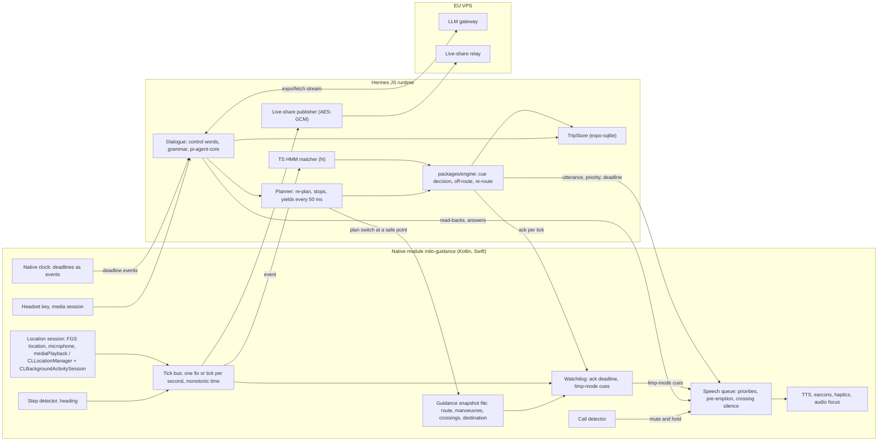

# R: Locked-screen runtime: what runs in native code and what in JavaScript
Research date: 27 Sep 2026. Tags: [V] verified in a primary source I fetched or read (source file, registry tarball, official docs); [P] secondary source; [U] could not verify; [M] my own measurement, estimate or reading of Milo's code. Bracketed numbers point to Sources; letters point to the other reports in this folder. WebSearch was unavailable (budget spent), so everything below comes from fetched pages, npm tarballs, AOSP mirrors and a Hermes build I compiled.

## In short

1. **The versions.**
   - Expo SDK 57 ships React Native **0.86.3**, and SDK 58 preview.7 ships **0.88.0-rc.1** [V 4].
   - Both run **Hermes V1** by default: `hermes-v250829098.0.17` for 0.86.3, with `HERMES_V1_ENABLED_FALLBACK = true` on Android and the V1 podspec path on iOS unless `RCT_HERMES_V1_ENABLED=0` [V 1, 3, 10].
   - The timer code discussed below is functionally identical in 0.86.3 and 0.88.0-rc.1 (the diff is a comma and two comment URLs), so the SDK 58 upgrade that O budgets changes none of it [V 1, 2].
2. **On a locked Android phone, JavaScript runs but its timers do not.**
   - In bridgeless mode, `setTimeout`/`setInterval` are C++ host functions (`TimerManager`). They forward every delay, including 0, to `JavaTimerRegistry`, then to `JavaTimerManager.createTimer`, which fires timers only from Choreographer frame callbacks [V 1].
   - The screen lock calls `onHostPause`, which sets `isPaused`. After that, `doFrame` returns without firing anything unless a Headless JS task is active [V 1].
   - Events from native modules, promises, microtasks, `setImmediate` (a microtask shim in bridgeless mode), network callbacks and SQLite completions keep running. `setTimeout`, `setInterval`, `requestAnimationFrame` and everything built on them do not: Expo's `AbortSignal.timeout` polyfill, debounce, retry back-off and "sleep" never fire until the app returns to the foreground [V 1, 5].
   - Expo hit this itself. `expo-task-manager` 55.0.10 (17 Mar 2026) now starts a Headless JS task "to keep JS timers alive" (PR #43821) [V 6].
3. **The critic's Choreographer hypothesis is false on AOSP, but only matters with a headless task.**
   - When the display powers off, SurfaceFlinger switches to synthetic VSYNC: "When the display is off, keep feeding clients at 60 Hz" (Android 16 source, LineageOS 23.0 mirror) [V 21].
   - So with a headless task active, timers do fire while the CPU is awake. `HeadlessJsTaskService` holds an untimed partial wake lock [V 1], and the timer frame callback re-posts itself every frame, so the main thread wakes about 60 times a second for the whole walk [V 1]. That battery cost is unmeasured [U]. OEM builds may differ [U].
4. **On iOS, the JavaScript thread and its timers keep running while locked, as long as the app is not suspended.**
   - `RCTTiming` turns off its `CADisplayLink` in the background and schedules an `NSTimer` for pending timers [V 1].
   - With background location active, iOS does not suspend the app [V 25]. `CLLocationUpdate.liveUpdates` can still let it suspend when the walker stands still [V 27], which is one more reason to keep D's `CLLocationManager` with `pausesLocationUpdatesAutomatically = false`.
5. **Measured on the Porta Romana fixture, desktop Hermes V1 (built from the RN 0.86 tag) [M]:**
   - one guidance step averages 0.06–0.27 ms per fix, 63 ms at worst (a fix that triggers a re-route);
   - a full re-plan from mid-route takes 94 ms median, 150 ms maximum;
   - "add a pharmacy" takes 0.45–1.4 s for the candidates plus 0.25–0.5 s to set the stop;
   - building the zone takes **8.7 s**, 87% of it in one geometry call per node;
   - JSON parsing takes only 55 ms for 5 MB.
   G's ~200 ms budget holds for the guidance tick, holds for the median re-plan, and fails for adding a stop, until two small engine fixes land (§4).
6. **Recommendation: option D.**
   - JavaScript (the TS engine and N's matcher) decides the cues.
   - Native code owns the clock, the speech queue and a minimal watchdog that keeps guiding from a snapshot when JavaScript stalls or is not yet running.
   - No JavaScript timers in the guidance or dialogue path.
   - This costs about 6–10 developer-days net over O and G. Porting the safety core to Kotlin and Swift (option B) would cost 20–35 days [M].

## 1. What React Native JavaScript does with the screen locked

### 1.1 Android: foreground service (`location|microphone|mediaPlayback`) started from the foreground; screen locked, Activity stopped

The Activity stops when the screen locks ("When your activity is no longer visible to the user, it enters the Stopped state") [V 20]. `ReactHostImpl.onHostPause` then moves the React context to the paused state, and `JavaTimerManager.onHostPause` sets `isPaused` [V 1].

| In the JS runtime | Works? | Latency | Evidence |
|---|---|---|---|
| Events from a native module (fixes, steps, TTS callbacks) | Yes | Queued on the JS thread: near zero when idle, otherwise the rest of the running JS task (see §4: up to 1.4 s during "add a stop" on desktop Hermes) | Event path does not touch Choreographer [V 1]; latency [M] |
| Promises, `queueMicrotask`, `setImmediate` | Yes | Same task | `setUpTimers.js`: bridgeless `setImmediate` is shimmed "via `queueMicrotask`" [V 1] |
| `setTimeout`, `setInterval`, `requestAnimationFrame` | **No**: never fire until the app is resumed | ∞ | `doFrame`: `if (isPaused.get() && !isRunningTasks.get()) return` [V 1] |
| The same with a Headless JS task running | Yes, quantised to frames (~16 ms) through synthetic VSYNC while the CPU is awake | ~16 ms | [V 1, 21]; OEM behaviour [U] |
| `AbortSignal.timeout` (Expo polyfill; RN's `abort-controller` 3.0.0 lacks it) | **No** (built on `setTimeout`) | ∞ | [V 5] |
| `expo/fetch` streaming (the global `fetch` in SDK 57), WebSocket | Yes (OkHttp in native code; data arrives as events) | Network | Expo installs `expo/fetch` as `fetch` [V 5]; device behaviour to confirm in R0 [M] |
| `expo-sqlite` writes | Yes (native threads, promise resolution) | ms | [M] |
| Native TTS calls | Yes. From Android 17, audio focus needs a visible activity or a non-short FGS, and apps targeting API 37 need an FGS with while-in-use capability [V 19] | ms | [V 19] |

**Consequences for Milo's code today.**
- `places.ts` and `transit.ts` call `AbortSignal.timeout` [M]. On a locked Android phone a hung Photon request would never time out.
- The streaming code of pi-agent-core (`streamProxy`) uses no timers [V 42]. pi-ai's retry and sleep helpers use `setTimeout` [V 42], but they run on the gateway, not on the phone.

### 1.2 Android: Activity destroyed, process death, Doze, OEMs

- **Activity destroyed with the process alive** (a swipe that leaves the process running, "Don't keep activities"):
  - The `ReactHost` belongs to `MainApplication` (a lazy property in the SDK 57 template) [V 32].
  - `onHostDestroy` only changes the lifecycle state, so the JS runtime survives [V 1]. Timers stay paused.
- **Low memory:** "The system never kills an activity directly to free up memory. Instead, it kills the process" [V 20]. JavaScript and native code die together.
- **Restart without an Activity:**
  - `HeadlessJsTaskService` can start the React instance with no Activity (`reactHost.start()`) and holds a partial wake lock until it is destroyed [V 1].
  - A service restarted from the background cannot open location or microphone: "you must call `Context.startForegroundService()`… while your app has a visible activity", unless an exemption applies [V 16]. Whether a `START_STICKY` restart counts as "a system component starts the service" is not documented [U]; R0 tests it.
  - On Android 17, audio from such a service may fail silently [V 19].
  - Recovery therefore goes through a user action:
    - a tap on a notification, which is exempt [V 16];
    - or a headset key, since "media key events from external devices" grant while-in-use access [V 19].
- **Doze** with a foreground service:
  - Partial wake locks are ignored only for apps whose process state is above `PROCESS_STATE_BOUND_FOREGROUND_SERVICE` [V 22].
  - Network is allowed for process states at or below `BOUND_FOREGROUND_SERVICE` [V 23].
  - An FGS process therefore keeps its wake locks and network in Doze.
- **Timeouts:**
  - Only `dataSync` and `mediaProcessing` foreground services are capped (6 h in 24 h) [V 15].
  - Android 16 applies job runtime quotas to jobs "executing concurrently with a foreground service" [V 17]. `expo-location`'s JobScheduler delivery path (D, O) is therefore a poor base for guidance.
- **OEMs:**
  - dontkillmyapp ranks Huawei, Xiaomi, OnePlus and Samsung worst, and AOSP/Pixel best [V 24].
  - Samsung, from Android 11: "Apps can no longer hold wake lock in foreground services". In July 2024 Samsung promised that "since One UI 6.0, foreground services of apps targeting Android 14 will be guaranteed to work as intended" [V 24]. Verify on the test Samsung.

### 1.3 iOS: `location` + `audio` background modes, `CLBackgroundActivitySession`

- **Timers.** `appDidMoveToBackground` stops the display link and calls `didUpdateFrame`, which schedules an `NSTimer` for the next due timer. Background timers keep firing [V 1].
- **The JS thread runs** while the app is not suspended. "You can ask the system to not suspend your app while location services are active" [V 25].
- **CPU and memory limits:**
  - Apple documents the `EXC_RESOURCE` subtypes `CPU`/`CPU_FATAL` ("A thread in the process used too much CPU over a short period of time") and `WAKEUPS`, but I found no published thresholds [V 28, U].
  - Jetsam kills on `per-process-limit` and on `vm-pageshortage` ("free background process memory for the current foreground app") [V 30].
  - `0xdead10cc` kills an app that "held on to a file lock or SQLite database lock during suspension" [V 29]. TripStore must flush before location stops at the end of a trip.
- **Relaunch:**
  - After termination, iOS relaunches the app in the background when location updates arrive. The app must recreate `CLBackgroundActivitySession` and restart updates "immediately upon receiving background app launch" [V 27, 25].
  - The SDK 57 template calls `startReactNative` in `didFinishLaunching`, so the JS bundle loads on a background launch too [V 32; loading time M].

## 2. Where the reports disagree, settled

| Report | Claim | Verdict |
|---|---|---|
| D | Fusion and HMM matching in native code, TS engine for cues | Half right. Time, speech and a fallback belong in native code. The matcher needs Milo's graph, which lives in JavaScript, so a native matcher means a second graph implementation |
| N | TS HMM matcher (~400 lines) fed by native events | **Adopt.** Events run on a locked phone; the tick costs well under 1 ms (§4) |
| O §11 | "Guidance must not depend on the JS thread" | Too strict and costly. What must not depend on JavaScript: the clock, the speech queue, a minimal fallback, and recovery |
| G S0 | Hermes spike of pi-agent-core, screen locked | Tests the wrong risk: pi-agent-core has no timers in its loop [V 42]. The risks are Android timers and long JS tasks. Merge into R0 (§8) |
| J | TripStore written after every turn, every cue logged | Fine: native async writes. Batch them per fix, and flush before iOS suspension |
| K vs I | Publisher inside the native location service (K), JS with `@noble/ciphers` (I) | **I.** K's premise (JavaScript stops when locked) is wrong for events. Drive publishing from fix events, never from timers: "every 5 s" means "the first fix ≥5 s after the last send". A dead phone shows as "last update X ago" on the relay |

## 3. Options

| Option | What | Effort [M] | Risk | Solves timers | Solves long tasks | Survives process death |
|---|---|---|---|---|---|---|
| A. JS-driven | Native streams fixes, steps and heading; TS engine and matcher decide; native speaks; no JS timers | Base (O: 8–12 + 5–7 d) | Long planner tasks delay fixes; silent guidance after a JS crash | Yes, by the rule | No | No |
| B. Native safety core | Matcher, cue timing, off-route and speech queue in Kotlin and Swift (or KMP, like Soundscape-Android, N) | +20–35 d; every cue change made twice; the graph ported too | Divergence between two engines; KMP-in-Expo integration | Yes | Yes | No (same process) |
| C. Second JS runtime in the service | `react-native-worklets` runtime; standalone Hermes via JSI; JSC `JSContext`; QuickJS-ng; Javet | +4–8 d | See below | Partly | Yes | No |
| **D. A plus native clock, speech queue and watchdog** | A, plus native deadlines as events, a native priority queue, and a watchdog that guides from a snapshot when JavaScript misses its ack | **+6–10 d net** (§9) | A second, deliberately dumb guidance path to test | Yes | Covered | Recovers (native snapshot, TripStore, notification or relaunch) |

**Option C in detail.**
- **react-native-worklets** (MIT; 0.10.1 in SDK 57, 0.13.0 in SDK 58) [V 4, 33]:
  - `createWorkletRuntime` runs a separate Hermes on its own thread. Its `setTimeout` goes through a C++ `EventLoop::pushTimeout`, not Choreographer [V 33].
  - Bundle Mode gives worklets "access to your whole JavaScript bundle" [V 34], so `packages/engine` could run there unchanged.
  - Networking in worklet runtimes sits behind `WORKLETS_FETCH_PREVIEW_ENABLED` [V 33].
  - The runtime belongs to the React instance, so it dies with the process.
  - The zone must live in one runtime (11 MB of V8 heap measured [M]) or be duplicated.
  - Keep it as the **fallback for offloading the planner** if R0 fails after the engine fixes.
- **Standalone Hermes in the service:** C++/JNI on `libhermes`, a second bundle, message IPC; 5–8 d [M]. It survives Activity destruction but not process death.
- **QuickJS-ng** (MIT, 0.17.0) [V 35]:
  - about 2× slower than Hermes V1 on the V8 suite (geomean) [V 14];
  - practically no `Intl` (kangax 0.25; `hours.ts` then falls back to device time) [V 14];
  - usable from Kotlin through quickjs-kt (Kotlin Multiplatform) [V 36].
- **Javet** (Apache-2.0, 6.0.1, V8 with JIT on Android) [V 37]: rejected. The arm64 `.so` is 110 MB [V 37], and it has no iOS build.

## 4. Measurements [M]

**Setup.**
- `packages/engine` bundled with rolldown from a script outside the repo, run on the Porta Romana fixture: 6 navigate cases, 4,179 fixes.
- Machine: 4 vCPU Intel Xeon (model 207) at 2.1 GHz; Node 22.22.2.
- Hermes V1 built from tag `hermes-v250829098.0.17`, the one RN 0.86.3 pins, run as `hermesc -O` bytecode, as release builds do (Gradle default `["-O", "-output-source-map"]`; Xcode script `EXTRA_COMPILER_ARGS=-O`) [V 1, 10]. Its clock has 1 ms resolution.
- Re-plan: `createPlan` from the recorded mid-route fix of each case.
- Add a stop: `stopCandidates('pharmacy')`, then `setStop`.

| Operation (median / max, ms) | V8 JIT | V8 `--jitless` | **Hermes V1** | Phone, ×1.5–3 [U] |
|---|---|---|---|---|
| `JSON.parse` network 5.0 MB | 36 / 61 | 45 / 47 | **55 / 55** | 80–165 |
| `JSON.parse` features 0.62 MB | 3.7 / 8 | 3.9 / 6 | **5 / 7** | 8–21 |
| Build Zone (graph, indexes) | 1,020–1,070 / 1,350 | 9,730 / 9,790 | **8,780 / 8,780** | 13,000–26,000 |
| First plan (cold) | 155–189 | 513 | **522** | 780–1,570 |
| Plan (warm) | 10–11 / 42–47 | 47 / 249 | **33 / 388** | 50–1,160 |
| Re-plan from mid-route | 17–18 / 26–29 | 86 / 163 | **94 / 150** | 140–450 |
| Stop candidates (pharmacy) | 90–92 / 235–282 | 549 / 1,459 | **446 / 1,391** | 670–4,170 |
| Set the stop | 29–40 / 47 | 162 / 325 | **251 / 499** | 380–1,500 |
| `step()` per fix, mean | 0.03 | 0.16 | **0.06–0.27** | ≤0.8 |
| `step()` worst fix (includes a re-route) | 19–26 | 68 | **63** | 95–190 |

- **Translation to a phone.**
  - My Hermes V1 runs are 3–9× slower than V8 JIT on this workload.
  - The published V8-suite ratio is larger: V8 JIT is 15.6× faster than Hermes V1 on amd64 and 13.8× on arm64 (geomean, range 4.3–62×). Hermes V1 is 1.5–1.6× faster than legacy Hermes [V 14].
  - `--jitless` V8 is a fair Hermes proxy here.
  - A mid-range phone core being 1.5–3× slower than this cloud vCPU is my assumption. Geekbench and NanoReview returned 403, so I have no primary source [U]. R0 runs the same `.hbc` on the devices.
- **Verdict on G's ~200 ms.**
  - Guidance ticks fit: under 1 ms on average, and 95–190 ms on a phone for the worst tick (one that re-routes).
  - A re-plan from the current position fits at the median; its tail does not.
  - "Add a stop" blocks the JS thread for 0.5–4 s, which at 1.2 m/s is up to 5 m of walking without cues.
  - Zone building must never run on the JS thread during a walk. It also sets the cold-start time after a relaunch.
- **Two cheap engine fixes the profile points to** (V8 `--jitless` CPU profile):
  - **Zone build:** 8.8 of 10.0 s is `insideBuffer`, which runs a full jsts `Geometry.intersects` (a DE-9IM relate) for each of about 31k nodes (`zone.ts:189`, `osm/network.ts:126`). A distance-to-rectangle test (the buffer of a box is a rounded box) or a prepared geometry removes almost all of it, down to about 1 s on desktop Hermes by subtraction [M].
  - **Stop candidates:** 99% of the time is `shortestPath`, run 2 × `CAND_N` (8) + 1 times. One forward and one reverse one-to-many search do the same work in 2–3 searches, about 5× less [M].
  - Both: 2–3 d including parity tests.
- **For I §6:** parse time is not the problem (55 ms for 5 MB). A binary pack format is not needed for speed; the zone construction above is.

## 5. Recommended architecture (option D)

**Watchdog behaviour.**
- Each tick carries an id. JavaScript acknowledges it after `step()`.
- If no acknowledgement arrives within 1.5 s, native code enters limp mode. It projects the fix on the snapshot polyline and speaks the pre-rendered manoeuvre text at 30 m and 10 m. It warns "off route" beyond 40 m, respects crossing silence zones, and says once: "Guidance is catching up, keep going".
- Limp mode ends at the next acknowledgement.
- The same path covers the seconds after a relaunch, before the zone is rebuilt. After an Android process death it covers nothing, because the whole process is gone. There, recovery is a notification ("Guidance stopped. Tap or press the headset button to resume") and a restore from TripStore plus the snapshot.

## 6. Placement table

| Function | Where | Android | iOS | Why |
|---|---|---|---|---|
| Fused fix, step detection, heading | Native | FGS; fused provider; `TYPE_STEP_DETECTOR` | `CLLocationManager` `.fitness`, no auto-pause; `CMPedometer` | Only native code keeps sensors locked (D, N) |
| Tick (clock) | Native: 1 Hz, plus a tick without a fix in GPS dropouts | Handler on the service thread | DispatchSource | JS timers stall on Android [V 1] |
| Map matcher (HMM) | JS (N) | – | – | Needs the graph; the tick costs under 1 ms [M] |
| Cue decision, off-route, re-route | JS (`packages/engine`) | – | – | One engine; golden transcripts in Node |
| Speech queue and priorities (G §5.6) | **Native** | – | – | Instructions pre-empt read-backs, and crossing silence must hold even when JS is late |
| TTS, earcons, haptics, audio focus | Native (O `milo-voice-out`) | Android 17 needs an FGS with while-in-use [V 19] | `.voicePrompt` session (D) | Platform rules |
| TripStore writes | JS, `expo-sqlite`, batched per tick | – | Flush before location stops (`0xdead10cc`) [V 29] | Exact, testable (J) |
| Dialogue loop and gateway streaming | JS (pi-agent-core, `streamProxy`, `expo/fetch`) | Deadlines from the native clock | – | No timers in the loop [V 42]; tools stay local (G) |
| Mid-trip re-planning | JS, yielding through `await milo.yield()` every ~50 ms; the switch at a safe point pushes a new snapshot | – | – | Measured 0.1–4 s on a phone [M/U]; the watchdog covers the gap |
| Live-share encryption and publishing | JS (I): `@noble/ciphers`, triggered by fix events | – | – | Works locked; no timers |
| Call detection (K) | Native: mode listener, `CXCallObserver`; mutes the queue, then tells JS | API 31 listener (K) | [V K] | Must act even when JS is busy |
| Crash and process-death recovery | Native snapshot file plus TripStore | Notification or headset key to resume; `ApplicationExitInfo` on the next launch | Background relaunch; recreate the session natively before JS [V 27] | While-in-use rules [V 16, 19] |

## 7. Rules for developers and agents

1. **No `setTimeout`, `setInterval`, `requestAnimationFrame`, `AbortSignal.timeout`, debounce or sleep** in `packages/engine`, the guidance glue or the dialogue path. Enforce it with ESLint `no-restricted-globals` and `no-restricted-properties`. UI code may use them.
2. **Time comes from native ticks.** Pass the tick's monotonic time into `step()` (it already takes `now`). Never read `Date.now()` for guidance decisions.
3. **Every deadline is a native event** (`milo.deadline(id, ms)`): gateway request timeout, barge-in window, confirmation wait. On the event, call `AbortController.abort()`.
4. **JavaScript never plays audio.** It enqueues `{text, priority, deadline, zone}`; native code owns the queue.
5. **The snapshot is pushed before every plan switch** (route, manoeuvre list with along-route distances, pre-rendered short texts, crossing zones, destination).
6. **No JS task longer than 50 ms during a walk,** except planning, which yields every ~50 ms and tells native code "busy" and "idle".
7. **Never start the guidance FGS from the background;** resume only through a notification or the headset key. Do not use `expo-location` background tasks, TaskManager or `expo-background-task` for guidance.
8. **Keep `packages/engine` free of runtime globals** in guidance code (`fetch` and timeouts stay in `places.ts` and `transit.ts`), so it can move to a worklet runtime unchanged.
9. **Test in Node with replayed traces (report S) and a fake native clock.** Every cue change updates the golden transcripts.
10. **Re-run R0 T1–T3 after each Expo SDK upgrade** (0.5 d).

## 8. R0: the runtime spike (replaces G S0; 3–4 days)

**Devices:**
- a mid-range Samsung (One UI 7 or 8);
- a Pixel as the AOSP control;
- an iPhone on iOS 18 or later.

**Build:**
- Expo SDK 57 release build (Hermes bytecode).
- A prototype `milo-guidance` that emits ticks, receives acks and speaks.
- Fixes come from the device or from a native replay of a recorded trace (report S), injected into the native module on both platforms.

| Test | Pass threshold |
|---|---|
| T1. 60-minute locked walk (or replay), `step()` on each tick | ≥99% of ticks acknowledged within 200 ms; 100% within 1 s outside planner windows |
| T2. Cue timing: native fix timestamp to TTS `onStart` | p95 ≤300 ms, p99 ≤600 ms; no cue more than 2 s late |
| T3. JS timers locked: 1 s ticker, with and without a Headless JS keep-alive | Confirms the Android stall and iOS operation. The keep-alive's battery cost decides whether it is ever enabled |
| T4. pi-agent-core with `streamProxy` through the gateway, locked, headset-triggered, 10 turns | 10/10 complete; first token ≤2 s on 4G; a native-deadline abort works |
| T5. "Add a pharmacy" ×5 during the walk, before and after the engine fixes | No manoeuvre cue more than 2 s late (watchdog). After the fixes, the planner's longest task ≤200 ms p95, or schedule the worklet-runtime offload |
| T6. `adb shell dumpsys deviceidle force-idle`, then `step light` | 1 Hz ticks continue; a gateway turn and TTS work |
| T7. Swipe away (Samsung, Pixel); "Don't keep activities" | Guidance continues, or a resume notification appears within 10 s and one tap restores the trip within 5 s |
| T8. Process death: `am kill` in the background, `send-trim-memory`; iOS termination with location active | Android: as T7. iOS: background relaunch, native "catching up" cue within 5 s, JS guidance within 15 s |
| T9. Battery per hour, screen off (batterystats, Xcode energy log) | ≤8%/h device drain on the Samsung (D estimates 2–5%/h for GNSS) [M threshold] |
| T10. iOS: 3 minutes of planner loops in the background | No `CPU_FATAL`; collect `MXCPUExceptionDiagnostic` reports [V 31] |
| T11. Android 17 target: audio focus from the FGS locked, and after a background restart | Granted; restart path fails as documented [V 19] |

## 9. Effort changes

| Item | O / G / K / N before | After | Delta [M] |
|---|---|---|---|
| `milo-guidance` | 8–12 d | 13–18 d: + native clock (1 d), watchdog with snapshot and limp mode on both platforms (4 d), recovery paths (1–2 d) | +5–6 d |
| Voice output | 5–7 d | 7–10 d: priority queue with pre-emption and re-queue, crossing silence, call-mute hook, acks | +2–3 d |
| Hermes spike | G S0: 2 d | R0: 3–4 d | +1–2 d |
| Engine performance fixes | – | Prepared geometry for the zone build, one-to-many stop search, yield points | +2–3 d |
| Live-share publisher | K: 2–3 d per platform | JS: 1–1.5 d | −3 to −4.5 d |
| TS matcher (N) | 4–6 d | Unchanged | 0 |
| **Net** | | | **about +6–10 d** (option B would add 20–35 d) |

## 10. Precedents

- **expo-task-manager:** registers a Headless JS task to keep timers alive [V 6]. It delivers background location through JobScheduler (D, O), which Android 16 quotas now touch [V 17].
- **Transistor BackgroundGeolocation 5.6.0:** the native core records locations and posts them to your URL "regardless of" headless mode. Headless JS is only for "custom work" after termination on Android [V 38].
- **react-native-background-actions 4.1.0:** a `HeadlessJsTaskService` foreground service running a JS loop "forever". On iOS it has only `beginBackgroundTask`, which "won't keep your app in the background forever" [V 39].
- **Native apps:**
  - Microsoft Soundscape (iOS) is Swift, MIT [V 41].
  - Soundscape-Android keeps its GeoEngine in Kotlin Multiplatform (N).
  - Organic Maps (Apache-2.0) computes spoken turn notifications in its C++ core (`libs/routing/turns_notification_manager.cpp`) [V 40].
- **An RN app running turn-by-turn in JS while locked, and its failures:** none found among the sources I could reach, without web search [U].

## 11. Open questions

1. Does a `START_STICKY` restart of the FGS count as system-started (with while-in-use access) or not? (T7, T8)
2. What does the Headless JS keep-alive cost in battery (60 Hz synthetic VSYNC wake-ups)? Does Samsung honour its wake lock? (T3, T9)
3. What is the real phone/desktop factor for Hermes V1 on the engine? (Run the same `.hbc` on the devices.)
4. Should the watchdog also dead-reckon along the snapshot in porticoes (steps × stride, D), or only report "position uncertain"?
5. At which thresholds does iOS raise `EXC_RESOURCE` CPU warnings for a background navigation app?
6. How does report S inject replayed traces on iOS without Xcode (the native replay in the module is assumed here)?

## Sources

1. React Native 0.86.3 npm tarball (read 27 Sep 2026): `ReactAndroid/.../modules/core/JavaTimerManager.kt`, `runtime/ReactInstance.kt`, `runtime/ReactHostImpl.kt`, `HeadlessJsTaskService.kt`, `jstasks/HeadlessJsTaskContext.kt`, `jni/react/runtime/jni/JavaTimerRegistry.cpp`, `ReactCommon/react/runtime/TimerManager.cpp`, `.../ios/ReactCommon/ObjCTimerRegistry.mm`, `React/CoreModules/RCTTiming.mm`, `Libraries/Core/setUpTimers.js`, `setUpXHR.js`, `sdks/.hermesv1version`. https://registry.npmjs.org/react-native/-/react-native-0.86.3.tgz ; critic's leads: https://raw.githubusercontent.com/facebook/react-native/main/packages/react-native/ReactAndroid/src/main/java/com/facebook/react/modules/core/JavaTimerManager.kt , https://raw.githubusercontent.com/facebook/react-native/main/packages/react-native/React/CoreModules/RCTTiming.mm
2. React Native 0.88.0-rc.1 npm tarball (same files, diffed). https://registry.npmjs.org/react-native/-/react-native-0.88.0-rc.1.tgz
3. React Native 0.86.3 `sdks/hermes-engine/hermes-engine.podspec` and `hermes-utils.rb` (`hermes_v1_enabled` unless `RCT_HERMES_V1_ENABLED == "0"`). https://registry.npmjs.org/react-native/-/react-native-0.86.3.tgz
4. Expo 57.0.25 and 58.0.0-preview.7 `bundledNativeModules.json` (react-native 0.86.3 / 0.88.0-rc.1; react-native-worklets 0.10.1 / 0.13.0). https://registry.npmjs.org/expo/57.0.25 , https://registry.npmjs.org/expo/58.0.0-preview.7
5. Expo 57.0.25 `src/winter/runtime.native.ts`, `AbortSignal.ts`; `abort-controller` 3.0.0. https://registry.npmjs.org/expo/-/expo-57.0.25.tgz
6. expo-task-manager 57.0.20 `TaskService.java` and CHANGELOG (55.0.10, 17 Mar 2026). https://registry.npmjs.org/expo-task-manager/57.0.20 ; https://github.com/expo/expo/pull/43821
7. React Native docs, Headless JS (0.87). https://reactnative.dev/docs/headless-js-android
8. Expo TaskManager (SDK 57). https://docs.expo.dev/versions/latest/sdk/task-manager/
9. Expo BackgroundTask (SDK 57). https://docs.expo.dev/versions/latest/sdk/background-task/
10. @react-native/gradle-plugin 0.86.3 `ProjectUtils.kt` (`HERMES_V1_ENABLED_FALLBACK = true`), `ReactExtension.kt` (`hermesFlags` default `-O`); RN 0.86.3 `scripts/react-native-xcode.sh`. https://registry.npmjs.org/@react-native/gradle-plugin/0.86.3
11. React Native 0.82 release post (Hermes V1: no JIT, Expensify gains). https://reactnative.dev/blog/2025/10/08/react-native-0.82
12. Hermes source, tag `hermes-v250829098.0.17`, built locally (Release, `HERMES_UNICODE_LITE`). https://github.com/facebook/hermes/tree/hermes-v250829098.0.17
13. hermes-compiler 250829098.0.17 (npm). https://registry.npmjs.org/hermes-compiler
14. JavaScript engines zoo, `engines.json` (V8 v7 suite, March 2026 builds; conformance). https://zoo.js.org/engines.json ; https://raw.githubusercontent.com/ivankra/javascript-zoo/master/README.md
15. Android, Foreground service timeouts (updated 16 Sep 2026). https://developer.android.com/develop/background-work/services/fgs/timeout
16. Android, Restrictions on starting a foreground service from the background. https://developer.android.com/develop/background-work/services/fgs/restrictions-bg-start
17. Android 16 behaviour changes (job quotas with FGS). https://developer.android.com/about/versions/16/behavior-changes-all
18. Android 17 behaviour changes (API 37). https://developer.android.com/about/versions/17/behavior-changes-all
19. Android 17, Background audio hardening. https://developer.android.com/about/versions/17/changes/bg-audio
20. Android, The activity lifecycle. https://developer.android.com/guide/components/activities/activity-lifecycle
21. AOSP SurfaceFlinger (LineageOS 23.0 mirror): `Scheduler/EventThread.cpp`, `SurfaceFlinger.cpp`, `surfaceflinger_flags_new.aconfig`. https://raw.githubusercontent.com/LineageOS/android_frameworks_native/lineage-23.0/services/surfaceflinger/Scheduler/EventThread.cpp (android.googlesource.com returned 503)
22. AOSP `PowerManagerService.java` (LineageOS 23.0). https://raw.githubusercontent.com/LineageOS/android_frameworks_base/lineage-23.0/services/core/java/com/android/server/power/PowerManagerService.java
23. AOSP `NetworkPolicyManager.java` (LineageOS 23.0). https://raw.githubusercontent.com/LineageOS/android_frameworks_base/lineage-23.0/core/java/android/net/NetworkPolicyManager.java
24. Don't kill my app: ranking and Samsung page. https://dontkillmyapp.com/ ; https://dontkillmyapp.com/samsung
25. Apple, Handling location updates in the background. https://developer.apple.com/documentation/corelocation/handling-location-updates-in-the-background
26. Apple, CLBackgroundActivitySession. https://developer.apple.com/documentation/corelocation/clbackgroundactivitysession-3mzv3
27. Apple WWDC23 10180, Discover streamlined location updates (transcript). https://developer.apple.com/videos/play/wwdc2023/10180/
28. Apple, EXC_RESOURCE. https://developer.apple.com/documentation/xcode/exc_resource
29. Apple, SIGKILL termination reasons. https://developer.apple.com/documentation/xcode/sigkill
30. Apple, Identifying high-memory use with jetsam event reports. https://developer.apple.com/documentation/xcode/identifying-high-memory-use-with-jetsam-event-reports
31. Apple, MXCPUExceptionDiagnostic (MetricKit). https://developer.apple.com/documentation/metrickit/mxcpuexceptiondiagnostic
32. expo-template-bare-minimum 57.0.27: `AppDelegate.swift`, `MainApplication.kt`. https://registry.npmjs.org/expo-template-bare-minimum
33. react-native-worklets 0.10.1 tarball (`runLoop/workletRuntime/setTimeout.ts`, `WorkletRuntimeDecorator.cpp`, `bundleMode/network.native.ts`) and README (MIT). https://registry.npmjs.org/react-native-worklets ; https://raw.githubusercontent.com/software-mansion/react-native-reanimated/main/packages/react-native-worklets/README.md
34. Worklets docs, Bundle Mode (0.13). https://docs.swmansion.com/react-native-worklets/docs/bundleMode/
35. quickjs-ng README, LICENSE (MIT), `quickjs.h` 0.17.0. https://raw.githubusercontent.com/quickjs-ng/quickjs/master/README.md ; https://quickjs-ng.github.io/quickjs/
36. quickjs-kt README. https://raw.githubusercontent.com/dokar3/quickjs-kt/main/README.md
37. Javet README, 6.0 release notes, LICENSE (Apache-2.0), `javet-v8-android` 6.0.1 AAR on Maven Central (arm64 `.so` 110 MB). https://raw.githubusercontent.com/caoccao/Javet/main/README.rst ; https://repo1.maven.org/maven2/com/caoccao/javet/javet-v8-android/6.0.1/
38. react-native-background-geolocation 5.6.0, `Config.d.ts` (`enableHeadless`). https://registry.npmjs.org/react-native-background-geolocation/5.6.0
39. react-native-background-actions README and 4.1.0 `RNBackgroundActionsTask.java`. https://raw.githubusercontent.com/Rapsssito/react-native-background-actions/master/README.md
40. Organic Maps, `libs/routing/turns_notification_manager.cpp`; LICENSE. https://raw.githubusercontent.com/organicmaps/organicmaps/master/libs/routing/turns_notification_manager.cpp
41. Microsoft Soundscape README and LICENSE.txt (MIT). https://raw.githubusercontent.com/microsoft/soundscape/main/README.md
42. @earendil-works/pi-agent-core 0.87.1 (`dist/proxy.js`, `harness/runtime/drive/retry.js`) and pi-ai `dist/utils/{retry,sleep}.js`. https://registry.npmjs.org/@earendil-works/pi-agent-core
43. Milo repository: `packages/engine/src/{navigate,zone,plan,transit,places,hours}.ts`, `osm/network.ts`; fixture `test/fixtures/porta-romana`.
